# Real-World Example 1: Multi-Team RAG Pipeline with Cost Governance

## Executive Summary

**Company**: TechCorp Inc. (5,000 employees, SaaS company)
**Problem**: Three teams building RAG systems independently, costs spiraling to $45K/month with no visibility
**Solution**: Unified GenOps-AI governance layer with team-based attribution and budget controls
**Result**: 35% cost reduction ($15.7K savings/month), <5 minute incident response, zero budget overages

---

## Business Context

### Scenario

TechCorp has three engineering teams building AI-powered features:

1. **Customer Support Team** (Team A)
   - Building intelligent chatbot for 10,000+ daily queries
   - Using OpenAI GPT-4 for quality responses
   - Cost: Unknown (billed to shared AWS account)

2. **Internal Knowledge Team** (Team B)
   - Creating employee documentation search (Notion/Confluence indexing)
   - Using Anthropic Claude for summarization
   - Cost: Unknown (individual API keys)

3. **Sales Intelligence Team** (Team C)
   - Building competitive intelligence pipeline
   - Using multiple providers (OpenAI, Cohere, Pinecone)
   - Cost: Unknown (mix of accounts)

### Pain Points

**Before GenOps-AI**:
- ❌ Monthly surprise bills ($42K in March, $51K in April)
- ❌ No attribution by team or project
- ❌ Can't answer "Which team is driving costs?"
- ❌ No budget alerts (overages discovered end-of-month)
- ❌ Duplicate spending (same embeddings computed twice)
- ❌ No policy enforcement (GPT-4 used in dev environments)
- ❌ Manual cost tracking (5-10 hours/week)

**After GenOps-AI**:
- ✅ Real-time cost dashboards per team
- ✅ Budget alerts before overages (email + Slack)
- ✅ Policy enforcement (no GPT-4 in non-prod)
- ✅ Cost attribution to customer ID (SaaS chargeback)
- ✅ Automated reporting (zero manual effort)
- ✅ 35% cost reduction through optimization
- ✅ <5 minute incident response

---

## Architecture Overview

### System Architecture

```mermaid
graph TB
    subgraph "Team A: Customer Support Chatbot"
        A_API[FastAPI Service<br/>chat.techcorp.com]
        A_EMBED[Embedding Service<br/>OpenAI text-embedding-3]
        A_LLM[LLM Service<br/>OpenAI GPT-4]
        A_VECTOR[Pinecone<br/>Vector DB]
    end

    subgraph "Team B: Internal Knowledge Search"
        B_API[Django Service<br/>docs.internal.techcorp.com]
        B_EMBED[Embedding Service<br/>Cohere Embed v3]
        B_LLM[LLM Service<br/>Anthropic Claude Opus]
        B_VECTOR[Weaviate<br/>Vector DB]
    end

    subgraph "Team C: Sales Intelligence"
        C_SCRAPE[Web Scraper<br/>Competitor Monitoring]
        C_EMBED[Embedding Service<br/>OpenAI Ada-002]
        C_LLM[Multi-LLM Router<br/>LiteLLM]
        C_VECTOR[Chroma<br/>Vector DB]
    end

    subgraph "GenOps-AI Instrumentation"
        GENOPS[GenOps SDK<br/>Auto-Instrumentation]

        subgraph "Cost Attribution"
            ATTR_TEAM[Team Attribution<br/>support, knowledge, sales]
            ATTR_PROJ[Project Attribution<br/>chatbot, docs, intel]
            ATTR_CUST[Customer Attribution<br/>customer_id for SaaS]
        end

        subgraph "Policy Enforcement"
            POL_BUD[Budget Policies<br/>$10K/team/month]
            POL_ENV[Environment Policies<br/>GPT-4 = prod only]
            POL_RATE[Rate Limits<br/>1000 req/min/team]
        end

        subgraph "Cost Tracking"
            COST_EMBED[Embedding Costs<br/>$0.0001/1K tokens]
            COST_LLM[LLM Costs<br/>Provider-specific]
            COST_VEC[Vector DB Costs<br/>Storage + Queries]
        end
    end

    subgraph "OpenTelemetry Pipeline"
        OTEL[OTLP Collector<br/>otel.techcorp.com]
        PROC[Processors<br/>Enrichment, Filtering]
    end

    subgraph "Observability: Datadog"
        DD_TRACE[APM Traces<br/>Distributed Tracing]
        DD_METRIC[Custom Metrics<br/>Costs, Tokens, Latency]
        DD_DASH[Dashboards<br/>Team/Project/Customer]
        DD_ALERT[Alerts<br/>Budget Thresholds]
    end

    subgraph "Governance Outputs"
        SLACK[Slack Alerts<br/>#ai-cost-alerts]
        EMAIL[Email Reports<br/>Weekly Summaries]
        EXPORT[Cost Export<br/>Finance Integration]
    end

    %% Team A Flow
    A_API --> GENOPS
    A_EMBED --> GENOPS
    A_LLM --> GENOPS
    A_API --> A_VECTOR

    %% Team B Flow
    B_API --> GENOPS
    B_EMBED --> GENOPS
    B_LLM --> GENOPS
    B_API --> B_VECTOR

    %% Team C Flow
    C_SCRAPE --> GENOPS
    C_EMBED --> GENOPS
    C_LLM --> GENOPS
    C_SCRAPE --> C_VECTOR

    %% GenOps to Attribution
    GENOPS --> ATTR_TEAM
    GENOPS --> ATTR_PROJ
    GENOPS --> ATTR_CUST

    %% GenOps to Policies
    GENOPS --> POL_BUD
    GENOPS --> POL_ENV
    GENOPS --> POL_RATE

    %% GenOps to Cost Tracking
    GENOPS --> COST_EMBED
    GENOPS --> COST_LLM
    GENOPS --> COST_VEC

    %% GenOps to OTLP
    GENOPS --> OTEL
    OTEL --> PROC

    %% OTLP to Datadog
    PROC --> DD_TRACE
    PROC --> DD_METRIC

    %% Datadog to Dashboards
    DD_TRACE --> DD_DASH
    DD_METRIC --> DD_DASH
    DD_DASH --> DD_ALERT

    %% Alerts to Outputs
    DD_ALERT --> SLACK
    DD_ALERT --> EMAIL
    DD_DASH --> EXPORT

    %% Styling
    classDef teamAStyle fill:#e3f2fd,stroke:#1976d2,stroke-width:2px
    classDef teamBStyle fill:#f3e5f5,stroke:#7b1fa2,stroke-width:2px
    classDef teamCStyle fill:#e8f5e9,stroke:#388e3c,stroke-width:2px
    classDef genopsStyle fill:#fff3e0,stroke:#f57c00,stroke-width:3px
    classDef otelStyle fill:#fce4ec,stroke:#c2185b,stroke-width:2px
    classDef ddStyle fill:#e0f2f1,stroke:#00796b,stroke-width:2px
    classDef govStyle fill:#fff9c4,stroke:#f9a825,stroke-width:2px

    class A_API,A_EMBED,A_LLM,A_VECTOR teamAStyle
    class B_API,B_EMBED,B_LLM,B_VECTOR teamBStyle
    class C_SCRAPE,C_EMBED,C_LLM,C_VECTOR teamCStyle
    class GENOPS,ATTR_TEAM,ATTR_PROJ,ATTR_CUST,POL_BUD,POL_ENV,POL_RATE,COST_EMBED,COST_LLM,COST_VEC genopsStyle
    class OTEL,PROC otelStyle
    class DD_TRACE,DD_METRIC,DD_DASH,DD_ALERT ddStyle
    class SLACK,EMAIL,EXPORT govStyle
```



---

## Tech Stack Details

### Team A: Customer Support Chatbot

**Application Stack**:
- **Framework**: FastAPI (Python 3.11)
- **RAG Library**: LangChain 0.1.0
- **Vector DB**: Pinecone (serverless)
- **LLM**: OpenAI GPT-4 Turbo
- **Embeddings**: OpenAI text-embedding-3-large
- **Cache**: Redis (semantic cache)
- **Deployment**: Kubernetes (GKE)

**GenOps Integration**:
```python
# requirements.txt
fastapi==0.109.0
langchain==0.1.0
openai==1.10.0
pinecone-client==3.0.0
genops==1.0.0  # GenOps SDK
```

### Team B: Internal Knowledge Search

**Application Stack**:
- **Framework**: Django 5.0
- **RAG Library**: LlamaIndex 0.9.0
- **Vector DB**: Weaviate Cloud
- **LLM**: Anthropic Claude Opus 4
- **Embeddings**: Cohere Embed v3
- **Cache**: None (always fresh)
- **Deployment**: AWS ECS Fargate

**GenOps Integration**:
```python
# requirements.txt
django==5.0.0
llama-index==0.9.0
anthropic==0.18.0
cohere==4.40
weaviate-client==4.4.0
genops==1.0.0  # GenOps SDK
```

### Team C: Sales Intelligence

**Application Stack**:
- **Framework**: Flask (Python 3.11)
- **RAG Library**: Haystack 2.0
- **Vector DB**: Chroma (self-hosted)
- **LLM**: LiteLLM (OpenAI, Anthropic, Cohere fallback)
- **Embeddings**: OpenAI Ada-002 (cost optimization)
- **Scraper**: Scrapy
- **Deployment**: Docker Compose (EC2)

**GenOps Integration**:
```python
# requirements.txt
flask==3.0.0
haystack-ai==2.0.0
litellm==1.20.0
chromadb==0.4.0
scrapy==2.11.0
genops==1.0.0  # GenOps SDK
```

### Shared Infrastructure

**OpenTelemetry Collector**:
```yaml
# otel-collector-config.yaml
receivers:
  otlp:
    protocols:
      grpc:
        endpoint: 0.0.0.0:4317
      http:
        endpoint: 0.0.0.0:4318

processors:
  batch:
    timeout: 10s
    send_batch_size: 100

  resource:
    attributes:
      - key: environment
        value: production
        action: insert

exporters:
  datadog:
    api:
      key: ${DD_API_KEY}
      site: datadoghq.com

service:
  pipelines:
    traces:
      receivers: [otlp]
      processors: [batch, resource]
      exporters: [datadog]
    metrics:
      receivers: [otlp]
      processors: [batch, resource]
      exporters: [datadog]
```

**Datadog Agent**: Version 7.50.0 with OTLP receiver enabled

---

## Step-by-Step Implementation

### Phase 1: Team A - Customer Support Chatbot (Week 1)

#### Step 1.1: Install GenOps SDK

```bash
cd customer-support-chatbot
pip install genops
```

#### Step 1.2: Configure GenOps

Create `genops.yaml`:
```yaml
genops:
  service_name: "customer-support-chatbot"
  environment: "production"

  exporters:
    - type: "otlp"
      endpoint: "http://otel-collector.techcorp.com:4317"

  providers:
    openai:
      api_key: "${OPENAI_API_KEY}"
      track_embeddings: true

    pinecone:
      api_key: "${PINECONE_API_KEY}"

  policies:
    - name: "team_a_budget"
      type: "budget"
      limit: 10000.0  # $10K USD/month
      period: "monthly"
      teams: ["support"]
      enforcement: "WARNING"  # Week 1: observe only

    - name: "no_gpt4_in_dev"
      type: "model"
      blocked: ["gpt-4"]
      environment: "development"
      enforcement: "BLOCKED"

  attribution:
    team: "support"
    project: "chatbot"
    customer_field: "x-customer-id"  # Extract from headers
```

#### Step 1.3: Instrument Application Code

**Before** (without GenOps):
```python
# app/main.py
from fastapi import FastAPI
from langchain.chat_models import ChatOpenAI
from langchain.embeddings import OpenAIEmbeddings
from langchain.vectorstores import Pinecone
from langchain.chains import RetrievalQA

app = FastAPI()

llm = ChatOpenAI(model="gpt-4-turbo", temperature=0)
embeddings = OpenAIEmbeddings(model="text-embedding-3-large")
vectorstore = Pinecone.from_existing_index("support-docs", embeddings)

@app.post("/chat")
async def chat(request: ChatRequest):
    qa_chain = RetrievalQA.from_chain_type(
        llm=llm,
        retriever=vectorstore.as_retriever()
    )
    response = qa_chain.run(request.question)
    return {"answer": response}
```

**After** (with GenOps - Option 1: Auto-Instrumentation):
```python
# app/main.py
from fastapi import FastAPI, Request
from langchain.chat_models import ChatOpenAI
from langchain.embeddings import OpenAIEmbeddings
from langchain.vectorstores import Pinecone
from langchain.chains import RetrievalQA
from genops import GenOps  # Import GenOps

# Initialize GenOps BEFORE creating LLM clients
GenOps.init(config_path="genops.yaml")

app = FastAPI()

llm = ChatOpenAI(model="gpt-4-turbo", temperature=0)
embeddings = OpenAIEmbeddings(model="text-embedding-3-large")
vectorstore = Pinecone.from_existing_index("support-docs", embeddings)

@app.post("/chat")
async def chat(request: ChatRequest, http_request: Request):
    # Extract customer ID from headers for attribution
    customer_id = http_request.headers.get("x-customer-id", "unknown")

    # GenOps automatically tracks this entire block
    with GenOps.track(
        operation="customer_support_query",
        team="support",
        project="chatbot",
        customer_id=customer_id  # Custom attribute for SaaS chargeback
    ):
        qa_chain = RetrievalQA.from_chain_type(
            llm=llm,
            retriever=vectorstore.as_retriever()
        )
        response = qa_chain.run(request.question)

    return {"answer": response}
```

**After** (with GenOps - Option 2: LangChain Callbacks):
```python
# app/main.py
from fastapi import FastAPI, Request
from langchain.chat_models import ChatOpenAI
from langchain.embeddings import OpenAIEmbeddings
from langchain.vectorstores import Pinecone
from langchain.chains import RetrievalQA
from genops import GenOps
from genops.providers.langchain import GenOpsCallbackHandler  # LangChain integration

GenOps.init(config_path="genops.yaml")

app = FastAPI()

llm = ChatOpenAI(model="gpt-4-turbo", temperature=0)
embeddings = OpenAIEmbeddings(model="text-embedding-3-large")
vectorstore = Pinecone.from_existing_index("support-docs", embeddings)

@app.post("/chat")
async def chat(request: ChatRequest, http_request: Request):
    customer_id = http_request.headers.get("x-customer-id", "unknown")

    # Create GenOps callback handler with attribution
    callback = GenOpsCallbackHandler(
        team="support",
        project="chatbot",
        customer_id=customer_id
    )

    qa_chain = RetrievalQA.from_chain_type(
        llm=llm,
        retriever=vectorstore.as_retriever(),
        callbacks=[callback]  # Add GenOps callback
    )

    response = qa_chain.run(request.question)
    return {"answer": response}
```

**Code Changes**: **3 lines added** (import, init, callback)
**Existing Code**: **Unchanged** (zero refactoring)

#### Step 1.4: Deploy and Validate

```bash
# Deploy to Kubernetes
kubectl apply -f k8s/deployment.yaml

# Validate telemetry export
kubectl logs -l app=customer-support-chatbot | grep "GenOps"
# Expected: "GenOps initialized successfully"
# Expected: "Exported 10 spans to OTLP collector"

# Check Datadog APM
# Navigate to: https://app.datadoghq.com/apm/traces
# Filter: service:customer-support-chatbot
# Verify: Traces appearing with genops.* attributes
```

#### Step 1.5: Build Datadog Dashboard

**Dashboard Configuration** (`dashboards/team-a-costs.json`):
```json
{
  "title": "Team A: Customer Support - AI Costs",
  "widgets": [
    {
      "definition": {
        "type": "timeseries",
        "title": "Daily AI Costs (USD)",
        "requests": [{
          "q": "sum:genops.cost.total{team:support}.rollup(sum, 86400)",
          "display_type": "bars"
        }]
      }
    },
    {
      "definition": {
        "type": "query_value",
        "title": "Month-to-Date Spend",
        "requests": [{
          "q": "sum:genops.cost.total{team:support}",
          "aggregator": "sum"
        }]
      }
    },
    {
      "definition": {
        "type": "toplist",
        "title": "Top 10 Customers by AI Cost",
        "requests": [{
          "q": "top(sum:genops.cost.total{team:support} by {customer_id}, 10, 'sum', 'desc')"
        }]
      }
    },
    {
      "definition": {
        "type": "timeseries",
        "title": "Tokens Used (Input vs Output)",
        "requests": [
          {"q": "sum:genops.tokens.input{team:support}", "display_type": "line"},
          {"q": "sum:genops.tokens.output{team:support}", "display_type": "line"}
        ]
      }
    },
    {
      "definition": {
        "type": "query_value",
        "title": "Average Cost per Query",
        "requests": [{
          "q": "sum:genops.cost.total{team:support} / sum:genops.requests{team:support}",
          "aggregator": "avg"
        }]
      }
    }
  ]
}
```

**Import Dashboard**:
```bash
# Using Datadog API
curl -X POST "https://api.datadoghq.com/api/v1/dashboard" \
  -H "DD-API-KEY: ${DD_API_KEY}" \
  -H "DD-APPLICATION-KEY: ${DD_APP_KEY}" \
  -H "Content-Type: application/json" \
  -d @dashboards/team-a-costs.json
```

#### Step 1.6: Configure Budget Alerts

**Alert Definition** (Datadog Monitor):
```json
{
  "name": "Team A: Budget Alert - 80% of Monthly Limit",
  "type": "metric alert",
  "query": "sum(last_1h):sum:genops.cost.total{team:support}.rollup(sum, 2592000) > 8000",
  "message": "⚠️ Team A (Customer Support) has spent $8,000 (80% of monthly budget)\n\n**Current Spend**: {{value}} USD\n**Budget**: $10,000/month\n**Remaining**: ${{10000 - value}} USD\n\n**Top Cost Drivers**:\n- Check [Team A Dashboard](https://app.datadoghq.com/dashboard/team-a)\n- Review customer-level breakdown\n\n@slack-ai-cost-alerts @team-a-leads",
  "tags": ["team:support", "budget:alert"],
  "priority": 2
}
```

**Result**: Slack notification sent when 80% budget consumed

---

### Phase 2: Team B - Internal Knowledge Search (Week 2)

#### Step 2.1: Install GenOps in Django App

```bash
cd internal-knowledge-search
pip install genops
```

#### Step 2.2: Configure GenOps

Create `genops.yaml`:
```yaml
genops:
  service_name: "internal-knowledge-search"
  environment: "production"

  exporters:
    - type: "otlp"
      endpoint: "http://otel-collector.techcorp.com:4317"

  providers:
    anthropic:
      api_key: "${ANTHROPIC_API_KEY}"

    cohere:
      api_key: "${COHERE_API_KEY}"

  policies:
    - name: "team_b_budget"
      type: "budget"
      limit: 10000.0  # $10K USD/month
      period: "monthly"
      teams: ["knowledge"]
      enforcement: "WARNING"

  attribution:
    team: "knowledge"
    project: "docs-search"
```

#### Step 2.3: Instrument Django Views

**Before**:
```python
# search/views.py
from django.http import JsonResponse
from llama_index.llms import Anthropic
from llama_index.embeddings import CohereEmbedding
from llama_index import VectorStoreIndex, ServiceContext

def search(request):
    query = request.GET.get('q')

    llm = Anthropic(model="claude-opus-4")
    embed_model = CohereEmbedding(model_name="embed-english-v3.0")

    service_context = ServiceContext.from_defaults(llm=llm, embed_model=embed_model)
    index = VectorStoreIndex.from_vector_store(vector_store, service_context=service_context)

    query_engine = index.as_query_engine()
    response = query_engine.query(query)

    return JsonResponse({"answer": str(response)})
```

**After**:
```python
# search/views.py
from django.http import JsonResponse
from llama_index.llms import Anthropic
from llama_index.embeddings import CohereEmbedding
from llama_index import VectorStoreIndex, ServiceContext, set_global_handler
from genops import GenOps

# Initialize GenOps once (in Django apps.py or settings.py)
GenOps.init(config_path="genops.yaml")

# Set LlamaIndex to use GenOps handler
set_global_handler("genops")

def search(request):
    query = request.GET.get('q')
    user_id = request.user.id  # Django user

    # GenOps automatically tracks through LlamaIndex handler
    with GenOps.track(
        operation="docs_search",
        team="knowledge",
        project="docs-search",
        user_id=user_id
    ):
        llm = Anthropic(model="claude-opus-4")
        embed_model = CohereEmbedding(model_name="embed-english-v3.0")

        service_context = ServiceContext.from_defaults(llm=llm, embed_model=embed_model)
        index = VectorStoreIndex.from_vector_store(vector_store, service_context=service_context)

        query_engine = index.as_query_engine()
        response = query_engine.query(query)

    return JsonResponse({"answer": str(response)})
```

**Code Changes**: **5 lines added**
**Refactoring**: **None**

---

### Phase 3: Team C - Sales Intelligence (Week 3)

#### Step 3.1: Install GenOps in Flask App

```bash
cd sales-intelligence
pip install genops
```

#### Step 3.2: Configure with LiteLLM Multi-Provider

```yaml
# genops.yaml
genops:
  service_name: "sales-intelligence"
  environment: "production"

  exporters:
    - type: "otlp"
      endpoint: "http://otel-collector.techcorp.com:4317"

  providers:
    litellm:
      auto_instrument: true  # Automatically track all LiteLLM calls

  policies:
    - name: "team_c_budget"
      type: "budget"
      limit: 10000.0  # $10K USD/month
      period: "monthly"
      teams: ["sales"]
      enforcement: "BLOCKED"  # Hard limit for Team C

    - name: "model_fallback_order"
      type: "custom"
      config:
        primary: "gpt-4-turbo"
        fallback: ["claude-opus-4", "cohere-command-r-plus"]

  attribution:
    team: "sales"
    project: "competitive-intel"
```

#### Step 3.3: Instrument Flask Routes with LiteLLM

**Before**:
```python
# app.py
from flask import Flask, request, jsonify
import litellm

app = Flask(__name__)

@app.route('/analyze', methods=['POST'])
def analyze():
    data = request.json
    competitor = data['competitor']
    content = data['content']

    # LiteLLM with fallback
    response = litellm.completion(
        model="gpt-4-turbo",
        messages=[{"role": "user", "content": f"Analyze competitor {competitor}: {content}"}],
        fallbacks=["claude-opus-4", "command-r-plus"]
    )

    return jsonify({"analysis": response.choices[0].message.content})
```

**After**:
```python
# app.py
from flask import Flask, request, jsonify
import litellm
from genops import GenOps
from genops.providers.litellm import auto_instrument

app = Flask(__name__)

# Initialize GenOps and instrument LiteLLM
GenOps.init(config_path="genops.yaml")
auto_instrument(team="sales", project="competitive-intel")

@app.route('/analyze', methods=['POST'])
def analyze():
    data = request.json
    competitor = data['competitor']
    content = data['content']

    # GenOps automatically tracks, including fallbacks
    with GenOps.track(
        operation="competitor_analysis",
        competitor=competitor  # Custom attribute
    ):
        response = litellm.completion(
            model="gpt-4-turbo",
            messages=[{"role": "user", "content": f"Analyze competitor {competitor}: {content}"}],
            fallbacks=["claude-opus-4", "command-r-plus"]
        )

    return jsonify({"analysis": response.choices[0].message.content})
```

**Code Changes**: **4 lines added**
**LiteLLM Fallback**: Automatically tracked (if GPT-4 fails → Claude cost recorded)

---

## Unified Datadog Dashboard (All Teams)

### Master Dashboard Configuration

```json
{
  "title": "TechCorp AI Costs - All Teams",
  "widgets": [
    {
      "definition": {
        "type": "timeseries",
        "title": "Daily Costs by Team",
        "requests": [{
          "q": "sum:genops.cost.total{*} by {team}.rollup(sum, 86400)",
          "display_type": "bars",
          "style": {
            "palette": "dog_classic"
          }
        }]
      }
    },
    {
      "definition": {
        "type": "query_value",
        "title": "Total Monthly Spend",
        "requests": [{
          "q": "sum:genops.cost.total{*}.rollup(sum, 2592000)",
          "aggregator": "sum"
        }],
        "custom_unit": "USD",
        "precision": 2
      }
    },
    {
      "definition": {
        "type": "sunburst",
        "title": "Cost Breakdown (Team → Project → Provider)",
        "requests": [{
          "q": "sum:genops.cost.total{*} by {team, project, provider}"
        }]
      }
    },
    {
      "definition": {
        "type": "timeseries",
        "title": "Budget Utilization by Team",
        "requests": [
          {
            "q": "sum:genops.cost.total{team:support}.rollup(sum, 2592000) / 10000 * 100",
            "display_type": "line",
            "metadata": [{"alias": "Team A"}]
          },
          {
            "q": "sum:genops.cost.total{team:knowledge}.rollup(sum, 2592000) / 10000 * 100",
            "display_type": "line",
            "metadata": [{"alias": "Team B"}]
          },
          {
            "q": "sum:genops.cost.total{team:sales}.rollup(sum, 2592000) / 10000 * 100",
            "display_type": "line",
            "metadata": [{"alias": "Team C"}]
          }
        ],
        "yaxis": {
          "max": 100,
          "label": "Budget %"
        },
        "markers": [
          {"value": 80, "display_type": "warning dashed"},
          {"value": 100, "display_type": "error dashed"}
        ]
      }
    },
    {
      "definition": {
        "type": "toplist",
        "title": "Most Expensive Operations",
        "requests": [{
          "q": "top(sum:genops.cost.total{*} by {operation}, 10, 'sum', 'desc')"
        }]
      }
    },
    {
      "definition": {
        "type": "query_table",
        "title": "Model Usage Summary",
        "requests": [{
          "q": "sum:genops.cost.total{*} by {model}, sum:genops.requests{*} by {model}, avg:genops.cost.per_request{*} by {model}"
        }]
      }
    }
  ]
}
```

---

## Cost Optimization Results

### Before GenOps-AI (April 2024)

| Team | Monthly Cost | Visibility | Issues |
|------|--------------|------------|--------|
| Team A | $18,500 | None | Using GPT-4 for all queries (including simple ones) |
| Team B | $14,200 | None | Re-computing same embeddings daily |
| Team C | $17,800 | None | No fallback (expensive provider always used) |
| **Total** | **$50,500** | **0%** | **Unknown waste** |

### After GenOps-AI (May 2024 - 1 month later)

| Team | Monthly Cost | Savings | Optimizations |
|------|--------------|---------|---------------|
| Team A | $12,300 | $6,200 | • GPT-3.5 for simple queries (70% of traffic)<br/>• Semantic caching (25% cache hit rate)<br/>• Removed dev environment GPT-4 usage |
| Team B | $9,100 | $5,100 | • Implemented embedding cache (Redis)<br/>• Switched to Cohere v3 (cheaper, same quality)<br/>• Batch processing for daily updates |
| Team C | $11,300 | $6,500 | • LiteLLM smart fallback (cheaper models first)<br/>• Identified 30% of queries work with GPT-3.5<br/>• Eliminated duplicate API calls |
| **Total** | **$32,700** | **$17,800** | **35% cost reduction** |

**ROI**:
- GenOps cost: $0 (open-source)
- Infrastructure cost: $200/month (OTLP collector, Datadog metrics)
- **Net savings**: $17,600/month
- **Annual savings**: $211,200

---

## Monitoring and Alerting

### Configured Alerts

1. **Budget Threshold (80%)**:
   ```
   Alert when: sum:genops.cost.total{team:*}.rollup(sum, 2592000) > 8000
   Notify: Slack #ai-cost-alerts, team leads
   ```

2. **Budget Hard Limit (100%)**:
   ```
   Alert when: sum:genops.cost.total{team:sales}.rollup(sum, 2592000) > 10000
   Action: Policy enforcement blocks new requests
   Notify: VP Engineering, Finance team
   ```

3. **Anomaly Detection**:
   ```
   Alert when: anomalies(sum:genops.cost.total{*} by {team}, 'agile', 2)
   Example: Team A normally spends $400/day, suddenly $1,200/day
   Notify: On-call engineer
   ```

4. **High Latency + High Cost**:
   ```
   Alert when: avg:genops.latency{*} > 5000 AND sum:genops.cost.total{*} > 100
   Message: "Expensive slow queries detected - possible optimization opportunity"
   ```

### Weekly Reports

**Automated Email** (sent every Monday):
```
Subject: Weekly AI Cost Summary - May 6-12, 2024

Total Spend: $7,523 (-12% vs last week)

Team Breakdown:
- Team A (Support): $2,841 (38%)
- Team B (Knowledge): $2,103 (28%)
- Team C (Sales): $2,579 (34%)

Top Insights:
1. Team C saved $412 by using GPT-3.5 for 35% of queries
2. Team A cache hit rate improved to 32% (was 25%)
3. Team B reduced embedding costs by 18% (batch processing)

Action Items:
- Team A: Consider Semantic Router for query classification
- Team B: Evaluate Voyage AI embeddings (potentially cheaper)
- Team C: Investigate Friday spike ($891 vs $400 avg)

View Dashboard: https://app.datadoghq.com/dashboard/techcorp-ai-costs
```

---

## Lessons Learned

### What Worked Well

1. **Incremental Rollout**:
   - Week 1: Team A (observation only)
   - Week 2: Team B (soft policies)
   - Week 3: Team C (hard policies)
   - Result: Zero production incidents

2. **Auto-Instrumentation**:
   - Teams didn't need to change existing code structure
   - LangChain/LlamaIndex callbacks "just worked"
   - LiteLLM fallbacks tracked automatically

3. **Team-Based Attribution**:
   - Finance could finally allocate AI costs to teams
   - Internal chargebacks implemented
   - Teams now have "skin in the game" for optimization

4. **Customer-Level Attribution (Team A)**:
   - Identified top 10 customers driving 60% of costs
   - Implemented usage-based pricing for enterprise tier
   - Result: $3K/month additional revenue

### Challenges and Solutions

**Challenge 1**: Team C hit budget limit mid-month (June)
- **Root Cause**: Competitor analysis spike (product launch monitoring)
- **Solution**: Temporary budget increase ($10K → $12K for June)
- **Long-term**: Predictive budgeting based on product launch calendar

**Challenge 2**: Datadog metrics cost increased by $150/month
- **Root Cause**: High cardinality (customer_id attribute)
- **Solution**: Sampling for long-tail customers (>90 percentile)
- **Result**: $50/month cost (acceptable trade-off)

**Challenge 3**: Team B resisted instrumentation initially
- **Concern**: "Performance overhead will slow queries"
- **Solution**: Benchmarked overhead (<2ms per query, 0.3% impact)
- **Result**: Team bought in after seeing cost insights

---

## Future Enhancements

### Q3 2024 Roadmap

1. **Predictive Budgeting**:
   - Machine learning model to forecast monthly costs
   - Alert when trending toward overage
   - Based on: historical patterns, seasonality, product launches

2. **Automatic Optimization Recommendations**:
   - "Team A: 20% of queries could use GPT-3.5 (save $400/month)"
   - "Team B: Switch to Voyage embeddings (save $200/month, 1% quality drop)"
   - Powered by GenOps telemetry analysis

3. **Cross-Team Collaboration**:
   - Shared embedding cache across teams (eliminate duplication)
   - Team A and Team C both embed product docs → share vectors
   - Potential savings: $600/month

4. **Chargeback Automation**:
   - Export GenOps costs to finance system (NetSuite)
   - Automatic invoice line items for B2B customers
   - "AI API Usage" as SKU

---

## Conclusion

GenOps-AI enabled TechCorp to:

✅ **Gain visibility**: 0% → 100% cost attribution in 3 weeks
✅ **Reduce costs**: 35% savings ($17.8K/month)
✅ **Prevent overages**: Zero surprise bills after implementation
✅ **Empower teams**: Data-driven optimization decisions
✅ **Scale confidently**: Add new teams without fear of runaway costs

**Key Metric**: Time to answer "What did we spend on AI last month?"
- Before: 2-3 days (manual CSV aggregation)
- After: 5 seconds (Datadog dashboard)

**Total Implementation Effort**: 3 weeks, 2 engineers
**Total Code Changes**: <50 lines across 3 services
**Ongoing Maintenance**: <1 hour/week (dashboard reviews)

**ROI**: $211K annual savings vs $0 software cost = ∞% ROI
