# Real-World Example 2: Enterprise Chatbot with Policy Enforcement

## Executive Summary

**Company**: FinanceSecure Corp (Financial Services, 15,000 employees)
**Problem**: Need enterprise AI chatbot with strict compliance, security, and cost controls
**Solution**: GenOps-AI with comprehensive policy framework and audit trails
**Result**: SOC 2 compliant AI deployment, 100% policy adherence, zero security incidents in 6 months

---

## Business Context

### Scenario

FinanceSecure Corp (a financial services company) needs to deploy an internal AI chatbot for:

1. **HR Self-Service** - Benefits enrollment, PTO requests, policy questions
2. **IT Helpdesk** - Password resets, software installation, troubleshooting
3. **Compliance Q&A** - Financial regulations, internal policies, SOC 2 procedures

### Regulatory Requirements

**Compliance Frameworks**:
- **SOC 2 Type II**: Audit trails, access controls, data retention
- **GDPR**: Employee data protection (EU employees)
- **FINRA**: Financial industry regulations
- **ISO 27001**: Information security management

### Hard Requirements

| Requirement | Rationale | Implementation |
|-------------|-----------|----------------|
| **No PII in Logs** | GDPR compliance | GenOps PII filter processor |
| **Role-Based Access** | SOC 2 requirement | Team-based policies by department |
| **Budget Controls** | Cost governance | Department-level budget limits |
| **Audit Trail** | Compliance evidence | OpenTelemetry spans → immutable log |
| **No Production Data in Dev** | Security policy | Environment-based model restrictions |
| **Rate Limiting** | DoS prevention | User-level request throttling |
| **Content Filtering** | Prevent misuse | Prompt validation policies |
| **Multi-Region Compliance** | Data residency | Region-aware provider routing |

### Pain Points (Before GenOps-AI)

❌ **No Audit Trail**: Can't prove compliance in SOC 2 audit
❌ **Budget Overruns**: IT department spent $8K in one week (test queries)
❌ **Security Gaps**: Developers using GPT-4 API keys in dev (risky)
❌ **PII Leakage**: Employee SSNs appeared in OpenAI logs (violation)
❌ **No Rate Limits**: One user made 10,000 requests (cost spike)
❌ **Compliance Risk**: No way to prove "we don't store customer data in AI prompts"

---

## Architecture Overview

### Enterprise Chatbot Architecture

```mermaid
graph TB
    subgraph "Frontend Layer"
        WEB[Web UI<br/>React SPA]
        TEAMS[Microsoft Teams<br/>Bot Integration]
        SLACK[Slack<br/>Bot Integration]
    end

    subgraph "API Gateway Layer"
        APIGW[Kong API Gateway<br/>Authentication, Rate Limiting]
        AUTH[Okta SSO<br/>Role-Based Access]
    end

    subgraph "Application Layer"
        CHAT[Chatbot Service<br/>Node.js + LangChain]

        subgraph "Use Case Handlers"
            HR[HR Handler<br/>Benefits, PTO, Policies]
            IT[IT Handler<br/>Helpdesk, Tickets]
            COMP[Compliance Handler<br/>Regulations, Procedures]
        end

        ROUTER[Intent Router<br/>Classify user query]
    end

    subgraph "GenOps-AI Governance Layer"
        GENOPS[GenOps SDK<br/>Policy Enforcement Engine]

        subgraph "Policy Framework"
            POL_AUTH[Authorization Policies<br/>RBAC by Department]
            POL_BUD[Budget Policies<br/>Department Spend Limits]
            POL_RATE[Rate Limit Policies<br/>User/IP/Department Quotas]
            POL_CONTENT[Content Policies<br/>PII Detection, Prompt Validation]
            POL_ENV[Environment Policies<br/>Model Restrictions by Env]
            POL_GEO[Geographic Policies<br/>Data Residency Compliance]
        end

        subgraph "Data Processing"
            PII_FILTER[PII Filter Processor<br/>Redact SSN, Credit Cards]
            AUDIT[Audit Log Processor<br/>Compliance Evidence]
            ENCRYPT[Encryption Processor<br/>At-Rest Data Protection]
        end
    end

    subgraph "LLM Provider Layer"
        subgraph "Production Providers"
            OAI_PROD[OpenAI GPT-4<br/>US East Region]
            ANT_PROD[Anthropic Claude<br/>AWS Bedrock US]
        end

        subgraph "Development Providers"
            OAI_DEV[OpenAI GPT-3.5<br/>Sandbox Account]
        end

        subgraph "EU Providers (GDPR)"
            OAI_EU[OpenAI GPT-4<br/>EU Region]
            ANT_EU[Anthropic Claude<br/>AWS Bedrock EU]
        end
    end

    subgraph "Data Layer"
        MONGO[MongoDB<br/>Conversation History]
        REDIS[Redis<br/>Session Cache]
        VECTOR[Pinecone<br/>Knowledge Base Vectors]
    end

    subgraph "Observability & Compliance"
        OTEL[OTLP Collector<br/>Telemetry Aggregation]

        subgraph "Datadog Monitoring"
            DD_APM[APM Traces<br/>Request Flow]
            DD_LOGS[Log Management<br/>Audit Logs]
            DD_SEC[Security Monitoring<br/>Anomaly Detection]
        end

        subgraph "Compliance Outputs"
            S3[S3 Bucket<br/>Immutable Audit Logs]
            SPLUNK[Splunk<br/>SIEM Integration]
            REPORT[Compliance Reports<br/>SOC 2 Evidence]
        end
    end

    %% User Flow
    WEB --> APIGW
    TEAMS --> APIGW
    SLACK --> APIGW

    APIGW --> AUTH
    AUTH --> CHAT

    %% Chatbot Routing
    CHAT --> ROUTER
    ROUTER --> HR
    ROUTER --> IT
    ROUTER --> COMP

    %% GenOps Interception
    HR --> GENOPS
    IT --> GENOPS
    COMP --> GENOPS

    %% Policy Enforcement
    GENOPS --> POL_AUTH
    GENOPS --> POL_BUD
    GENOPS --> POL_RATE
    GENOPS --> POL_CONTENT
    GENOPS --> POL_ENV
    GENOPS --> POL_GEO

    %% Data Processing
    GENOPS --> PII_FILTER
    PII_FILTER --> AUDIT
    AUDIT --> ENCRYPT

    %% Provider Selection (Geographic)
    POL_GEO --> OAI_PROD
    POL_GEO --> ANT_PROD
    POL_GEO --> OAI_EU
    POL_GEO --> ANT_EU

    POL_ENV --> OAI_DEV

    %% Data Storage
    CHAT --> MONGO
    CHAT --> REDIS
    CHAT --> VECTOR

    %% Observability Flow
    GENOPS --> OTEL
    OTEL --> DD_APM
    OTEL --> DD_LOGS
    OTEL --> DD_SEC

    %% Compliance Outputs
    DD_LOGS --> S3
    DD_LOGS --> SPLUNK
    DD_APM --> REPORT

    %% Styling
    classDef frontendStyle fill:#e3f2fd,stroke:#1976d2,stroke-width:2px
    classDef gatewayStyle fill:#f3e5f5,stroke:#7b1fa2,stroke-width:2px
    classDef appStyle fill:#e8f5e9,stroke:#388e3c,stroke-width:2px
    classDef genopsStyle fill:#fff3e0,stroke:#f57c00,stroke-width:3px
    classDef providerStyle fill:#fce4ec,stroke:#c2185b,stroke-width:2px
    classDef dataStyle fill:#e0f2f1,stroke:#00796b,stroke-width:2px
    classDef obsStyle fill:#fff9c4,stroke:#f9a825,stroke-width:2px

    class WEB,TEAMS,SLACK frontendStyle
    class APIGW,AUTH gatewayStyle
    class CHAT,ROUTER,HR,IT,COMP appStyle
    class GENOPS,POL_AUTH,POL_BUD,POL_RATE,POL_CONTENT,POL_ENV,POL_GEO,PII_FILTER,AUDIT,ENCRYPT genopsStyle
    class OAI_PROD,ANT_PROD,OAI_DEV,OAI_EU,ANT_EU providerStyle
    class MONGO,REDIS,VECTOR dataStyle
    class OTEL,DD_APM,DD_LOGS,DD_SEC,S3,SPLUNK,REPORT obsStyle
```



---

## Tech Stack Details

### Application Stack

**Frontend**:
- React 18.2 (Web UI)
- Microsoft Bot Framework (Teams integration)
- Slack Bolt SDK (Slack integration)

**Backend**:
- **Framework**: Node.js 20 + Express 4.18
- **AI Orchestration**: LangChain.js 0.1.0
- **LLM Providers**: OpenAI, Anthropic (via AWS Bedrock)
- **Vector Database**: Pinecone (serverless)
- **Session Storage**: Redis 7.2
- **Conversation History**: MongoDB 7.0
- **Authentication**: Okta (SSO)
- **API Gateway**: Kong 3.4

**GenOps Integration**:
```json
// package.json
{
  "dependencies": {
    "express": "^4.18.0",
    "langchain": "^0.1.0",
    "openai": "^4.20.0",
    "@anthropic-ai/sdk": "^0.18.0",
    "genops": "^1.0.0",
    "genops-langchain": "^1.0.0",
    "@opentelemetry/api": "^1.7.0",
    "@opentelemetry/sdk-node": "^0.47.0"
  }
}
```

### Infrastructure

**Deployment**:
- **Platform**: AWS EKS (Kubernetes)
- **Regions**: us-east-1 (US), eu-west-1 (EU - GDPR)
- **Container Registry**: AWS ECR
- **Secrets Management**: AWS Secrets Manager
- **Networking**: VPC with private subnets

**Observability**:
- **APM**: Datadog
- **SIEM**: Splunk Enterprise Security
- **Audit Logs**: AWS S3 (immutable, versioned)
- **OTLP Collector**: OpenTelemetry Collector 0.91.0

---

## Policy Framework Implementation

### 1. Authorization Policies (RBAC)

**Policy Definition** (`genops.yaml`):
```yaml
genops:
  policies:
    - name: "hr_access_control"
      type: "authorization"
      enforcement: "BLOCKED"
      config:
        allowed_departments: ["hr", "executive"]
        allowed_roles: ["hr_admin", "hr_manager", "executive"]
        operation: "hr_query"
        message: "Access denied: HR queries require HR department membership"

    - name: "it_access_control"
      type: "authorization"
      enforcement: "BLOCKED"
      config:
        allowed_departments: ["it", "engineering", "executive"]
        allowed_roles: ["it_admin", "engineer", "executive"]
        operation: "it_query"

    - name: "compliance_access_control"
      type: "authorization"
      enforcement: "BLOCKED"
      config:
        allowed_departments: ["compliance", "legal", "executive"]
        allowed_roles: ["compliance_officer", "legal", "executive"]
        operation: "compliance_query"
        audit_required: true  # Extra logging for compliance queries
```

**Application Code**:
```javascript
// src/handlers/hrHandler.js
const { GenOps } = require('genops');
const { track, enforcePolicy } = require('genops');

async function handleHRQuery(userId, query, userContext) {
  // GenOps enforces policy before execution
  return await enforcePolicy('hr_access_control', {
    user_id: userId,
    department: userContext.department,
    roles: userContext.roles
  }, async () => {
    // Only executed if policy passes
    const response = await track({
      operation: 'hr_query',
      team: 'hr',
      user_id: userId,
      department: userContext.department
    }, async () => {
      // LangChain query execution
      const result = await hrChain.call({ input: query });
      return result.text;
    });

    return response;
  });
}
```

**Policy Violation Response**:
```json
{
  "error": "PolicyViolationError",
  "policy": "hr_access_control",
  "message": "Access denied: HR queries require HR department membership",
  "user_id": "john.doe@financesecure.com",
  "department": "engineering",
  "timestamp": "2024-05-15T14:32:18Z",
  "request_id": "req_abc123"
}
```

**Audit Log Entry** (Datadog):
```json
{
  "event": "policy_violation",
  "policy_name": "hr_access_control",
  "enforcement": "BLOCKED",
  "user_id": "john.doe@financesecure.com",
  "user_department": "engineering",
  "user_roles": ["engineer"],
  "required_departments": ["hr", "executive"],
  "operation": "hr_query",
  "timestamp": "2024-05-15T14:32:18Z",
  "ip_address": "10.0.1.45",
  "severity": "MEDIUM"
}
```

---

### 2. Budget Policies (Department-Level)

**Policy Definition**:
```yaml
genops:
  policies:
    - name: "hr_monthly_budget"
      type: "budget"
      enforcement: "WARNING"  # Soft limit
      config:
        limit: 2000.0  # $2K USD/month
        period: "monthly"
        departments: ["hr"]
        alert_threshold: 0.8  # Alert at 80%
        notification_channels: ["slack://ai-governance", "email://hr-leads@financesecure.com"]

    - name: "it_monthly_budget"
      type: "budget"
      enforcement: "BLOCKED"  # Hard limit
      config:
        limit: 5000.0  # $5K USD/month (higher traffic)
        period: "monthly"
        departments: ["it"]
        alert_threshold: 0.9
        override_roles: ["cto", "vp_engineering"]  # Can override

    - name: "dev_environment_budget"
      type: "budget"
      enforcement: "BLOCKED"
      config:
        limit: 500.0  # $500 USD/month (prevent runaway dev costs)
        period: "monthly"
        environments: ["development", "staging"]
```

**Budget Exceeded Handling**:
```javascript
// src/middleware/budgetCheck.js
const { GenOps } = require('genops');

app.use(async (req, res, next) => {
  const department = req.user.department;
  const environment = process.env.NODE_ENV;

  try {
    // Check budget before processing
    await GenOps.checkBudget({
      department,
      environment
    });
    next();
  } catch (error) {
    if (error.name === 'BudgetExceededError') {
      // Log for audit
      GenOps.logEvent({
        event: 'budget_exceeded',
        department,
        current_spend: error.currentSpend,
        limit: error.limit,
        user_id: req.user.id
      });

      return res.status(429).json({
        error: 'Budget Exceeded',
        message: `Department ${department} has exceeded monthly AI budget ($${error.limit})`,
        current_spend: error.currentSpend,
        limit: error.limit,
        contact: 'finance@financesecure.com'
      });
    }
    next(error);
  }
});
```

**Slack Alert** (80% threshold):
```
⚠️ AI Budget Alert: HR Department

**Current Spend**: $1,612.45 (80.6% of budget)
**Monthly Limit**: $2,000.00
**Remaining**: $387.55
**Projected Month-End**: $2,015 (1% over budget)

**Top Cost Drivers**:
1. Benefits enrollment queries: $543 (33%)
2. PTO policy questions: $412 (26%)
3. Payroll inquiries: $328 (20%)

**Recommended Actions**:
- Review query patterns for optimization
- Consider caching common responses
- Evaluate model downgrade for simple queries

View Dashboard: https://app.datadoghq.com/dashboard/hr-ai-costs
```

---

### 3. Rate Limit Policies (Anti-Abuse)

**Multi-Level Rate Limiting**:
```yaml
genops:
  policies:
    - name: "user_rate_limit"
      type: "rate_limit"
      enforcement: "BLOCKED"
      config:
        limit: 100  # requests
        window: 3600  # per hour
        key: "user_id"
        burst: 10  # Allow 10 request burst

    - name: "ip_rate_limit"
      type: "rate_limit"
      enforcement: "BLOCKED"
      config:
        limit: 500  # requests
        window: 3600  # per hour
        key: "ip_address"
        message: "Rate limit exceeded. Please contact IT if you need higher limits."

    - name: "department_rate_limit"
      type: "rate_limit"
      enforcement: "WARNING"
      config:
        limit: 10000  # requests
        window: 86400  # per day
        key: "department"
        alert_threshold: 0.9
```

**Implementation with Redis**:
```javascript
// src/policies/rateLimitPolicy.js
const { GenOps } = require('genops');
const redis = require('redis');

class RateLimitPolicy {
  constructor(config) {
    this.config = config;
    this.redisClient = redis.createClient();
  }

  async evaluate(context) {
    const key = this.buildKey(context);
    const current = await this.redisClient.incr(key);

    if (current === 1) {
      // First request in window, set TTL
      await this.redisClient.expire(key, this.config.window);
    }

    if (current > this.config.limit) {
      // Rate limit exceeded
      GenOps.logEvent({
        event: 'rate_limit_exceeded',
        policy: this.config.name,
        key,
        current,
        limit: this.config.limit,
        user_id: context.user_id,
        ip_address: context.ip_address
      });

      throw new RateLimitExceededError({
        limit: this.config.limit,
        window: this.config.window,
        retryAfter: await this.redisClient.ttl(key)
      });
    }

    // Within limits
    return {
      allowed: true,
      remaining: this.config.limit - current,
      resetAt: Date.now() + (await this.redisClient.ttl(key)) * 1000
    };
  }

  buildKey(context) {
    const keyValue = context[this.config.key];
    return `genops:ratelimit:${this.config.name}:${keyValue}`;
  }
}
```

**Rate Limit Response Headers**:
```http
HTTP/1.1 429 Too Many Requests
X-RateLimit-Limit: 100
X-RateLimit-Remaining: 0
X-RateLimit-Reset: 1715782800
Retry-After: 3600

{
  "error": "RateLimitExceeded",
  "message": "You have exceeded 100 requests per hour. Please try again later.",
  "limit": 100,
  "window": 3600,
  "retry_after_seconds": 3600
}
```

---

### 4. Content Policies (PII Detection & Prompt Validation)

**PII Detection Policy**:
```yaml
genops:
  policies:
    - name: "pii_detection"
      type: "content"
      enforcement: "BLOCKED"
      config:
        scan_fields: ["prompt", "user_query"]
        patterns:
          - type: "ssn"
            regex: "\b\d{3}-\d{2}-\d{4}\b"
            message: "Social Security Number detected. Please remove PII."
          - type: "credit_card"
            regex: "\b\d{4}[\s-]?\d{4}[\s-]?\d{4}[\s-]?\d{4}\b"
            message: "Credit card number detected. Please remove PII."
          - type: "email"
            regex: "[a-zA-Z0-9._%+-]+@financesecure\\.com"
            action: "REDACT"  # Redact instead of block
            replacement: "[EMAIL_REDACTED]"
        gdpr_mode: true  # Extra strict for EU users

    - name: "prompt_validation"
      type: "content"
      enforcement: "BLOCKED"
      config:
        max_length: 4000  # characters
        blocked_keywords: ["jailbreak", "ignore previous", "system prompt"]
        required_language: ["en", "es"]  # English and Spanish only
```

**Implementation**:
```javascript
// src/policies/contentPolicy.js
const { GenOps } = require('genops');

class PIIDetectionPolicy {
  constructor(config) {
    this.config = config;
    this.patterns = this.compilePatterns(config.patterns);
  }

  async evaluate(context) {
    const violations = [];

    for (const field of this.config.scan_fields) {
      const content = context[field];
      if (!content) continue;

      for (const pattern of this.patterns) {
        const matches = content.match(pattern.regex);
        if (matches) {
          if (pattern.action === 'REDACT') {
            // Redact in place
            context[field] = content.replace(pattern.regex, pattern.replacement);
            GenOps.logEvent({
              event: 'pii_redacted',
              field,
              pattern_type: pattern.type,
              user_id: context.user_id
            });
          } else {
            // Block request
            violations.push({
              type: pattern.type,
              field,
              message: pattern.message
            });
          }
        }
      }
    }

    if (violations.length > 0) {
      // Log security incident
      GenOps.logEvent({
        event: 'pii_detected',
        severity: 'HIGH',
        violations,
        user_id: context.user_id,
        ip_address: context.ip_address,
        timestamp: new Date().toISOString()
      });

      throw new ContentPolicyViolationError({
        message: 'PII detected in request',
        violations
      });
    }

    return { allowed: true, redacted_fields: this.getRedactedFields(context) };
  }
}
```

**User-Facing Error**:
```json
{
  "error": "ContentPolicyViolation",
  "message": "Your query contains personally identifiable information (PII). Please remove sensitive data and try again.",
  "violations": [
    {
      "type": "ssn",
      "field": "prompt",
      "message": "Social Security Number detected. Please remove PII."
    }
  ],
  "help_url": "https://docs.financesecure.com/chatbot/pii-guidelines"
}
```

---

### 5. Environment Policies (Dev vs Prod)

**Model Restrictions by Environment**:
```yaml
genops:
  policies:
    - name: "prod_only_models"
      type: "environment"
      enforcement: "BLOCKED"
      config:
        environments:
          production:
            allowed_models: ["gpt-4-turbo", "claude-opus-4", "claude-sonnet-4"]
            allowed_providers: ["openai", "anthropic-bedrock"]
          staging:
            allowed_models: ["gpt-3.5-turbo", "claude-sonnet-4"]
            allowed_providers: ["openai", "anthropic-bedrock"]
          development:
            allowed_models: ["gpt-3.5-turbo"]  # Only cheap models in dev
            allowed_providers: ["openai"]
            max_tokens: 500  # Limit output length
```

**Enforcement**:
```javascript
// src/services/llmService.js
const { GenOps } = require('genops');

async function callLLM(model, prompt, context) {
  const environment = process.env.NODE_ENV;

  // GenOps validates model allowed in current environment
  await GenOps.validateEnvironmentPolicy({
    model,
    environment,
    provider: context.provider
  });

  return await track({
    operation: 'llm_call',
    model,
    environment,
    department: context.department
  }, async () => {
    // Actual LLM call
    return await openai.chat.completions.create({
      model,
      messages: [{ role: 'user', content: prompt }]
    });
  });
}

// Usage
try {
  const response = await callLLM('gpt-4-turbo', userQuery, context);
} catch (error) {
  if (error.name === 'EnvironmentPolicyViolationError') {
    // Development environment tried to use GPT-4
    console.error('GPT-4 not allowed in development environment');
    // Fallback to GPT-3.5
    const response = await callLLM('gpt-3.5-turbo', userQuery, context);
  }
}
```

---

### 6. Geographic Policies (Data Residency)

**GDPR-Compliant Routing**:
```yaml
genops:
  policies:
    - name: "eu_data_residency"
      type: "geographic"
      enforcement: "BLOCKED"
      config:
        regions:
          eu:
            allowed_providers: ["openai-eu", "anthropic-bedrock-eu"]
            data_region: "eu-west-1"
            user_attributes: ["country_code"]
            eu_countries: ["DE", "FR", "GB", "IT", "ES", "NL", "PL"]
          us:
            allowed_providers: ["openai-us", "anthropic-bedrock-us"]
            data_region: "us-east-1"
```

**Dynamic Provider Selection**:
```javascript
// src/services/providerRouter.js
const { GenOps } = require('genops');

async function selectProvider(userContext) {
  const userCountry = userContext.country_code;
  const isEU = EU_COUNTRIES.includes(userCountry);

  if (isEU) {
    // Route to EU-compliant provider
    return {
      provider: 'anthropic-bedrock-eu',
      region: 'eu-west-1',
      model: 'claude-opus-4'
    };
  } else {
    // Route to US provider
    return {
      provider: 'openai-us',
      region: 'us-east-1',
      model: 'gpt-4-turbo'
    };
  }
}

// Usage
const providerConfig = await selectProvider(req.user);

await track({
  operation: 'chatbot_query',
  user_country: req.user.country_code,
  provider: providerConfig.provider,
  region: providerConfig.region,
  gdpr_compliant: req.user.country_code in EU_COUNTRIES
}, async () => {
  const client = createClient(providerConfig);
  return await client.chat(userQuery);
});
```

---

## Compliance Audit Trail

### Immutable Audit Logs (S3)

**Audit Log Export**:
```javascript
// src/exporters/auditLogExporter.js
const { GenOps } = require('genops');
const AWS = require('aws-sdk');

class AuditLogExporter {
  constructor() {
    this.s3 = new AWS.S3();
    this.bucket = 'financesecure-ai-audit-logs';
  }

  async export(spans) {
    const auditRecords = spans.map(span => ({
      timestamp: span.startTime,
      trace_id: span.traceId,
      span_id: span.spanId,
      operation: span.name,
      user_id: span.attributes['user.id'],
      department: span.attributes['user.department'],
      model: span.attributes['genops.model'],
      cost: span.attributes['genops.cost.total'],
      tokens_input: span.attributes['genops.tokens.input'],
      tokens_output: span.attributes['genops.tokens.output'],
      policy_decisions: span.attributes['genops.policy.decisions'],
      ip_address: span.attributes['net.peer.ip'],
      user_agent: span.attributes['http.user_agent'],
      status: span.status.code,
      errors: span.events.filter(e => e.name === 'exception')
    }));

    // Write to S3 with versioning and immutability
    const key = `audit-logs/${new Date().toISOString().split('T')[0]}/log-${Date.now()}.json`;

    await this.s3.putObject({
      Bucket: this.bucket,
      Key: key,
      Body: JSON.stringify(auditRecords, null, 2),
      ContentType: 'application/json',
      ServerSideEncryption: 'AES256',
      Metadata: {
        'record-count': auditRecords.length.toString(),
        'export-timestamp': new Date().toISOString()
      }
    }).promise();

    console.log(`Exported ${auditRecords.length} audit records to S3: ${key}`);
  }
}
```

**S3 Bucket Policy** (Immutable, Versioned):
```json
{
  "Version": "2012-10-17",
  "Statement": [
    {
      "Sid": "DenyDeleteAuditLogs",
      "Effect": "Deny",
      "Principal": "*",
      "Action": ["s3:DeleteObject", "s3:DeleteObjectVersion"],
      "Resource": "arn:aws:s3:::financesecure-ai-audit-logs/*"
    },
    {
      "Sid": "RequireEncryption",
      "Effect": "Deny",
      "Principal": "*",
      "Action": "s3:PutObject",
      "Resource": "arn:aws:s3:::financesecure-ai-audit-logs/*",
      "Condition": {
        "StringNotEquals": {
          "s3:x-amz-server-side-encryption": "AES256"
        }
      }
    }
  ]
}
```

### SOC 2 Compliance Reports

**Automated Evidence Collection**:
```javascript
// src/compliance/soc2Report.js
const { GenOps } = require('genops');

class SOC2Reporter {
  async generateMonthlyReport(year, month) {
    const startDate = new Date(year, month - 1, 1);
    const endDate = new Date(year, month, 0);

    // Query Datadog for telemetry
    const metrics = await this.queryDatadog({
      start: startDate,
      end: endDate,
      metrics: [
        'genops.cost.total',
        'genops.requests',
        'genops.policy.violations',
        'genops.policy.blocked'
      ]
    });

    return {
      report_period: `${year}-${month}`,
      summary: {
        total_requests: metrics.requests.sum,
        total_cost: metrics.cost.sum,
        policy_violations: metrics.violations.sum,
        blocked_requests: metrics.blocked.sum,
        compliance_rate: (1 - metrics.violations.sum / metrics.requests.sum) * 100
      },
      controls: {
        access_control: {
          total_access_checks: metrics.requests.sum,
          denied_access: metrics.blocked.sum,
          denial_rate: (metrics.blocked.sum / metrics.requests.sum) * 100,
          evidence: 's3://financesecure-ai-audit-logs/2024-05/'
        },
        budget_control: {
          departments_monitored: 3,
          budget_alerts_triggered: 2,
          budget_limits_enforced: 1,
          evidence: 'https://app.datadoghq.com/monitors/budget-alerts'
        },
        pii_protection: {
          scans_performed: metrics.requests.sum,
          pii_detected: 47,
          requests_blocked: 47,
          false_positive_rate: 0,
          evidence: 's3://financesecure-ai-audit-logs/pii-incidents/'
        },
        data_residency: {
          eu_requests: 1234,
          eu_compliant_routing: 1234,
          compliance_rate: 100,
          evidence: 'https://app.datadoghq.com/dashboard/gdpr-compliance'
        }
      },
      auditor_notes: [
        'All AI requests subject to policy enforcement (100% coverage)',
        'Immutable audit trail maintained in S3 with 7-year retention',
        'Zero PII leakage incidents (47 attempts blocked)',
        'Budget controls prevented $3,200 in unauthorized spending'
      ]
    };
  }
}
```

---

## Results and Impact

### Compliance Outcomes (6 Months)

| Metric | Result | Evidence |
|--------|--------|----------|
| **SOC 2 Audit** | ✅ Passed (zero findings) | Auditor verified 100% policy enforcement |
| **GDPR Compliance** | ✅ Compliant | EU employee data never left EU region |
| **PII Protection** | ✅ Zero leaks | 47 PII attempts blocked, 0 false negatives |
| **Budget Adherence** | ✅ 100% | No department exceeded budget |
| **Access Control** | ✅ 100% enforced | 234 unauthorized access attempts blocked |
| **Audit Trail** | ✅ Complete | 1.2M requests logged in immutable S3 |

### Cost Governance Results

**Before GenOps-AI** (March 2024):
| Department | Monthly Spend | Issues |
|------------|---------------|--------|
| HR | $3,200 | No visibility, GPT-4 overuse |
| IT | $8,100 | One week test spike ($8K) |
| Compliance | $1,400 | Manual tracking |
| **Total** | **$12,700** | **No controls** |

**After GenOps-AI** (September 2024):
| Department | Monthly Spend | Savings | Controls |
|------------|---------------|---------|----------|
| HR | $1,850 | $1,350 | Budget alerts, model optimization |
| IT | $4,200 | $3,900 | Hard budget limit, rate limiting |
| Compliance | $1,100 | $300 | Cached responses for common queries |
| **Total** | **$7,150** | **$5,550** | **44% cost reduction** |

**Annual Savings**: $66,600

### Security Incidents

**Before GenOps-AI**:
- ❌ 3 PII leakage incidents (employee SSNs in logs)
- ❌ 1 budget runaway ($8K in one week)
- ❌ 5 unauthorized access attempts (no enforcement)

**After GenOps-AI**:
- ✅ **0 PII leakage incidents** (47 attempts blocked)
- ✅ **0 budget overruns** (hard limits enforced)
- ✅ **234 unauthorized access attempts blocked** (RBAC enforced)

---

## Lessons Learned

### What Worked Exceptionally Well

1. **Policy-as-Code Approach**:
   - All policies defined in `genops.yaml` (version controlled)
   - Changes reviewed via pull requests (compliance approves)
   - Rollback capability for policy changes

2. **Layered Enforcement**:
   - WARNING policies for initial rollout (observe)
   - BLOCKED policies after tuning (enforce)
   - Result: Zero production incidents during rollout

3. **Immutable Audit Trail**:
   - S3 versioning + object lock = auditor confidence
   - SOC 2 audit passed on first try
   - 7-year retention meets regulatory requirements

4. **RBAC Integration**:
   - Okta attributes flow directly to GenOps policies
   - Department/role checks happen automatically
   - Zero application code needed for access control

### Challenges Overcome

**Challenge 1**: False positives in PII detection
- **Issue**: Regex patterns flagging internal IDs (e.g., "123-45-6789" document numbers)
- **Solution**: Contextual PII detection (SSN only in specific fields), ML-based classifier
- **Result**: False positive rate reduced from 12% to <1%

**Challenge 2**: EU data residency complexity
- **Issue**: Some EU employees traveling to US (conflicting requirements)
- **Solution**: User preference override + audit log justification required
- **Result**: 100% GDPR compliance maintained

**Challenge 3**: Budget alert fatigue
- **Issue**: Daily budget alerts overwhelming teams
- **Solution**: Smart thresholds (80%, 95%, 100%) + weekly summaries
- **Result**: Alert fatigue eliminated, engagement improved

---

## Future Enhancements

### Q1 2025 Roadmap

1. **ML-Based Anomaly Detection**:
   - Detect unusual query patterns (potential data exfiltration)
   - Alert on cost anomalies (10x spike in one hour)
   - Integrate with Datadog Anomaly Detection

2. **Automated Policy Tuning**:
   - Recommend budget adjustments based on usage trends
   - Suggest model downgrades for cost optimization
   - A/B test policies before enforcement

3. **Expanded Content Filtering**:
   - Toxicity detection (prevent harassment)
   - Competitive intelligence filtering (no competitor queries in public models)
   - Proprietary data detection (ML model trained on internal docs)

4. **Self-Service Policy Management**:
   - Department admins can request budget increases
   - Approval workflow (manager → finance → CTO)
   - Temporary policy overrides (with justification)

---

## Conclusion

GenOps-AI enabled FinanceSecure Corp to deploy an enterprise AI chatbot that:

✅ **Meets regulatory requirements**: SOC 2, GDPR, FINRA, ISO 27001
✅ **Enforces security policies**: Zero PII leaks, RBAC, rate limiting
✅ **Controls costs**: 44% reduction ($66K annual savings)
✅ **Provides audit trail**: 1.2M requests logged in immutable storage
✅ **Scales confidently**: Add new departments without security/compliance risk

**Key Metric**: Time to prove compliance in SOC 2 audit
- **Before**: 40 hours (manual log aggregation, policy documentation)
- **After**: 2 hours (automated evidence collection from GenOps)

**Total Implementation**: 6 weeks, 3 engineers (1 backend, 1 security, 1 compliance)
**Total Code Changes**: ~500 lines (mostly policy definitions)
**Ongoing Maintenance**: <2 hours/week (policy reviews)

**Compliance Confidence**: 100% (zero audit findings in 6 months)
