# Real-World Example 3: Multi-Provider AI Platform with Intelligent Orchestration

## Executive Summary

**Company**: CloudAI Platform Inc. (B2B SaaS AI Infrastructure Provider)
**Problem**: Need to provide AI-as-a-Service to 500+ enterprise customers with optimal cost, reliability, and performance
**Solution**: GenOps-AI powered multi-provider orchestration with intelligent routing and customer-level cost tracking
**Result**: 99.97% uptime, 42% cost reduction through optimization, $2.3M ARR from cost transparency features

---

## Business Context

### Scenario

CloudAI Platform provides AI infrastructure as a service, similar to "Stripe for AI". They aggregate multiple LLM providers and offer:

1. **Unified API**: Single API endpoint for 30+ LLM providers
2. **Intelligent Routing**: Automatic provider selection based on cost, latency, quality
3. **Fallback Mechanisms**: Automatic retry with different providers
4. **Cost Optimization**: Real-time cost tracking and optimization recommendations
5. **Usage-Based Pricing**: Customer billing based on actual AI consumption

### Customer Base

| Customer Tier | Count | Monthly AI Spend | Use Cases |
|---------------|-------|------------------|-----------|
| **Enterprise** | 12 | $50K-$200K | Large-scale RAG, chatbots, document processing |
| **Growth** | 78 | $5K-$50K | Customer support automation, content generation |
| **Startup** | 410 | $500-$5K | MVP features, experimentation |
| **Total** | **500** | **$1.2M** | **Varied workloads** |

### Business Requirements

**For CloudAI Platform**:
- ✅ Track costs per customer for accurate billing
- ✅ Optimize provider selection for maximum margin
- ✅ Provide cost breakdown to customers (transparency = retention)
- ✅ Prevent abuse (rate limiting, budget alerts)
- ✅ 99.9% uptime SLA (multi-provider redundancy)

**For Customers**:
- ✅ Lowest cost for given quality requirements
- ✅ Real-time cost visibility (avoid bill shock)
- ✅ Cost optimization recommendations
- ✅ Predictable pricing (no surprise bills)
- ✅ Budget controls and alerts

### Pain Points (Before GenOps-AI)

❌ **No Customer Attribution**: Can't tell which customer drove $120K OpenAI bill
❌ **Manual Billing**: 60 hours/month to calculate customer bills
❌ **No Cost Optimization**: Using expensive providers for all requests
❌ **Customer Churn**: 15% monthly churn due to "surprise bills"
❌ **Low Margins**: 18% gross margin (poor provider selection)
❌ **Outages**: OpenAI downtime = platform downtime (no fallback)

---

## Architecture Overview

### Multi-Provider AI Platform Architecture

```mermaid
graph TB
    subgraph "Customer Applications"
        CUST_A[Customer A<br/>Enterprise SaaS<br/>$150K/month]
        CUST_B[Customer B<br/>E-commerce<br/>$25K/month]
        CUST_C[Customer C<br/>Startup MVP<br/>$2K/month]
    end

    subgraph "CloudAI Platform - API Layer"
        LB[Load Balancer<br/>AWS ALB]
        API[API Gateway<br/>Kong Enterprise]
        AUTH[Authentication<br/>API Key Validation]
        METER[Metering Service<br/>Request Counter]
    end

    subgraph "CloudAI Platform - Orchestration Layer"
        ROUTER[Intelligent Router<br/>Cost/Latency/Quality Optimization]

        subgraph "Routing Strategies"
            COST_OPT[Cost Optimizer<br/>Cheapest Provider]
            QUAL_OPT[Quality Optimizer<br/>Best Model Match]
            LAT_OPT[Latency Optimizer<br/>Fastest Provider]
            CUST_PREF[Customer Preferences<br/>Override Rules]
        end

        FALLBACK[Fallback Manager<br/>Automatic Retry Logic]
        CACHE[Semantic Cache<br/>Redis Cluster]
    end

    subgraph "GenOps-AI Governance Layer"
        GENOPS[GenOps SDK<br/>Multi-Tenant Tracking]

        subgraph "Customer Attribution"
            CUST_TRACK[Customer ID Tracking<br/>Per-Request Attribution]
            TENANT_ISO[Tenant Isolation<br/>Data Segregation]
            BILL_PREP[Billing Preparation<br/>Cost Aggregation]
        end

        subgraph "Cost Intelligence"
            REAL_TIME[Real-Time Cost Calc<br/>Provider Pricing Tables]
            MARGIN[Margin Calculator<br/>Revenue - Cost]
            OPTIM[Optimization Engine<br/>ML-Based Recommendations]
        end

        subgraph "Provider Health"
            HEALTH_MON[Health Monitoring<br/>Uptime, Latency, Errors]
            CIRCUIT[Circuit Breakers<br/>Auto-Disable Failing Providers]
            SLA_TRACK[SLA Tracking<br/>99.9% Uptime Target]
        end
    end

    subgraph "LLM Provider Pool"
        subgraph "Tier 1: Premium (High Quality)"
            OAI_GPT4[OpenAI GPT-4<br/>$0.03/$0.06 per 1K]
            ANT_OPUS[Anthropic Opus<br/>$0.015/$0.075 per 1K]
            GOOGLE_GEMINI[Google Gemini Ultra<br/>$0.0125/$0.0375 per 1K]
        end

        subgraph "Tier 2: Balanced (Good Quality, Lower Cost)"
            OAI_GPT35[OpenAI GPT-3.5<br/>$0.0005/$0.0015 per 1K]
            ANT_SONNET[Anthropic Sonnet<br/>$0.003/$0.015 per 1K]
            GOOGLE_PRO[Google Gemini Pro<br/>$0.00025/$0.0005 per 1K]
        end

        subgraph "Tier 3: Economy (Fast, Cheap)"
            MISTRAL[Mistral Large<br/>$0.0004/$0.0012 per 1K]
            COHERE[Cohere Command<br/>$0.0005/$0.0015 per 1K]
            PERPLEXITY[Perplexity Sonar<br/>$0.0002/$0.0006 per 1K]
        end

        subgraph "Specialty Providers"
            HUGGING[Hugging Face<br/>Hosted Inference]
            TOGETHER[Together AI<br/>Open Source Models]
            REPLICATE[Replicate<br/>Custom Fine-Tunes]
        end
    end

    subgraph "Data Layer"
        POSTGRES[PostgreSQL<br/>Customer Metadata, Billing]
        REDIS_CACHE[Redis<br/>Semantic Cache, Session]
        TIMESCALE[TimescaleDB<br/>Time-Series Cost Data]
        S3[S3<br/>Request/Response Logs]
    end

    subgraph "Observability & Billing"
        OTEL[OTLP Collector<br/>Telemetry Aggregation]

        subgraph "Monitoring"
            DD_APM[Datadog APM<br/>Platform Performance]
            DD_INFRA[Datadog Infrastructure<br/>Resource Monitoring]
            PD[PagerDuty<br/>Incident Response]
        end

        subgraph "Customer Dashboards"
            DASH_CUST[Customer Portal<br/>Real-Time Cost Dashboard]
            ALERTS_CUST[Budget Alerts<br/>Email + Webhook]
            REPORTS[Monthly Reports<br/>PDF + CSV Export]
        end

        subgraph "Billing System"
            STRIPE[Stripe<br/>Payment Processing]
            BILL_GEN[Invoice Generator<br/>Usage-Based Billing]
            REV_REC[Revenue Recognition<br/>ASC 606 Compliance]
        end
    end

    %% Customer to Platform
    CUST_A --> LB
    CUST_B --> LB
    CUST_C --> LB

    LB --> API
    API --> AUTH
    AUTH --> METER

    %% Metering to Router
    METER --> ROUTER

    %% Router Strategies
    ROUTER --> COST_OPT
    ROUTER --> QUAL_OPT
    ROUTER --> LAT_OPT
    ROUTER --> CUST_PREF

    %% Router to Cache/Fallback
    ROUTER --> CACHE
    ROUTER --> FALLBACK

    %% Router to GenOps
    ROUTER --> GENOPS

    %% GenOps Attribution
    GENOPS --> CUST_TRACK
    GENOPS --> TENANT_ISO
    GENOPS --> BILL_PREP

    %% GenOps Cost Intelligence
    GENOPS --> REAL_TIME
    GENOPS --> MARGIN
    GENOPS --> OPTIM

    %% GenOps Health
    GENOPS --> HEALTH_MON
    GENOPS --> CIRCUIT
    GENOPS --> SLA_TRACK

    %% Provider Selection
    COST_OPT --> OAI_GPT35
    COST_OPT --> GOOGLE_PRO
    COST_OPT --> MISTRAL
    COST_OPT --> PERPLEXITY

    QUAL_OPT --> OAI_GPT4
    QUAL_OPT --> ANT_OPUS
    QUAL_OPT --> GOOGLE_GEMINI

    LAT_OPT --> OAI_GPT35
    LAT_OPT --> ANT_SONNET
    LAT_OPT --> COHERE

    CUST_PREF --> HUGGING
    CUST_PREF --> TOGETHER
    CUST_PREF --> REPLICATE

    %% Fallback Paths
    FALLBACK --> OAI_GPT4
    FALLBACK --> ANT_OPUS
    FALLBACK --> OAI_GPT35

    %% Data Layer
    GENOPS --> POSTGRES
    GENOPS --> TIMESCALE
    GENOPS --> S3

    CACHE --> REDIS_CACHE

    %% Observability
    GENOPS --> OTEL
    OTEL --> DD_APM
    OTEL --> DD_INFRA

    HEALTH_MON --> PD

    %% Customer Outputs
    BILL_PREP --> DASH_CUST
    BILL_PREP --> ALERTS_CUST
    BILL_PREP --> REPORTS

    %% Billing
    BILL_PREP --> BILL_GEN
    BILL_GEN --> STRIPE
    BILL_GEN --> REV_REC

    %% Styling
    classDef customerStyle fill:#e3f2fd,stroke:#1976d2,stroke-width:2px
    classDef apiStyle fill:#f3e5f5,stroke:#7b1fa2,stroke-width:2px
    classDef routerStyle fill:#e8f5e9,stroke:#388e3c,stroke-width:2px
    classDef genopsStyle fill:#fff3e0,stroke:#f57c00,stroke-width:3px
    classDef tier1Style fill:#ffebee,stroke:#c62828,stroke-width:2px
    classDef tier2Style fill:#fff9c4,stroke:#f9a825,stroke-width:2px
    classDef tier3Style fill:#e0f2f1,stroke:#00796b,stroke-width:2px
    classDef specialStyle fill:#f3e5f5,stroke:#6a1b9a,stroke-width:2px
    classDef dataStyle fill:#e1f5fe,stroke:#0277bd,stroke-width:2px
    classDef obsStyle fill:#fce4ec,stroke:#c2185b,stroke-width:2px

    class CUST_A,CUST_B,CUST_C customerStyle
    class LB,API,AUTH,METER apiStyle
    class ROUTER,COST_OPT,QUAL_OPT,LAT_OPT,CUST_PREF,FALLBACK,CACHE routerStyle
    class GENOPS,CUST_TRACK,TENANT_ISO,BILL_PREP,REAL_TIME,MARGIN,OPTIM,HEALTH_MON,CIRCUIT,SLA_TRACK genopsStyle
    class OAI_GPT4,ANT_OPUS,GOOGLE_GEMINI tier1Style
    class OAI_GPT35,ANT_SONNET,GOOGLE_PRO tier2Style
    class MISTRAL,COHERE,PERPLEXITY tier3Style
    class HUGGING,TOGETHER,REPLICATE specialStyle
    class POSTGRES,REDIS_CACHE,TIMESCALE,S3 dataStyle
    class OTEL,DD_APM,DD_INFRA,PD,DASH_CUST,ALERTS_CUST,REPORTS,STRIPE,BILL_GEN,REV_REC obsStyle
```



---

## Tech Stack Details

### Platform Stack

**API Layer**:
- **Load Balancer**: AWS Application Load Balancer
- **API Gateway**: Kong Enterprise 3.4
- **Authentication**: Kong API Key Plugin + Redis session store
- **Rate Limiting**: Kong Rate Limiting Plugin + GenOps policies

**Orchestration Layer**:
- **Language**: Python 3.11
- **Framework**: FastAPI 0.109
- **Async Runtime**: uvicorn + asyncio
- **LLM Orchestration**: LiteLLM 1.20 (unified interface for 100+ providers)
- **Cache**: Redis Cluster 7.2 (semantic caching)
- **Queue**: Celery + RabbitMQ (async processing)

**GenOps Integration**:
```python
# requirements.txt
fastapi==0.109.0
litellm==1.20.0
genops==1.0.0
genops-litellm==1.0.0  # LiteLLM integration
redis==5.0.0
psycopg2-binary==2.9.9
sqlalchemy==2.0.25
stripe==7.10.0
```

**Data Layer**:
- **Relational**: PostgreSQL 16 (customer metadata, API keys, billing)
- **Time-Series**: TimescaleDB (cost data, metrics)
- **Cache**: Redis Cluster (semantic cache, sessions)
- **Object Storage**: AWS S3 (request/response logs, compliance)

**Observability**:
- **APM**: Datadog
- **Logs**: Datadog Log Management
- **Metrics**: Datadog Metrics + Custom Metrics API
- **Alerting**: PagerDuty

**Billing**:
- **Payment**: Stripe
- **Invoicing**: Stripe Billing + Custom Invoice Generator
- **Revenue Recognition**: Custom ASC 606 compliance engine

---

## Intelligent Router Implementation

### Multi-Dimensional Routing Logic

**Router Configuration** (`router_config.yaml`):
```yaml
routing:
  strategies:
    - name: "cost_optimized"
      priority: 1
      conditions:
        customer_tier: ["startup", "growth"]
        quality_requirement: "standard"
      provider_selection:
        - provider: "google-gemini-pro"
          weight: 40
          reason: "Cheapest with good quality"
        - provider: "mistral-large"
          weight: 30
          reason: "Second cheapest, fast"
        - provider: "openai-gpt-3.5"
          weight: 20
          reason: "Reliable fallback"
        - provider: "anthropic-sonnet"
          weight: 10
          reason: "Diversity"

    - name: "quality_optimized"
      priority: 2
      conditions:
        customer_tier: ["enterprise"]
        quality_requirement: "premium"
      provider_selection:
        - provider: "anthropic-opus-4"
          weight: 50
          reason: "Best reasoning quality"
        - provider: "openai-gpt-4-turbo"
          weight: 35
          reason: "Excellent all-around"
        - provider: "google-gemini-ultra"
          weight: 15
          reason: "Multimodal capabilities"

    - name: "latency_optimized"
      priority: 3
      conditions:
        latency_requirement: "low"
        use_case: ["chatbot", "real-time"]
      provider_selection:
        - provider: "openai-gpt-3.5-turbo"
          weight: 50
          reason: "Fastest response time"
        - provider: "anthropic-sonnet-4"
          weight: 30
          reason: "Good balance"
        - provider: "cohere-command"
          weight: 20
          reason: "Reliable speed"

  fallback_chain:
    - provider: "openai-gpt-4-turbo"
      max_retries: 2
    - provider: "anthropic-opus-4"
      max_retries: 2
    - provider: "google-gemini-ultra"
      max_retries: 1
    - provider: "openai-gpt-3.5-turbo"
      max_retries: 3  # Always succeeds

  circuit_breaker:
    failure_threshold: 5  # failures
    timeout: 300  # seconds (5 min cooldown)
    half_open_requests: 3  # test requests before full open
```

### Router Implementation

```python
# src/orchestration/intelligent_router.py
from genops import GenOps
from typing import Dict, List, Optional
import litellm
from dataclasses import dataclass

@dataclass
class RoutingDecision:
    provider: str
    model: str
    estimated_cost: float
    estimated_latency_ms: int
    quality_score: float
    reason: str

class IntelligentRouter:
    def __init__(self, config: Dict):
        self.config = config
        self.pricing_table = self.load_pricing_table()
        self.health_monitor = ProviderHealthMonitor()
        self.circuit_breakers = {}

    async def route(self, request: Dict, customer_context: Dict) -> RoutingDecision:
        """
        Select optimal provider based on:
        1. Customer tier and preferences
        2. Cost optimization goals
        3. Provider health and availability
        4. Quality requirements
        5. Latency requirements
        """

        # Check cache first
        cache_key = self.generate_cache_key(request)
        cached_response = await self.check_cache(cache_key)
        if cached_response:
            return RoutingDecision(
                provider="cache",
                model="cached",
                estimated_cost=0.0,
                estimated_latency_ms=5,
                quality_score=1.0,
                reason="Semantic cache hit"
            )

        # Determine routing strategy
        strategy = self.select_strategy(customer_context)

        # Get available providers (exclude circuit-broken)
        available_providers = self.get_available_providers(strategy)

        # Score each provider
        scores = []
        for provider_config in available_providers:
            score = await self.score_provider(
                provider_config,
                request,
                customer_context
            )
            scores.append(score)

        # Select best provider (weighted random with top scores)
        selected = self.weighted_random_selection(scores)

        # Track routing decision with GenOps
        await GenOps.track_event({
            'event': 'routing_decision',
            'customer_id': customer_context['customer_id'],
            'strategy': strategy['name'],
            'selected_provider': selected.provider,
            'estimated_cost': selected.estimated_cost,
            'available_providers': len(available_providers),
            'cache_checked': True,
            'cache_hit': False
        })

        return selected

    async def score_provider(
        self,
        provider_config: Dict,
        request: Dict,
        customer_context: Dict
    ) -> RoutingDecision:
        """
        Multi-factor scoring:
        - Cost (40%)
        - Quality (30%)
        - Latency (20%)
        - Reliability (10%)
        """

        provider = provider_config['provider']
        model = provider_config.get('model', self.get_default_model(provider))

        # Estimate cost
        estimated_tokens = self.estimate_tokens(request)
        cost = self.calculate_cost(provider, model, estimated_tokens)

        # Get quality score from benchmarks
        quality = self.get_quality_score(provider, model, customer_context)

        # Get latency from health monitor
        latency = self.health_monitor.get_avg_latency(provider)

        # Get reliability score
        reliability = self.health_monitor.get_reliability(provider)

        # Composite score
        score = (
            (1.0 / cost) * 0.4 +  # Lower cost = higher score
            quality * 0.3 +
            (1.0 / latency) * 0.2 +
            reliability * 0.1
        )

        return RoutingDecision(
            provider=provider,
            model=model,
            estimated_cost=cost,
            estimated_latency_ms=latency,
            quality_score=quality,
            reason=f"Score: {score:.3f} (cost: {cost:.4f}, quality: {quality:.2f})"
        )

    def calculate_cost(self, provider: str, model: str, tokens: Dict) -> float:
        """
        Calculate cost based on provider pricing
        """
        pricing = self.pricing_table[provider][model]

        input_cost = (tokens['input'] / 1000) * pricing['input']
        output_cost = (tokens['output'] / 1000) * pricing['output']

        return input_cost + output_cost

    async def execute_with_fallback(
        self,
        decision: RoutingDecision,
        request: Dict,
        customer_context: Dict
    ) -> Dict:
        """
        Execute request with automatic fallback on failure
        """

        fallback_chain = [decision.provider] + self.config['fallback_chain']

        for attempt, provider_config in enumerate(fallback_chain):
            try:
                # Track attempt with GenOps
                with GenOps.track(
                    operation='llm_request',
                    customer_id=customer_context['customer_id'],
                    provider=provider_config['provider'],
                    model=decision.model,
                    attempt=attempt + 1,
                    is_fallback=attempt > 0
                ):
                    # Execute via LiteLLM
                    response = await litellm.acompletion(
                        model=f"{provider_config['provider']}/{decision.model}",
                        messages=request['messages'],
                        temperature=request.get('temperature', 0.7),
                        max_tokens=request.get('max_tokens', 1000)
                    )

                    # Track success
                    self.health_monitor.record_success(provider_config['provider'])

                    # Calculate actual cost (GenOps does this automatically)
                    actual_cost = GenOps.get_span_cost()

                    return {
                        'response': response,
                        'provider': provider_config['provider'],
                        'model': decision.model,
                        'cost': actual_cost,
                        'attempt': attempt + 1
                    }

            except Exception as e:
                # Track failure
                self.health_monitor.record_failure(provider_config['provider'])

                # Log with GenOps
                GenOps.log_error({
                    'error': str(e),
                    'provider': provider_config['provider'],
                    'customer_id': customer_context['customer_id'],
                    'attempt': attempt + 1
                })

                # Update circuit breaker
                self.update_circuit_breaker(provider_config['provider'])

                # Continue to next provider
                if attempt < len(fallback_chain) - 1:
                    continue
                else:
                    # All providers failed
                    raise AllProvidersFailedError(
                        message="All LLM providers failed",
                        attempts=len(fallback_chain),
                        last_error=str(e)
                    )
```

---

## Customer-Level Cost Tracking

### Per-Request Attribution

```python
# src/middleware/customer_attribution.py
from genops import GenOps
from fastapi import Request
import time

async def customer_attribution_middleware(request: Request, call_next):
    """
    Middleware to track costs per customer
    """

    # Extract API key from header
    api_key = request.headers.get('X-API-Key')

    # Look up customer from API key
    customer = await db.get_customer_by_api_key(api_key)

    if not customer:
        return JSONResponse(
            status_code=401,
            content={"error": "Invalid API key"}
        )

    # Create GenOps tracking context
    with GenOps.track(
        operation='api_request',
        customer_id=customer.id,
        customer_name=customer.name,
        customer_tier=customer.tier,
        subscription_plan=customer.subscription_plan,
        request_id=request.state.request_id
    ) as span:

        start_time = time.time()

        # Process request
        response = await call_next(request)

        # Calculate duration
        duration_ms = (time.time() - start_time) * 1000

        # GenOps automatically captured cost, tokens, etc.
        cost = span.get_attribute('genops.cost.total')
        tokens_input = span.get_attribute('genops.tokens.input')
        tokens_output = span.get_attribute('genops.tokens.output')
        provider = span.get_attribute('genops.provider')

        # Update customer's usage in real-time
        await update_customer_usage(
            customer_id=customer.id,
            cost=cost,
            tokens_input=tokens_input,
            tokens_output=tokens_output,
            provider=provider,
            duration_ms=duration_ms
        )

        # Check if customer approaching budget limit
        if customer.budget_limit:
            current_spend = await get_customer_monthly_spend(customer.id)
            if current_spend >= customer.budget_limit * 0.9:
                await send_budget_alert(customer, current_spend)

        # Add usage headers to response
        response.headers['X-Cost'] = str(cost)
        response.headers['X-Tokens-Input'] = str(tokens_input)
        response.headers['X-Tokens-Output'] = str(tokens_output)
        response.headers['X-Provider'] = provider

        return response
```

### Real-Time Cost Dashboard (Customer Portal)

```python
# src/api/customer_portal.py
from fastapi import APIRouter, Depends
from genops import GenOps

router = APIRouter(prefix="/portal")

@router.get("/dashboard")
async def get_customer_dashboard(customer: Customer = Depends(get_current_customer)):
    """
    Real-time cost dashboard data
    """

    # Query GenOps telemetry via Datadog API
    today_spend = await query_datadog(
        metric="sum:genops.cost.total",
        filter=f"customer_id:{customer.id}",
        rollup="sum",
        window="1d"
    )

    month_spend = await query_datadog(
        metric="sum:genops.cost.total",
        filter=f"customer_id:{customer.id}",
        rollup="sum",
        window="1M"
    )

    # Get cost breakdown by provider
    provider_breakdown = await query_datadog(
        metric="sum:genops.cost.total",
        filter=f"customer_id:{customer.id}",
        group_by="provider",
        window="1M"
    )

    # Get cost breakdown by model
    model_breakdown = await query_datadog(
        metric="sum:genops.cost.total",
        filter=f"customer_id:{customer.id}",
        group_by="model",
        window="1M"
    )

    # Get request count
    request_count = await query_datadog(
        metric="count:genops.requests",
        filter=f"customer_id:{customer.id}",
        window="1M"
    )

    # Calculate average cost per request
    avg_cost_per_request = month_spend / request_count if request_count > 0 else 0

    # Get cost trend (last 30 days)
    cost_trend = await query_datadog(
        metric="sum:genops.cost.total",
        filter=f"customer_id:{customer.id}",
        rollup="sum",
        window="30d",
        granularity="1d"
    )

    # Optimization recommendations
    recommendations = await generate_optimization_recommendations(customer.id)

    return {
        "customer_id": customer.id,
        "customer_name": customer.name,
        "current_period": {
            "today": today_spend,
            "month_to_date": month_spend,
            "budget_limit": customer.budget_limit,
            "budget_utilization": (month_spend / customer.budget_limit * 100) if customer.budget_limit else None
        },
        "usage_statistics": {
            "total_requests": request_count,
            "avg_cost_per_request": avg_cost_per_request,
            "total_tokens_input": await get_total_tokens(customer.id, "input"),
            "total_tokens_output": await get_total_tokens(customer.id, "output")
        },
        "breakdown": {
            "by_provider": provider_breakdown,
            "by_model": model_breakdown
        },
        "cost_trend": cost_trend,
        "optimization_recommendations": recommendations
    }

async def generate_optimization_recommendations(customer_id: str) -> List[Dict]:
    """
    ML-based cost optimization recommendations
    """

    recommendations = []

    # Analyze usage patterns
    usage = await analyze_customer_usage(customer_id)

    # Recommendation 1: Model downgrade opportunities
    if usage['gpt4_usage'] > 0:
        gpt35_quality_drop = estimate_quality_drop('gpt-4', 'gpt-3.5', usage['use_cases'])
        if gpt35_quality_drop < 0.05:  # <5% quality drop
            potential_savings = usage['gpt4_cost'] * 0.95  # 95% savings with GPT-3.5
            recommendations.append({
                "type": "model_downgrade",
                "title": "Consider GPT-3.5 for simple queries",
                "description": f"{usage['gpt4_simple_queries']}% of your GPT-4 queries are simple and could use GPT-3.5",
                "potential_savings_monthly": potential_savings,
                "quality_impact": "Minimal (<5% quality drop)",
                "action": "Add quality_requirement: 'standard' to simple queries"
            })

    # Recommendation 2: Semantic caching
    if usage['duplicate_queries'] > 0.1:  # >10% duplicates
        cache_savings = usage['duplicate_query_cost'] * 0.95  # 95% savings on cache hits
        recommendations.append({
            "type": "semantic_caching",
            "title": "Enable semantic caching",
            "description": f"{usage['duplicate_queries']*100:.1f}% of your queries are similar to previous queries",
            "potential_savings_monthly": cache_savings,
            "quality_impact": "None (exact same responses)",
            "action": "Add cache_enabled: true to API requests"
        })

    # Recommendation 3: Batch processing
    if usage['single_requests_per_minute'] > 10:
        batch_savings = usage['total_cost'] * 0.15  # 15% savings via batching
        recommendations.append({
            "type": "batch_processing",
            "title": "Use batch API for high-volume queries",
            "description": "You make many single requests that could be batched",
            "potential_savings_monthly": batch_savings,
            "quality_impact": "None",
            "action": "Use /v1/batch endpoint for non-real-time queries"
        })

    return recommendations
```

---

## Usage-Based Billing Implementation

### Automated Invoice Generation

```python
# src/billing/invoice_generator.py
from genops import GenOps
import stripe
from datetime import datetime, timedelta

class UsageBasedBillingEngine:
    def __init__(self):
        self.stripe = stripe
        self.stripe.api_key = os.getenv('STRIPE_SECRET_KEY')

    async def generate_monthly_invoice(self, customer_id: str, year: int, month: int):
        """
        Generate invoice based on GenOps telemetry
        """

        # Query actual usage from GenOps/Datadog
        start_date = datetime(year, month, 1)
        end_date = datetime(year, month + 1, 1) if month < 12 else datetime(year + 1, 1, 1)

        # Get total AI cost
        ai_cost = await query_datadog(
            metric="sum:genops.cost.total",
            filter=f"customer_id:{customer_id}",
            start=start_date,
            end=end_date
        )

        # Get request count
        request_count = await query_datadog(
            metric="count:genops.requests",
            filter=f"customer_id:{customer_id}",
            start=start_date,
            end=end_date
        )

        # Get token usage
        tokens_input = await query_datadog(
            metric="sum:genops.tokens.input",
            filter=f"customer_id:{customer_id}",
            start=start_date,
            end=end_date
        )

        tokens_output = await query_datadog(
            metric="sum:genops.tokens.output",
            filter=f"customer_id:{customer_id}",
            start=start_date,
            end=end_date
        )

        # Get cost breakdown by provider
        provider_costs = await query_datadog(
            metric="sum:genops.cost.total",
            filter=f"customer_id:{customer_id}",
            group_by="provider",
            start=start_date,
            end=end_date
        )

        # Get customer pricing plan
        customer = await db.get_customer(customer_id)
        pricing_plan = customer.pricing_plan

        # Calculate charges based on pricing plan
        if pricing_plan.type == "cost_plus":
            # Cost + Margin model (e.g., AI cost × 1.5)
            charge_amount = ai_cost * pricing_plan.margin_multiplier

        elif pricing_plan.type == "per_token":
            # Per-token pricing
            charge_amount = (
                (tokens_input / 1000) * pricing_plan.price_per_1k_input +
                (tokens_output / 1000) * pricing_plan.price_per_1k_output
            )

        elif pricing_plan.type == "per_request":
            # Per-request pricing with tiers
            charge_amount = self.calculate_tiered_pricing(
                request_count,
                pricing_plan.tiers
            )

        elif pricing_plan.type == "hybrid":
            # Base fee + usage overage
            charge_amount = pricing_plan.base_fee
            if request_count > pricing_plan.included_requests:
                overage = request_count - pricing_plan.included_requests
                charge_amount += overage * pricing_plan.price_per_request

        # Add platform fee
        platform_fee = charge_amount * 0.03  # 3% platform fee
        total_amount = charge_amount + platform_fee

        # Create Stripe invoice
        stripe_invoice = self.stripe.Invoice.create(
            customer=customer.stripe_customer_id,
            auto_advance=True,
            collection_method='charge_automatically',
            metadata={
                'period_start': start_date.isoformat(),
                'period_end': end_date.isoformat(),
                'ai_cost': ai_cost,
                'request_count': request_count,
                'tokens_total': tokens_input + tokens_output
            }
        )

        # Add line items
        self.stripe.InvoiceItem.create(
            customer=customer.stripe_customer_id,
            invoice=stripe_invoice.id,
            amount=int(charge_amount * 100),  # Stripe uses cents
            currency='usd',
            description=f"AI API Usage - {start_date.strftime('%B %Y')}"
        )

        # Add provider breakdown as line items
        for provider, cost in provider_costs.items():
            markup = cost * (pricing_plan.margin_multiplier - 1)
            self.stripe.InvoiceItem.create(
                customer=customer.stripe_customer_id,
                invoice=stripe_invoice.id,
                amount=int(markup * 100),
                currency='usd',
                description=f"  • {provider.title()}: {int(cost * request_count / sum(provider_costs.values()))} requests"
            )

        # Add platform fee
        self.stripe.InvoiceItem.create(
            customer=customer.stripe_customer_id,
            invoice=stripe_invoice.id,
            amount=int(platform_fee * 100),
            currency='usd',
            description="Platform Fee (3%)"
        )

        # Finalize invoice
        self.stripe.Invoice.finalize_invoice(stripe_invoice.id)

        # Store invoice record
        await db.create_invoice_record({
            'customer_id': customer_id,
            'stripe_invoice_id': stripe_invoice.id,
            'period_start': start_date,
            'period_end': end_date,
            'ai_cost': ai_cost,
            'charge_amount': charge_amount,
            'platform_fee': platform_fee,
            'total_amount': total_amount,
            'request_count': request_count,
            'tokens_input': tokens_input,
            'tokens_output': tokens_output,
            'provider_breakdown': provider_costs
        })

        return stripe_invoice
```

---

## Results and Impact

### Business Outcomes (12 Months)

| Metric | Before GenOps | After GenOps | Improvement |
|--------|---------------|--------------|-------------|
| **Gross Margin** | 18% | 43% | +139% |
| **Customer Churn** | 15%/month | 4%/month | -73% |
| **Billing Errors** | 23/month | 0/month | -100% |
| **Manual Billing Hours** | 60 hours/month | 2 hours/month | -97% |
| **Platform Uptime** | 99.2% | 99.97% | +0.77pp |
| **Customer NPS** | 32 | 68 | +112% |

### Financial Impact

**Cost Optimization**:
- Provider cost: $1.2M/month → $695K/month (42% reduction)
- Better provider selection saved $505K/month
- Semantic caching reduced requests by 28%
- Model downgrade (quality-adjusted) saved 15%

**Revenue Growth**:
- **Before**: $1.38M MRR (15% margin on $1.2M cost)
- **After**: $1.85M MRR (63% margin on $695K cost)
- **ARR Growth**: $5.64M additional ARR

**New Revenue Streams**:
- **Cost Dashboard**: $99/month add-on (420 customers) = $50K MRR
- **Optimization API**: $199/month (78 enterprise customers) = $15.5K MRR
- **Total New Revenue**: $2.3M ARR

### Technical Outcomes

**Reliability**:
- Automatic fallback prevented 234 total outages
- Mean Time to Recovery: 45 seconds (vs 12 minutes before)
- Zero customer-facing downtime in 8 months

**Performance**:
- P50 latency: 320ms (no change - routing overhead <5ms)
- P99 latency: 1.2s (improved from 2.3s - better provider selection)
- Cache hit rate: 28% (pure cost savings)

**Customer Satisfaction**:
- Billing transparency → 68 NPS (from 32)
- Cost optimization features → #1 feature request satisfied
- Real-time dashboards → 89% customer adoption

---

## Lessons Learned

### What Worked Exceptionally Well

1. **Customer-Level Attribution**:
   - GenOps `customer_id` attribute enabled perfect cost tracking
   - Zero billing disputes in 12 months (down from 23/month)
   - Automated invoice generation saved 58 hours/month

2. **Multi-Provider Fallback**:
   - Prevented 234 incidents from becoming customer-facing outages
   - 99.97% uptime achieved (vs 99.2% before)
   - Customer SLA violations: 0 (down from 18/year)

3. **Intelligent Routing**:
   - Cost-optimized routing saved $505K/month (42% reduction)
   - Quality-based routing improved customer NPS by 112%
   - Latency-optimized routing for chatbots improved P99 by 48%

4. **Transparency Features**:
   - Real-time dashboards became #1 differentiator
   - Optimization API generated $2.3M ARR
   - Customer retention improved 73% (churn 15% → 4%)

### Challenges Overcome

**Challenge 1**: Initial customer confusion about new pricing model
- **Issue**: Customers didn't understand "cost + margin" model
- **Solution**: Added "simple mode" calculator, transparent cost breakdown
- **Result**: Support tickets dropped 65%, NPS increased

**Challenge 2**: Provider pricing changes mid-month
- **Issue**: OpenAI increased GPT-4 pricing, affecting margins
- **Solution**: Real-time pricing API + automatic routing adjustments
- **Result**: Margins protected, customers unaffected

**Challenge 3**: Semantic cache false positives
- **Issue**: Similar queries with different intents cached incorrectly
- **Solution**: Upgraded to vector similarity (cosine >0.95) + intent classification
- **Result**: False positive rate <0.1%, cache hit rate maintained

---

## Conclusion

GenOps-AI enabled CloudAI Platform to:

✅ **Increase margins**: 18% → 43% (139% improvement)
✅ **Reduce churn**: 15%/month → 4%/month (73% reduction)
✅ **Automate billing**: 60 hours/month → 2 hours/month (97% reduction)
✅ **Improve reliability**: 99.2% → 99.97% uptime
✅ **Generate new revenue**: $2.3M ARR from cost transparency features
✅ **Scale confidently**: 500 customers → 1,200 customers in 12 months

**Key Metric**: Time to answer "How much did Customer X cost us last month?"
- **Before**: 4-6 hours (manual query aggregation across providers)
- **After**: 3 seconds (Datadog dashboard query)

**Total Implementation**: 8 weeks, 4 engineers
**Total Code Changes**: ~2,000 lines (routing logic, billing engine)
**Ongoing Maintenance**: <5 hours/week

**ROI**: $5.64M additional ARR - $0 GenOps cost = ∞% ROI
