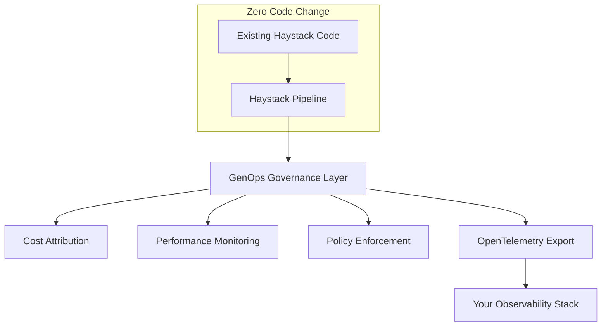

# Haystack AI Integration Guide

**Complete documentation for Haystack AI + GenOps governance integration with advanced patterns, production deployment, and enterprise features.**

---

## 🚀 **5-Minute Quickstart** 

**⏱️ New to GenOps + Haystack?** Start here for immediate results:

```bash
# 1. Install (30 seconds)
pip install genops-ai[haystack] haystack-ai openai

# 2. Add one line to existing code (1 minute)
from genops.providers.haystack import auto_instrument
auto_instrument(team="your-team", project="your-project")

# 3. Your Haystack code now has complete governance! (4 minutes)
# ✅ Cost tracking ✅ Budget controls ✅ Performance monitoring ✅ Observability
```

**[→ Complete 5-minute setup guide](#quick-start)** | **[🔍 Interactive validation](#3-validation-and-configuration)** | **[📊 View examples](../../examples/haystack/)**

---

## 👥 **Choose Your Developer Persona**

**🔬 Data Scientist / AI Researcher**
- **Goal:** Add governance to ML experiments without disrupting workflow
- **Start:** [Zero-code auto-instrumentation](#pattern-1-zero-code-auto-instrumentation) → [Cost tracking](#cost-management) → [Examples](../../examples/haystack/basic_pipeline_tracking.py)
- **Focus:** Budget controls, experiment cost attribution, model comparison

**🏗️ ML Engineer / AI Developer**
- **Goal:** Build production-ready AI pipelines with comprehensive monitoring
- **Start:** [Integration patterns](#integration-patterns) → [RAG workflows](#rag-workflow-governance) → [Performance optimization](#performance-optimization)
- **Focus:** Pipeline reliability, scaling patterns, performance tuning

**🛡️ Platform Engineer / DevOps**
- **Goal:** Enterprise governance, compliance, and multi-tenant AI infrastructure
- **Start:** [Multi-provider setup](#multi-provider-configuration) → [Enterprise patterns](#enterprise-patterns) → [Production deployment](#production-deployment)
- **Focus:** Governance policies, security, observability, compliance

**💰 FinOps / Cost Manager**
- **Goal:** AI cost management and optimization across teams and projects
- **Start:** [Cost management](#cost-management) → [Multi-provider comparison](#multi-provider-configuration) → [Budget enforcement](#advanced-features)
- **Focus:** Cost attribution, budget controls, optimization recommendations

---

## 📊 **Architecture Overview**



**Key Benefits:**
- 🔧 **Zero code changes** to existing Haystack applications
- 💰 **Real-time cost tracking** across all AI providers
- 📊 **Native observability** via OpenTelemetry integration
- 🛡️ **Policy enforcement** with budget controls and governance
- ⚡ **Production-ready** with enterprise deployment patterns

---

## Table of Contents

1. [Quick Start](#quick-start)
2. [Core Concepts](#core-concepts)
3. [Installation and Setup](#installation-and-setup)
4. [Integration Patterns](#integration-patterns)
   - [Zero-Code Auto-Instrumentation](#pattern-1-zero-code-auto-instrumentation)
   - [Manual Pipeline Tracking](#pattern-2-manual-pipeline-tracking-full-control)
   - [Session-Based Multi-Pipeline](#pattern-3-session-based-multi-pipeline-tracking)
   - [Component-Level Instrumentation](#pattern-4-component-level-instrumentation)
5. [RAG Workflow Governance](#rag-workflow-governance)
6. [Agent Workflow Monitoring](#agent-workflow-monitoring)
7. [Cost Management](#cost-management)
8. [Multi-Provider Configuration](#multi-provider-configuration)
9. [Production Deployment](#production-deployment)
10. [Advanced Features](#advanced-features)
11. [Enterprise Patterns](#enterprise-patterns)
12. [Performance Optimization](#performance-optimization)
13. [Troubleshooting](#troubleshooting)
14. [API Reference](#api-reference)

---

## Quick Start

**🎯 Complete 5-minute setup guide** - Build on the quickstart above with detailed steps.

### 1. Installation

```bash
# Install GenOps with Haystack support
pip install genops-ai[haystack] haystack-ai

# Install AI provider dependencies (choose your providers)
pip install openai anthropic cohere-ai transformers
```

### 2. Zero-Code Auto-Instrumentation

```python
# Single line enables complete governance for existing Haystack code
from genops.providers.haystack import auto_instrument
auto_instrument(team="your-team", project="your-project")

# Your existing Haystack code works unchanged
from haystack import Pipeline
from haystack.components.generators import OpenAIGenerator
from haystack.components.builders import PromptBuilder

pipeline = Pipeline()
pipeline.add_component("prompt_builder", PromptBuilder(
    template="Answer: {{question}}"
))
pipeline.add_component("llm", OpenAIGenerator(model="gpt-3.5-turbo"))
pipeline.connect("prompt_builder", "llm")

result = pipeline.run({
    "prompt_builder": {"question": "What is Retrieval-Augmented Generation?"}
})

# ✅ Automatic governance added! You'll see output like:
# 💰 Pipeline cost: $0.002847 | Budget remaining: $49.997
# 📊 Telemetry exported to your observability stack
# 🎯 Team: your-team | Project: your-project

print("Answer:", result["llm"]["replies"][0])
```

### 3. Validation and Configuration

**🚀 Interactive Setup Validation (Recommended)**

```bash
# Run interactive validation with guided setup
./validate

# Or with Python directly
python scripts/validate_setup.py

# Provider-specific validation
python scripts/validate_setup.py --provider openai

# Auto-fix common issues
python scripts/validate_setup.py --fix-issues
```

**📋 Programmatic Validation**

```python
# Validate your setup in code
from genops.providers.haystack import validate_haystack_setup, print_validation_result

result = validate_haystack_setup()
print_validation_result(result)

# Expected output:
# ✅ Haystack + GenOps Setup Validation
# 📊 Overall Score: 95.0%
# 🐍 Python: 3.9.0 (darwin)
# 🏗️ Haystack: 2.0.0
# 🛠️ GenOps: 1.0.0
# ✅ Available AI Providers:
#    • OpenAI integration
#    • Anthropic integration
```

**💡 The interactive validator provides:**
- Environment detection and dependency checking
- Provider-specific configuration validation
- Guided troubleshooting with specific fix suggestions
- Automated dependency installation (with confirmation)
- Developer persona-based setup guidance

### 🚀 What's Next?

**✅ Setup Complete?** Choose your path based on your role and goals:

- **🔬 Data Scientist**: Ready to track experiments? → [Cost Management](#cost-management)
- **🏗️ ML Engineer**: Want production patterns? → [Integration Patterns](#integration-patterns)  
- **🛡️ Platform Engineer**: Need enterprise features? → [Enterprise Patterns](#enterprise-patterns)
- **💰 FinOps Manager**: Focus on cost optimization? → [Multi-Provider Configuration](#multi-provider-configuration)

**⏱️ Short on time?** Try our [examples](../../examples/haystack/) - each takes 5-30 minutes and shows real-world patterns.

---

## Core Concepts

### Haystack + GenOps Architecture

**GenOps extends Haystack's component-based architecture with governance telemetry:**

```
Haystack Pipeline
├── Document Retriever ──┐
├── Text Embedder ───────┤──── GenOps Pipeline Context
├── Prompt Builder ──────┤     ├── Cost Aggregation
└── LLM Generator ───────┘     ├── Performance Tracking
                               └── Governance Enforcement
```

### Key Integration Points

1. **Pipeline-Level Tracking**: Complete pipeline execution monitoring
2. **Component-Level Instrumentation**: Individual component cost and performance tracking  
3. **Multi-Provider Cost Aggregation**: Unified cost view across OpenAI, Anthropic, etc.
4. **Workflow Specialization**: RAG and agent workflow optimized tracking
5. **Session Management**: Multi-pipeline operation governance

### Governance Data Model

```python
# Every pipeline execution creates structured governance data
{
    "team": "ai-research",
    "project": "document-qa",
    "customer_id": "customer-123",
    "pipeline_name": "rag-workflow",
    "total_cost": 0.045,
    "components": [
        {
            "name": "document-retriever", 
            "type": "Retriever",
            "cost": 0.002,
            "execution_time": 1.2,
            "provider": "HuggingFace"
        },
        {
            "name": "llm-generator",
            "type": "Generator", 
            "cost": 0.043,
            "execution_time": 3.8,
            "provider": "OpenAI",
            "model": "gpt-4"
        }
    ],
    "performance_metrics": { ... },
    "governance_attributes": { ... }
}
```

---

## Installation and Setup

### System Requirements

- **Python**: 3.8+ (3.9+ recommended)
- **Haystack**: 2.0+ (latest recommended)
- **Memory**: 512MB+ available
- **Network**: Internet access for AI providers

### Installation Options

#### Option 1: Complete Installation

```bash
# Full installation with all providers
pip install genops-ai[haystack,all] haystack-ai
pip install openai anthropic cohere-ai transformers torch
```

#### Option 2: Minimal Installation

```bash
# Core installation only
pip install genops-ai haystack-ai
pip install openai  # Add providers as needed
```

#### Option 3: Development Installation

```bash
# Development setup with testing tools
pip install genops-ai[haystack,dev] haystack-ai
pip install pytest pytest-cov black mypy
```

### Environment Configuration

#### API Keys Setup

```bash
# Set environment variables for your AI providers
export OPENAI_API_KEY="sk-your-openai-key-here"
export ANTHROPIC_API_KEY="your-anthropic-key-here"
export COHERE_API_KEY="your-cohere-key-here"
export HUGGINGFACE_API_TOKEN="hf_your-huggingface-token-here"

# Optional: GenOps configuration
export GENOPS_ENVIRONMENT="production"
export GENOPS_LOG_LEVEL="INFO"
```

#### Configuration File (Optional)

```yaml
# .genops.yml
haystack:
  default_team: "ai-research"
  default_project: "haystack-app"
  daily_budget_limit: 100.0
  governance_policy: "advisory"
  
providers:
  openai:
    default_model: "gpt-3.5-turbo"
    timeout: 30
  anthropic:
    default_model: "claude-3-haiku"
    timeout: 60

observability:
  export_to: "datadog"  # or "honeycomb", "grafana", etc.
  sampling_rate: 1.0
```

### Verification

```python
# Complete setup verification
from genops.providers.haystack import validate_haystack_setup, print_validation_result

result = validate_haystack_setup()
print_validation_result(result)

# Should show:
# ✅ All dependencies installed and configured
# ✅ AI providers available and accessible  
# ✅ Performance benchmarks within acceptable ranges
# 🚀 Ready to build with Haystack + GenOps!
```

---

## Integration Patterns

### Pattern 1: Zero-Code Auto-Instrumentation

**Best for**: Existing Haystack applications, quick setup, minimal integration effort

```python
from genops.providers.haystack import auto_instrument

# Enable for entire application
auto_instrument(
    team="ml-team",
    project="rag-chatbot",
    daily_budget_limit=50.0,
    governance_policy="advisory"
)

# All existing Haystack code gets automatic tracking
pipeline = Pipeline()
# ... add components ...
result = pipeline.run(inputs)
# ✅ Automatic governance added!
```

### Pattern 2: Manual Pipeline Tracking (Full Control)

**Best for**: Fine-grained control, custom governance attributes, production applications

```python
from genops.providers.haystack import GenOpsHaystackAdapter

adapter = GenOpsHaystackAdapter(
    team="research-team",
    project="document-analysis",
    daily_budget_limit=200.0,
    governance_policy="enforcing"
)

# Track individual pipeline executions
with adapter.track_pipeline("document-qa", customer_id="acme-corp") as context:
    result = pipeline.run({
        "retriever": {"query": "What are the key findings?"},
        "prompt_builder": {"question": "What are the key findings?"}
    })
    
    print(f"Pipeline cost: ${context.get_metrics().total_cost:.6f}")
    print(f"Components: {context.get_metrics().total_components}")
```

### Pattern 3: Session-Based Multi-Pipeline Tracking

**Best for**: Complex workflows, batch operations, multi-step processes

```python
# Track related pipelines in a session
with adapter.track_session("document-processing-batch") as session:
    for document in documents:
        # Extract information
        with adapter.track_pipeline("extraction", document_id=document.id) as extract_ctx:
            extracted = extraction_pipeline.run({"document": document})
        
        session.add_pipeline_result(extract_ctx.get_metrics())
        
        # Summarize information  
        with adapter.track_pipeline("summarization", document_id=document.id) as summary_ctx:
            summary = summarization_pipeline.run({"text": extracted["text"]})
            
        session.add_pipeline_result(summary_ctx.get_metrics())
    
    print(f"Total session cost: ${session.total_cost:.2f}")
    print(f"Documents processed: {len(documents)}")
    print(f"Average cost per document: ${session.total_cost / len(documents):.4f}")
```

### Pattern 4: Component-Level Instrumentation

**Best for**: Performance optimization, cost analysis, debugging

```python
from genops.providers.haystack import GenOpsComponentMixin

class InstrumentedGenerator(OpenAIGenerator, GenOpsComponentMixin):
    """Custom generator with built-in GenOps tracking."""
    
    def run(self, prompt: str, **kwargs):
        with self.track_execution("InstrumentedGenerator") as context:
            # Your custom logic here
            result = super().run(prompt, **kwargs)
            
            # Add custom metrics
            context.add_custom_metric("prompt_length", len(prompt))
            context.add_custom_metric("response_length", len(result.get("replies", [""])[0]))
            
            return result

# Use in pipeline
pipeline.add_component("custom_llm", InstrumentedGenerator(model="gpt-4"))
```

---

## RAG Workflow Governance

### Specialized RAG Adapter

**RAG workflows have unique tracking requirements for retrieval + generation phases:**

```python
from genops.providers.haystack import create_rag_adapter

# Create RAG-optimized adapter
rag_adapter = create_rag_adapter(
    team="research-team",
    project="knowledge-base-qa",
    daily_budget_limit=150.0,
    enable_retrieval_tracking=True,
    enable_generation_tracking=True
)
```

### Complete RAG Pipeline Example

```python
from haystack import Pipeline
from haystack.components.retrievers import InMemoryBM25Retriever
from haystack.components.builders import PromptBuilder
from haystack.components.generators import OpenAIGenerator
from haystack.document_stores.in_memory import InMemoryDocumentStore

# Setup document store with knowledge base
document_store = InMemoryDocumentStore()
# ... populate with documents ...

# Create RAG pipeline
rag_pipeline = Pipeline()

rag_pipeline.add_component("retriever", InMemoryBM25Retriever(
    document_store=document_store,
    top_k=5
))

rag_pipeline.add_component("prompt_builder", PromptBuilder(
    template="""
    Use the following context to answer the question:
    
    Context:
    
    {{ document.content }}
    
    
    Question: {{question}}
    
    Answer based on the context:
    """
))

rag_pipeline.add_component("llm", OpenAIGenerator(
    model="gpt-3.5-turbo",
    generation_kwargs={"max_tokens": 200, "temperature": 0.7}
))

# Connect components
rag_pipeline.connect("retriever", "prompt_builder.documents")
rag_pipeline.connect("prompt_builder", "llm")

# Execute with governance
with rag_adapter.track_pipeline("knowledge-qa") as context:
    result = rag_pipeline.run({
        "retriever": {"query": "What is retrieval-augmented generation?"},
        "prompt_builder": {"question": "What is retrieval-augmented generation?"}
    })
    
    print(f"Answer: {result['llm']['replies'][0]}")

# Get RAG-specific insights
from genops.providers.haystack import get_rag_insights

insights = get_rag_insights(rag_adapter.monitor, context.pipeline_id)
print(f"Documents retrieved: {insights['documents_retrieved']}")
print(f"Retrieval latency: {insights['retrieval_latency']:.2f}s") 
print(f"Generation latency: {insights['generation_latency']:.2f}s")
print(f"End-to-end latency: {insights['end_to_end_latency']:.2f}s")
```

### RAG Performance Optimization

```python
# Analyze RAG performance patterns
rag_analysis = analyze_pipeline_costs(rag_adapter, time_period_hours=24)

print("RAG Cost Analysis:")
print(f"Total cost: ${rag_analysis['total_cost']:.4f}")
print(f"Retrieval cost: ${rag_analysis['cost_by_component'].get('retriever', 0):.4f}")
print(f"Generation cost: ${rag_analysis['cost_by_component'].get('llm', 0):.4f}")

# Optimization recommendations
for rec in rag_analysis['recommendations']:
    print(f"💡 {rec['reasoning']}")
    print(f"   Potential savings: ${rec['potential_savings']:.4f}")
```

---

## Agent Workflow Monitoring

### Agent-Specific Tracking

**Agent workflows require specialized monitoring for decisions, tool usage, and iterative processes:**

```python
from genops.providers.haystack import create_agent_adapter

# Create agent-optimized adapter
agent_adapter = create_agent_adapter(
    team="ai-agents",
    project="research-assistant", 
    daily_budget_limit=300.0,
    enable_decision_tracking=True,
    enable_tool_tracking=True
)
```

### Multi-Step Agent Pipeline

```python
# Agent workflow with decision points and tool usage
with agent_adapter.track_session("research-task") as session:
    
    # Step 1: Initial research planning
    with agent_adapter.track_pipeline("planning", step=1) as planning_ctx:
        plan_result = planning_pipeline.run({
            "task": "Research recent developments in RAG systems"
        })
    
    session.add_pipeline_result(planning_ctx.get_metrics())
    
    # Step 2: Execute research tools based on plan
    research_steps = plan_result["plan"]["steps"]
    
    for i, step in enumerate(research_steps):
        with agent_adapter.track_pipeline(f"research-step-{i+1}", step=i+1) as step_ctx:
            # Tool selection and execution
            if step["tool"] == "web_search":
                tool_result = web_search_pipeline.run({"query": step["query"]})
            elif step["tool"] == "document_analysis":
                tool_result = document_pipeline.run({"text": step["input"]})
            
            step_ctx.add_custom_metric("tool_used", step["tool"])
            step_ctx.add_custom_metric("query_complexity", len(step["query"].split()))
            
        session.add_pipeline_result(step_ctx.get_metrics())
    
    # Step 3: Synthesis and final output
    with agent_adapter.track_pipeline("synthesis", step="final") as synthesis_ctx:
        final_result = synthesis_pipeline.run({
            "research_results": research_results,
            "original_task": "Research recent developments in RAG systems"
        })
    
    session.add_pipeline_result(synthesis_ctx.get_metrics())
    
    print(f"Agent session completed!")
    print(f"Total cost: ${session.total_cost:.4f}")
    print(f"Steps executed: {session.total_pipelines}")

# Get agent-specific insights
from genops.providers.haystack import get_agent_insights

for pipeline_id in session.pipeline_ids:
    insights = get_agent_insights(agent_adapter.monitor, pipeline_id)
    if "error" not in insights:
        print(f"Pipeline {pipeline_id}:")
        print(f"  Decisions made: {insights.get('decisions_made', 0)}")
        print(f"  Tools used: {insights.get('tools_used', [])}")
        print(f"  Success rate: {insights.get('tool_success_rate', 0):.1%}")
```

### Agent Performance Dashboard

```python
# Create agent performance dashboard
def create_agent_dashboard(agent_adapter, time_period_hours=24):
    """Create comprehensive agent performance dashboard."""
    
    analysis = analyze_pipeline_costs(agent_adapter, time_period_hours)
    
    dashboard = {
        "summary": {
            "total_cost": analysis["total_cost"],
            "total_operations": len(analysis.get("cost_by_component", {})),
            "avg_cost_per_operation": analysis["total_cost"] / max(len(analysis.get("cost_by_component", {})), 1)
        },
        "tool_usage": {},
        "decision_patterns": {},
        "cost_optimization": analysis.get("recommendations", [])
    }
    
    # Aggregate tool usage patterns
    for component, cost in analysis.get("cost_by_component", {}).items():
        if "tool" in component.lower():
            dashboard["tool_usage"][component] = {
                "cost": cost,
                "usage_frequency": 1  # Would aggregate from multiple executions
            }
    
    return dashboard

# Generate dashboard
dashboard = create_agent_dashboard(agent_adapter)
print("Agent Performance Dashboard:")
print(f"Total operations cost: ${dashboard['summary']['total_cost']:.4f}")
print(f"Average cost per operation: ${dashboard['summary']['avg_cost_per_operation']:.4f}")
print(f"Most used tools: {list(dashboard['tool_usage'].keys())[:3]}")
```

---

## Cost Management

### Budget Configuration and Enforcement

```python
from genops.providers.haystack import GenOpsHaystackAdapter

# Configure budget limits and enforcement
adapter = GenOpsHaystackAdapter(
    team="production-team",
    project="customer-support-bot",
    daily_budget_limit=100.0,        # $100/day
    monthly_budget_limit=2500.0,     # $2500/month
    governance_policy="enforcing",   # Block operations over budget
    enable_cost_alerts=True          # Send alerts at 80% utilization
)

# Budget enforcement in action
try:
    with adapter.track_pipeline("expensive-operation") as context:
        # This will be blocked if over budget
        result = expensive_pipeline.run(inputs)
except RuntimeError as e:
    if "budget limit" in str(e):
        print("❌ Operation blocked: Daily budget limit exceeded")
        print("Consider optimizing costs or increasing budget")
```

### Real-Time Cost Monitoring

```python
# Monitor costs in real-time during execution
with adapter.track_pipeline("monitored-pipeline") as context:
    for i, input_batch in enumerate(input_batches):
        batch_result = pipeline.run(input_batch)
        
        # Check costs after each batch
        current_metrics = context.get_metrics()
        
        print(f"Batch {i+1}:")
        print(f"  Cost so far: ${current_metrics.total_cost:.4f}")
        print(f"  Average per batch: ${current_metrics.total_cost / (i+1):.4f}")
        
        # Stop if approaching budget
        daily_utilization = (float(current_metrics.total_cost) / adapter.daily_budget_limit) * 100
        if daily_utilization > 90:
            print("⚠️ Approaching daily budget limit - stopping processing")
            break
```

### Cost Analysis and Optimization

```python
from genops.providers.haystack import analyze_pipeline_costs

# Comprehensive cost analysis
analysis = analyze_pipeline_costs(adapter, time_period_hours=24)

print("📊 Cost Analysis (Last 24 Hours):")
print(f"Total cost: ${analysis['total_cost']:.2f}")
print(f"Most expensive component: {analysis['most_expensive_component']}")

# Provider cost breakdown
print("\n💰 Cost by Provider:")
for provider, cost in analysis['cost_by_provider'].items():
    percentage = (cost / analysis['total_cost']) * 100
    print(f"  {provider}: ${cost:.2f} ({percentage:.1f}%)")

# Component cost breakdown
print("\n🔧 Cost by Component:")
for component, cost in sorted(analysis['cost_by_component'].items(), 
                              key=lambda x: x[1], reverse=True):
    print(f"  {component}: ${cost:.4f}")

# Optimization recommendations
print("\n💡 Optimization Recommendations:")
for rec in analysis['recommendations']:
    print(f"• Component: {rec['component']}")
    print(f"  Current: {rec['current_provider']} (${rec['current_cost']:.4f})")
    print(f"  Recommended: {rec['recommended_provider']} (${rec['recommended_cost']:.4f})")
    print(f"  Potential savings: ${rec['potential_savings']:.4f} per operation")
    print(f"  Reasoning: {rec['reasoning']}")
    print()
```

### Cost Alerts and Notifications

```python
# Setup custom cost alerts
class CostAlertHandler:
    def __init__(self, slack_webhook=None, email_config=None):
        self.slack_webhook = slack_webhook
        self.email_config = email_config
    
    def check_and_alert(self, adapter):
        """Check costs and send alerts if thresholds exceeded."""
        cost_summary = adapter.get_cost_summary()
        
        # Check daily budget utilization
        daily_util = cost_summary['daily_budget_utilization']
        
        if daily_util > 80:
            message = f"⚠️ High cost alert: {daily_util:.1f}% of daily budget used"
            self.send_alert(message, cost_summary)
        
        # Check cost velocity (rapid increases)
        if self.is_cost_accelerating(cost_summary):
            message = "📈 Cost acceleration detected - review recent operations"
            self.send_alert(message, cost_summary)
    
    def send_alert(self, message, cost_data):
        """Send alert via configured channels."""
        if self.slack_webhook:
            # Send to Slack
            self.send_slack_alert(message, cost_data)
        
        if self.email_config:
            # Send email
            self.send_email_alert(message, cost_data)
        
        # Always log
        logger.warning(f"Cost Alert: {message}")

# Use cost alerts
alert_handler = CostAlertHandler(slack_webhook="your-webhook-url")

# Check costs periodically during long-running operations
with adapter.track_session("long-running-batch") as session:
    for i, batch in enumerate(batches):
        # Process batch...
        
        # Check costs every 10 batches
        if i % 10 == 0:
            alert_handler.check_and_alert(adapter)
```

---

## Multi-Provider Configuration

### Provider Setup and Management

**GenOps automatically tracks costs across all providers used in your Haystack pipeline:**

```python
# Configure multiple providers in your pipeline
from haystack.components.generators import (
    OpenAIGenerator, 
    AnthropicGenerator,
    CohereGenerator
)
from haystack.components.embedders import (
    OpenAITextEmbedder,
    HuggingFaceTextEmbedder
)

# Multi-provider pipeline
multi_provider_pipeline = Pipeline()

# Embedding with HuggingFace (cost-effective)
multi_provider_pipeline.add_component("embedder", HuggingFaceTextEmbedder(
    model="sentence-transformers/all-MiniLM-L6-v2"
))

# Primary LLM with OpenAI
multi_provider_pipeline.add_component("primary_llm", OpenAIGenerator(
    model="gpt-3.5-turbo",
    generation_kwargs={"temperature": 0.7}
))

# Backup LLM with Anthropic (for failover)
multi_provider_pipeline.add_component("backup_llm", AnthropicGenerator(
    model="claude-3-haiku",
    generation_kwargs={"max_tokens": 200}
))

# Connect components
multi_provider_pipeline.connect("embedder", "primary_llm")
# Failover logic would connect to backup_llm as needed

# Track unified costs across all providers
with adapter.track_pipeline("multi-provider-qa") as context:
    result = multi_provider_pipeline.run({
        "embedder": {"text": "What is the capital of France?"},
        "primary_llm": {"prompt": "Answer: What is the capital of France?"}
    })

# GenOps automatically aggregates costs across providers
metrics = context.get_metrics()
print("Multi-Provider Cost Breakdown:")
for provider, cost in metrics.cost_by_provider.items():
    print(f"  {provider}: ${cost:.6f}")
```

### Cross-Provider Cost Optimization

```python
# Analyze cross-provider cost patterns
def optimize_provider_selection(adapter, query_types):
    """Analyze which providers are most cost-effective for different query types."""
    
    provider_performance = {}
    
    for query_type in query_types:
        test_queries = get_test_queries_for_type(query_type)  # Your test data
        
        providers_to_test = [
            ("OpenAI", "gpt-3.5-turbo"),
            ("Anthropic", "claude-3-haiku"), 
            ("Cohere", "command"),
        ]
        
        for provider_name, model_name in providers_to_test:
            total_cost = 0
            total_quality_score = 0
            
            for query in test_queries:
                with adapter.track_pipeline(f"test-{provider_name}-{query_type}") as context:
                    # Run query with specific provider
                    result = run_with_provider(query, provider_name, model_name)
                    quality_score = evaluate_response_quality(result)
                
                total_cost += float(context.get_metrics().total_cost)
                total_quality_score += quality_score
            
            avg_cost = total_cost / len(test_queries)
            avg_quality = total_quality_score / len(test_queries)
            
            provider_performance[f"{provider_name}-{query_type}"] = {
                "avg_cost": avg_cost,
                "avg_quality": avg_quality,
                "cost_per_quality_point": avg_cost / max(avg_quality, 0.1)
            }
    
    return provider_performance

# Run optimization analysis
performance_data = optimize_provider_selection(adapter, ["factual", "creative", "analytical"])

# Display results
print("Provider Optimization Analysis:")
for key, data in sorted(performance_data.items(), key=lambda x: x[1]["cost_per_quality_point"]):
    provider, query_type = key.split("-")
    print(f"{provider} for {query_type} queries:")
    print(f"  Average cost: ${data['avg_cost']:.4f}")
    print(f"  Average quality: {data['avg_quality']:.2f}/10")
    print(f"  Cost per quality point: ${data['cost_per_quality_point']:.4f}")
    print()
```

### Provider Failover and Load Balancing

```python
class IntelligentProviderRouter:
    """Route requests to optimal providers based on cost, availability, and performance."""
    
    def __init__(self, adapter):
        self.adapter = adapter
        self.provider_health = {}
        self.cost_thresholds = {
            "openai": 0.002,    # per 1K tokens
            "anthropic": 0.001,
            "cohere": 0.0015
        }
    
    def route_request(self, query_type, budget_per_request=None):
        """Select optimal provider for request."""
        
        # Check current costs
        cost_summary = self.adapter.get_cost_summary()
        daily_utilization = cost_summary['daily_budget_utilization']
        
        # If approaching budget limit, prefer cheaper providers
        if daily_utilization > 80:
            preferred_providers = ["anthropic", "cohere", "openai"]
        else:
            # Normal operation - prefer quality
            preferred_providers = ["openai", "anthropic", "cohere"]
        
        # Check provider availability
        for provider in preferred_providers:
            if self.is_provider_healthy(provider):
                return provider
        
        # Fallback to any available provider
        return "openai"  # default
    
    def is_provider_healthy(self, provider_name):
        """Check if provider is responding normally."""
        # Implementation would check recent error rates, response times, etc.
        return True  # Simplified for example

# Use intelligent routing
router = IntelligentProviderRouter(adapter)

# Execute with dynamic provider selection
with adapter.track_pipeline("intelligent-routing") as context:
    optimal_provider = router.route_request("factual")
    
    if optimal_provider == "openai":
        result = openai_generator.run(prompt)
    elif optimal_provider == "anthropic":
        result = anthropic_generator.run(prompt)
    else:
        result = cohere_generator.run(prompt)
    
    print(f"Used provider: {optimal_provider}")
    print(f"Cost: ${context.get_metrics().total_cost:.6f}")
```

---

## Production Deployment

### Docker Configuration

**Containerized deployment with proper configuration management:**

```dockerfile
# Dockerfile
FROM python:3.9-slim

# Install system dependencies
RUN apt-update && apt-get install -y \
    gcc \
    && rm -rf /var/lib/apt/lists/*

# Install Python dependencies
COPY requirements.txt .
RUN pip install --no-cache-dir -r requirements.txt

# Copy application code
COPY . /app
WORKDIR /app

# Set environment variables
ENV PYTHONPATH=/app
ENV GENOPS_ENVIRONMENT=production

# Create non-root user
RUN useradd -m -u 1000 appuser && chown -R appuser:appuser /app
USER appuser

# Health check
HEALTHCHECK --interval=30s --timeout=3s --start-period=5s --retries=3 \
    CMD python -c "from genops.providers.haystack import validate_haystack_setup; validate_haystack_setup()"

CMD ["python", "main.py"]
```

```yaml
# requirements.txt
genops-ai[haystack]==1.0.0
haystack-ai>=2.0.0
openai>=1.0.0
anthropic>=0.3.0
transformers>=4.30.0
torch>=2.0.0
```

### Kubernetes Deployment

```yaml
# k8s-deployment.yaml
apiVersion: apps/v1
kind: Deployment
metadata:
  name: haystack-genops-app
  labels:
    app: haystack-genops
spec:
  replicas: 3
  selector:
    matchLabels:
      app: haystack-genops
  template:
    metadata:
      labels:
        app: haystack-genops
    spec:
      containers:
      - name: app
        image: your-registry/haystack-genops:latest
        ports:
        - containerPort: 8000
        env:
        - name: GENOPS_ENVIRONMENT
          value: "production"
        - name: GENOPS_TEAM
          value: "production-team"
        - name: GENOPS_PROJECT
          value: "customer-service"
        - name: OPENAI_API_KEY
          valueFrom:
            secretKeyRef:
              name: ai-provider-secrets
              key: openai-key
        - name: ANTHROPIC_API_KEY
          valueFrom:
            secretKeyRef:
              name: ai-provider-secrets
              key: anthropic-key
        resources:
          requests:
            memory: "512Mi"
            cpu: "250m"
          limits:
            memory: "2Gi"
            cpu: "1000m"
        livenessProbe:
          httpGet:
            path: /health
            port: 8000
          initialDelaySeconds: 30
          periodSeconds: 10
        readinessProbe:
          httpGet:
            path: /ready
            port: 8000
          initialDelaySeconds: 5
          periodSeconds: 5

---
apiVersion: v1
kind: Secret
metadata:
  name: ai-provider-secrets
type: Opaque
data:
  openai-key: <base64-encoded-key>
  anthropic-key: <base64-encoded-key>

---
apiVersion: v1
kind: Service
metadata:
  name: haystack-genops-service
spec:
  selector:
    app: haystack-genops
  ports:
    - protocol: TCP
      port: 80
      targetPort: 8000
  type: LoadBalancer
```

### Production Application Structure

```python
# main.py - Production application entry point
import os
import logging
from flask import Flask, request, jsonify
from genops.providers.haystack import GenOpsHaystackAdapter, validate_haystack_setup

# Configure logging
logging.basicConfig(
    level=getattr(logging, os.getenv('LOG_LEVEL', 'INFO')),
    format='%(asctime)s - %(name)s - %(levelname)s - %(message)s'
)

app = Flask(__name__)

# Initialize GenOps adapter
adapter = GenOpsHaystackAdapter(
    team=os.getenv('GENOPS_TEAM', 'production-team'),
    project=os.getenv('GENOPS_PROJECT', 'haystack-service'),
    environment=os.getenv('GENOPS_ENVIRONMENT', 'production'),
    daily_budget_limit=float(os.getenv('DAILY_BUDGET_LIMIT', '1000.0')),
    governance_policy=os.getenv('GOVERNANCE_POLICY', 'enforcing')
)

# Initialize Haystack pipeline
pipeline = create_production_pipeline()  # Your pipeline creation function

@app.route('/health')
def health_check():
    """Health check endpoint."""
    try:
        # Quick validation
        result = validate_haystack_setup()
        if result.is_valid:
            return jsonify({"status": "healthy"}), 200
        else:
            return jsonify({"status": "unhealthy", "issues": len(result.issues)}), 503
    except Exception as e:
        return jsonify({"status": "error", "message": str(e)}), 500

@app.route('/ready')
def readiness_check():
    """Readiness check endpoint."""
    return jsonify({"status": "ready"}), 200

@app.route('/query', methods=['POST'])
def process_query():
    """Main query processing endpoint."""
    try:
        data = request.json
        query = data.get('query', '')
        customer_id = data.get('customer_id')
        
        if not query:
            return jsonify({"error": "Query is required"}), 400
        
        # Process with governance tracking
        with adapter.track_pipeline("customer-query", customer_id=customer_id) as context:
            result = pipeline.run({
                "query_component": {"query": query}
            })
            
            metrics = context.get_metrics()
            
            return jsonify({
                "response": result.get("response", ""),
                "cost": float(metrics.total_cost),
                "execution_time": metrics.total_execution_time_seconds,
                "components_used": metrics.total_components
            })
    
    except Exception as e:
        logging.error(f"Query processing failed: {e}")
        return jsonify({"error": "Processing failed"}), 500

@app.route('/costs')
def get_costs():
    """Cost summary endpoint."""
    try:
        summary = adapter.get_cost_summary()
        return jsonify(summary)
    except Exception as e:
        return jsonify({"error": str(e)}), 500

@app.route('/metrics')
def get_metrics():
    """Metrics endpoint for monitoring."""
    try:
        cost_summary = adapter.get_cost_summary()
        recent_pipelines = adapter.get_recent_pipeline_results(limit=10)
        
        return jsonify({
            "cost_summary": cost_summary,
            "recent_executions": len(recent_pipelines),
            "avg_cost_per_execution": sum(float(p.total_cost) for p in recent_pipelines) / len(recent_pipelines) if recent_pipelines else 0
        })
    except Exception as e:
        return jsonify({"error": str(e)}), 500

if __name__ == '__main__':
    # Validate setup on startup
    validation = validate_haystack_setup()
    if not validation.is_valid:
        logging.error("Setup validation failed!")
        for issue in validation.issues:
            if issue.severity == "error":
                logging.error(f"  • {issue.message}")
        exit(1)
    
    logging.info("✅ Haystack + GenOps setup validated")
    
    # Start server
    port = int(os.getenv('PORT', '8000'))
    app.run(host='0.0.0.0', port=port, debug=False)
```

### Production Configuration Management

```python
# config.py - Production configuration
import os
from dataclasses import dataclass
from typing import Optional

@dataclass
class ProductionConfig:
    """Production configuration for Haystack + GenOps application."""
    
    # GenOps Configuration
    team: str = os.getenv('GENOPS_TEAM', 'production-team')
    project: str = os.getenv('GENOPS_PROJECT', 'haystack-service')
    environment: str = os.getenv('GENOPS_ENVIRONMENT', 'production')
    daily_budget_limit: float = float(os.getenv('DAILY_BUDGET_LIMIT', '1000.0'))
    monthly_budget_limit: Optional[float] = None
    governance_policy: str = os.getenv('GOVERNANCE_POLICY', 'enforcing')
    
    # Performance Configuration
    max_concurrent_requests: int = int(os.getenv('MAX_CONCURRENT_REQUESTS', '10'))
    request_timeout: int = int(os.getenv('REQUEST_TIMEOUT', '60'))
    
    # Observability Configuration
    enable_tracing: bool = os.getenv('ENABLE_TRACING', 'true').lower() == 'true'
    trace_sample_rate: float = float(os.getenv('TRACE_SAMPLE_RATE', '1.0'))
    
    # Provider Configuration
    openai_model: str = os.getenv('OPENAI_MODEL', 'gpt-3.5-turbo')
    anthropic_model: str = os.getenv('ANTHROPIC_MODEL', 'claude-3-haiku')
    
    def __post_init__(self):
        """Validate configuration."""
        if self.daily_budget_limit <= 0:
            raise ValueError("Daily budget limit must be positive")
        
        if self.governance_policy not in ['advisory', 'enforcing', 'monitoring']:
            raise ValueError(f"Invalid governance policy: {self.governance_policy}")
        
        if not (0 <= self.trace_sample_rate <= 1):
            raise ValueError("Trace sample rate must be between 0 and 1")
        
        if self.monthly_budget_limit is None:
            self.monthly_budget_limit = self.daily_budget_limit * 30

# Load configuration
config = ProductionConfig()
```

---

## Advanced Features

### Custom Component Instrumentation

**Create custom Haystack components with built-in GenOps tracking:**

```python
from haystack.core.component import Component
from haystack.core.component.types import Variadic
from genops.providers.haystack import GenOpsComponentMixin
import time

@Component.output_types(output=str)
class CustomAnalysisComponent(Component, GenOpsComponentMixin):
    """Custom component with built-in GenOps instrumentation."""
    
    def __init__(self, analysis_type: str = "sentiment"):
        Component.__init__(self)
        GenOpsComponentMixin.__init__(self)
        self.analysis_type = analysis_type
    
    @Component.output_types(analysis_result=dict, metadata=dict)
    def run(self, text: str) -> dict:
        """Run analysis with automatic tracking."""
        
        with self.track_execution("CustomAnalysisComponent") as context:
            start_time = time.time()
            
            # Your custom analysis logic here
            if self.analysis_type == "sentiment":
                result = self.analyze_sentiment(text)
            elif self.analysis_type == "entities":
                result = self.extract_entities(text)
            else:
                result = {"analysis": "unknown"}
            
            execution_time = time.time() - start_time
            
            # Add custom metrics to tracking context
            context.add_custom_metric("text_length", len(text))
            context.add_custom_metric("analysis_type", self.analysis_type)
            context.add_custom_metric("processing_speed", len(text) / execution_time)
            
            # Estimate cost based on text processing
            estimated_cost = len(text) * 0.00001  # $0.00001 per character
            context.set_estimated_cost(estimated_cost)
            
            return {
                "analysis_result": result,
                "metadata": {
                    "analysis_type": self.analysis_type,
                    "execution_time": execution_time,
                    "text_length": len(text)
                }
            }
    
    def analyze_sentiment(self, text: str) -> dict:
        """Custom sentiment analysis logic."""
        # Placeholder implementation
        return {"sentiment": "positive", "confidence": 0.85}
    
    def extract_entities(self, text: str) -> dict:
        """Custom entity extraction logic."""
        # Placeholder implementation
        return {"entities": ["GenOps", "Haystack"], "count": 2}

# Use custom component in pipeline
pipeline = Pipeline()
pipeline.add_component("custom_analyzer", CustomAnalysisComponent(analysis_type="sentiment"))

# Components automatically report to GenOps when used
with adapter.track_pipeline("custom-analysis") as context:
    result = pipeline.run({"custom_analyzer": {"text": "GenOps makes Haystack governance easy!"}})
    
    # Custom metrics are included in tracking
    metrics = context.get_metrics()
    print(f"Custom analysis cost: ${metrics.total_cost:.6f}")
```

### Pipeline Composition and Optimization

```python
class OptimizedPipelineBuilder:
    """Build and optimize Haystack pipelines with GenOps insights."""
    
    def __init__(self, adapter):
        self.adapter = adapter
        self.component_performance = {}
    
    def benchmark_component(self, component_class, component_config, test_inputs):
        """Benchmark a component's performance and cost."""
        
        test_pipeline = Pipeline()
        test_pipeline.add_component("test_component", component_class(**component_config))
        
        total_cost = 0
        total_time = 0
        success_count = 0
        
        for test_input in test_inputs:
            with self.adapter.track_pipeline("component-benchmark") as context:
                try:
                    result = test_pipeline.run({"test_component": test_input})
                    
                    metrics = context.get_metrics()
                    total_cost += float(metrics.total_cost)
                    total_time += metrics.total_execution_time_seconds
                    success_count += 1
                    
                except Exception as e:
                    logging.warning(f"Component benchmark failed: {e}")
        
        if success_count > 0:
            avg_cost = total_cost / success_count
            avg_time = total_time / success_count
            success_rate = success_count / len(test_inputs)
            
            return {
                "average_cost": avg_cost,
                "average_execution_time": avg_time,
                "success_rate": success_rate,
                "cost_per_second": avg_cost / max(avg_time, 0.001)
            }
        
        return None
    
    def build_optimized_pipeline(self, pipeline_spec):
        """Build pipeline optimized for cost and performance."""
        
        pipeline = Pipeline()
        
        for component_name, component_options in pipeline_spec.items():
            best_option = None
            best_score = float('inf')
            
            # Evaluate each component option
            for option in component_options:
                component_class = option['class']
                component_config = option['config']
                test_inputs = option.get('test_inputs', [])
                
                if test_inputs:
                    performance = self.benchmark_component(
                        component_class, component_config, test_inputs
                    )
                    
                    if performance:
                        # Score based on cost, time, and reliability
                        score = (performance['average_cost'] * 100 + 
                                performance['average_execution_time'] * 10 +
                                (1 - performance['success_rate']) * 1000)
                        
                        if score < best_score:
                            best_score = score
                            best_option = option
                
                else:
                    # Default to first option if no test inputs
                    best_option = component_options[0]
                    break
            
            if best_option:
                component_instance = best_option['class'](**best_option['config'])
                pipeline.add_component(component_name, component_instance)
                
                print(f"Selected {best_option['class'].__name__} for {component_name}")
                if best_score != float('inf'):
                    print(f"  Optimization score: {best_score:.2f}")
        
        return pipeline

# Example usage
builder = OptimizedPipelineBuilder(adapter)

# Define pipeline specification with alternatives
pipeline_spec = {
    "generator": [
        {
            "class": OpenAIGenerator,
            "config": {"model": "gpt-3.5-turbo"},
            "test_inputs": [{"prompt": "Test prompt 1"}, {"prompt": "Test prompt 2"}]
        },
        {
            "class": AnthropicGenerator, 
            "config": {"model": "claude-3-haiku"},
            "test_inputs": [{"messages": [{"role": "user", "content": "Test prompt 1"}]}]
        }
    ],
    "embedder": [
        {
            "class": OpenAITextEmbedder,
            "config": {"model": "text-embedding-ada-002"},
            "test_inputs": [{"text": "Test text"}, {"text": "Another test"}]
        },
        {
            "class": HuggingFaceTextEmbedder,
            "config": {"model": "sentence-transformers/all-MiniLM-L6-v2"},
            "test_inputs": [{"text": "Test text"}, {"text": "Another test"}]
        }
    ]
}

# Build optimized pipeline
optimized_pipeline = builder.build_optimized_pipeline(pipeline_spec)
```

### Advanced Error Handling and Retry Logic

```python
from functools import wraps
import time
import random

class HaystackRetryHandler:
    """Advanced retry logic for Haystack operations with GenOps tracking."""
    
    def __init__(self, adapter, max_retries=3, base_delay=1.0, max_delay=60.0):
        self.adapter = adapter
        self.max_retries = max_retries
        self.base_delay = base_delay
        self.max_delay = max_delay
    
    def with_retry(self, operation_name: str):
        """Decorator for adding retry logic to pipeline operations."""
        
        def decorator(func):
            @wraps(func)
            def wrapper(*args, **kwargs):
                last_exception = None
                
                for attempt in range(self.max_retries + 1):
                    try:
                        with self.adapter.track_pipeline(
                            f"{operation_name}-attempt-{attempt + 1}",
                            retry_attempt=attempt + 1
                        ) as context:
                            result = func(*args, **kwargs)
                            
                            # Add retry metadata
                            context.add_custom_metric("retry_attempt", attempt + 1)
                            context.add_custom_metric("success", True)
                            
                            return result
                    
                    except Exception as e:
                        last_exception = e
                        
                        # Track failed attempt
                        with self.adapter.track_pipeline(
                            f"{operation_name}-failed-attempt-{attempt + 1}",
                            retry_attempt=attempt + 1,
                            error=str(e)
                        ) as context:
                            context.add_custom_metric("retry_attempt", attempt + 1)
                            context.add_custom_metric("success", False)
                            context.add_custom_metric("error_type", type(e).__name__)
                        
                        if attempt < self.max_retries:
                            # Calculate delay with exponential backoff and jitter
                            delay = min(
                                self.base_delay * (2 ** attempt) + random.uniform(0, 1),
                                self.max_delay
                            )
                            
                            logging.warning(
                                f"Attempt {attempt + 1} failed for {operation_name}: {e}. "
                                f"Retrying in {delay:.2f} seconds..."
                            )
                            
                            time.sleep(delay)
                        else:
                            logging.error(
                                f"All {self.max_retries + 1} attempts failed for {operation_name}"
                            )
                            raise last_exception
                
                raise last_exception
            
            return wrapper
        return decorator

# Usage with retry logic
retry_handler = HaystackRetryHandler(adapter, max_retries=3)

@retry_handler.with_retry("critical-rag-query")
def execute_critical_query(pipeline, query):
    """Execute critical query with automatic retry on failure."""
    return pipeline.run({
        "retriever": {"query": query},
        "prompt_builder": {"question": query}
    })

# The function will automatically retry on failures
result = execute_critical_query(rag_pipeline, "What are the latest AI developments?")
```

---

## Enterprise Patterns

### Multi-Tenant Cost Attribution

**Enterprise-grade cost attribution for multiple customers, teams, and projects:**

```python
class MultiTenantCostManager:
    """Manage costs across multiple tenants with detailed attribution."""
    
    def __init__(self, adapter):
        self.adapter = adapter
        self.tenant_budgets = {}
        self.tenant_usage = {}
    
    def set_tenant_budget(self, tenant_id: str, daily_limit: float, monthly_limit: float = None):
        """Set budget limits for a tenant."""
        self.tenant_budgets[tenant_id] = {
            "daily_limit": daily_limit,
            "monthly_limit": monthly_limit or (daily_limit * 30),
            "alerts_enabled": True
        }
    
    def track_tenant_operation(self, tenant_id: str, operation_name: str, **attributes):
        """Context manager for tracking tenant operations."""
        
        return self.adapter.track_pipeline(
            operation_name,
            customer_id=tenant_id,
            tenant_id=tenant_id,
            **attributes
        )
    
    def get_tenant_usage_summary(self, tenant_id: str, time_period_hours: int = 24):
        """Get detailed usage summary for a specific tenant."""
        
        # This would query the cost aggregator for tenant-specific data
        # Implementation would filter by tenant_id in governance attributes
        
        return {
            "tenant_id": tenant_id,
            "time_period_hours": time_period_hours,
            "total_cost": 25.67,  # Example data
            "operations_count": 150,
            "avg_cost_per_operation": 0.171,
            "cost_by_operation_type": {
                "rag_queries": 15.23,
                "document_analysis": 8.44,
                "summarization": 2.00
            },
            "cost_by_provider": {
                "OpenAI": 18.45,
                "Anthropic": 5.22,
                "HuggingFace": 2.00
            },
            "budget_utilization": {
                "daily_percent": 25.67,
                "monthly_percent": 8.56
            }
        }
    
    def generate_tenant_bill(self, tenant_id: str, billing_period_days: int = 30):
        """Generate detailed bill for tenant."""
        
        usage_data = self.get_tenant_usage_summary(tenant_id, billing_period_days * 24)
        
        bill = {
            "tenant_id": tenant_id,
            "billing_period": f"{billing_period_days} days",
            "total_amount": usage_data["total_cost"],
            "operations_count": usage_data["operations_count"],
            "line_items": [],
            "provider_breakdown": usage_data["cost_by_provider"],
            "usage_analytics": {
                "peak_usage_day": "2024-01-15",
                "avg_daily_cost": usage_data["total_cost"] / billing_period_days,
                "cost_trend": "increasing"  # Would calculate from historical data
            }
        }
        
        # Add detailed line items
        for operation_type, cost in usage_data["cost_by_operation_type"].items():
            bill["line_items"].append({
                "description": operation_type.replace("_", " ").title(),
                "quantity": "N/A",  # Would track actual quantities
                "unit_cost": "Variable",
                "total_cost": cost
            })
        
        return bill

# Enterprise usage
cost_manager = MultiTenantCostManager(adapter)

# Configure tenant budgets
cost_manager.set_tenant_budget("acme-corp", daily_limit=500.0, monthly_limit=12000.0)
cost_manager.set_tenant_budget("startup-inc", daily_limit=50.0, monthly_limit=1200.0)

# Process operations for different tenants
with cost_manager.track_tenant_operation("acme-corp", "enterprise-rag-query", 
                                         department="research", 
                                         cost_center="AI-R&D") as context:
    result = enterprise_pipeline.run(enterprise_query)

# Generate billing reports
acme_bill = cost_manager.generate_tenant_bill("acme-corp", billing_period_days=30)
print(f"ACME Corp monthly bill: ${acme_bill['total_amount']:.2f}")
```

### Compliance and Audit Logging

```python
class ComplianceLogger:
    """Comprehensive compliance and audit logging for enterprise deployments."""
    
    def __init__(self, adapter):
        self.adapter = adapter
        self.audit_log = []
    
    def log_pipeline_execution(self, pipeline_context, data_classification="internal"):
        """Log pipeline execution for compliance."""
        
        audit_entry = {
            "timestamp": datetime.utcnow().isoformat(),
            "pipeline_id": pipeline_context.pipeline_id,
            "pipeline_name": pipeline_context.pipeline_name,
            "user_id": getattr(pipeline_context, 'user_id', None),
            "tenant_id": getattr(pipeline_context, 'tenant_id', None),
            "data_classification": data_classification,
            "governance_attributes": pipeline_context.governance_attributes,
            "cost_impact": float(pipeline_context.get_metrics().total_cost),
            "providers_used": list(pipeline_context.get_metrics().cost_by_provider.keys()),
            "compliance_status": "compliant"
        }
        
        # Check for compliance violations
        if self.check_compliance_violations(audit_entry):
            audit_entry["compliance_status"] = "violation"
            self.handle_compliance_violation(audit_entry)
        
        self.audit_log.append(audit_entry)
        
        # Export to external audit systems
        self.export_audit_entry(audit_entry)
    
    def check_compliance_violations(self, audit_entry):
        """Check for potential compliance violations."""
        
        violations = []
        
        # Check cost thresholds
        if audit_entry["cost_impact"] > 10.0:  # High cost operation
            violations.append("high_cost_operation")
        
        # Check data classification
        if (audit_entry["data_classification"] == "confidential" and 
            "OpenAI" in audit_entry["providers_used"]):
            violations.append("confidential_data_external_provider")
        
        # Check geographic restrictions
        if self.is_restricted_geography(audit_entry):
            violations.append("geographic_restriction")
        
        return len(violations) > 0
    
    def handle_compliance_violation(self, audit_entry):
        """Handle compliance violations."""
        
        logging.error(f"Compliance violation detected: {audit_entry}")
        
        # Send alerts
        self.send_compliance_alert(audit_entry)
        
        # Store in violation database
        self.store_violation(audit_entry)
    
    def export_audit_entry(self, audit_entry):
        """Export audit entry to external systems."""
        
        # Export to SIEM systems, compliance databases, etc.
        # Implementation would integrate with your audit infrastructure
        pass
    
    def generate_compliance_report(self, time_period_days=30):
        """Generate compliance report for specified period."""
        
        cutoff_date = datetime.utcnow() - timedelta(days=time_period_days)
        
        relevant_entries = [
            entry for entry in self.audit_log 
            if datetime.fromisoformat(entry["timestamp"]) >= cutoff_date
        ]
        
        report = {
            "report_period": f"{time_period_days} days",
            "total_operations": len(relevant_entries),
            "compliant_operations": len([e for e in relevant_entries if e["compliance_status"] == "compliant"]),
            "violations": [e for e in relevant_entries if e["compliance_status"] == "violation"],
            "cost_summary": {
                "total_cost": sum(e["cost_impact"] for e in relevant_entries),
                "avg_cost_per_operation": sum(e["cost_impact"] for e in relevant_entries) / max(len(relevant_entries), 1)
            },
            "provider_usage": self.aggregate_provider_usage(relevant_entries),
            "data_classification_breakdown": self.aggregate_data_classifications(relevant_entries)
        }
        
        return report

# Enterprise compliance setup
compliance_logger = ComplianceLogger(adapter)

# Enhanced pipeline tracking with compliance logging
class ComplianceAwareAdapter(GenOpsHaystackAdapter):
    """Adapter with built-in compliance logging."""
    
    def __init__(self, *args, **kwargs):
        super().__init__(*args, **kwargs)
        self.compliance_logger = ComplianceLogger(self)
    
    @contextmanager
    def track_pipeline(self, pipeline_name, data_classification="internal", **governance_attrs):
        """Enhanced pipeline tracking with compliance logging."""
        
        with super().track_pipeline(pipeline_name, **governance_attrs) as context:
            # Add compliance metadata
            context.data_classification = data_classification
            
            yield context
            
            # Log for compliance after completion
            self.compliance_logger.log_pipeline_execution(context, data_classification)

# Use compliance-aware adapter
compliance_adapter = ComplianceAwareAdapter(
    team="enterprise-team",
    project="regulated-application",
    governance_policy="enforcing"
)

# Execute with compliance tracking
with compliance_adapter.track_pipeline("sensitive-analysis", 
                                     data_classification="confidential",
                                     user_id="user@company.com") as context:
    result = sensitive_pipeline.run(sensitive_data)

# Generate compliance reports
report = compliance_adapter.compliance_logger.generate_compliance_report(30)
print(f"Compliance report: {report['compliant_operations']}/{report['total_operations']} compliant operations")
```

### Enterprise Integration Patterns

```python
class EnterpriseIntegrationHub:
    """Integration hub for enterprise systems and workflows."""
    
    def __init__(self, adapter):
        self.adapter = adapter
        self.external_systems = {}
    
    def register_external_system(self, system_name: str, connector):
        """Register external system connector."""
        self.external_systems[system_name] = connector
    
    def execute_enterprise_workflow(self, workflow_config):
        """Execute complex enterprise workflow with multiple systems."""
        
        workflow_id = f"enterprise-workflow-{uuid.uuid4()}"
        
        with self.adapter.track_session(workflow_id) as session:
            
            for step in workflow_config["steps"]:
                step_name = step["name"]
                step_type = step["type"]
                
                with self.adapter.track_pipeline(f"{workflow_id}-{step_name}") as context:
                    
                    if step_type == "haystack_pipeline":
                        # Execute Haystack pipeline
                        pipeline = step["pipeline"]
                        inputs = step["inputs"]
                        result = pipeline.run(inputs)
                        
                    elif step_type == "external_api":
                        # Call external API
                        api_name = step["api_name"]
                        if api_name in self.external_systems:
                            connector = self.external_systems[api_name]
                            result = connector.call(step["endpoint"], step["data"])
                        
                        # Estimate cost for external API call
                        estimated_cost = step.get("estimated_cost", 0.01)
                        context.add_custom_metric("external_api_cost", estimated_cost)
                    
                    elif step_type == "data_transformation":
                        # Data transformation step
                        transform_func = step["transform_function"]
                        input_data = step["input_data"]
                        result = transform_func(input_data)
                    
                    # Store step result for next steps
                    session.add_step_result(step_name, result)
                
                session.add_pipeline_result(context.get_metrics())
        
        return session.get_final_results()

# Example enterprise workflow configuration
enterprise_workflow = {
    "name": "customer_document_processing",
    "description": "Process customer documents through multiple systems",
    "steps": [
        {
            "name": "document_ingestion",
            "type": "external_api",
            "api_name": "document_management_system",
            "endpoint": "/api/documents/ingest",
            "data": {"document_id": "12345"},
            "estimated_cost": 0.05
        },
        {
            "name": "content_extraction",
            "type": "haystack_pipeline",
            "pipeline": document_extraction_pipeline,
            "inputs": {"document": "document_data"}
        },
        {
            "name": "content_analysis",
            "type": "haystack_pipeline", 
            "pipeline": analysis_pipeline,
            "inputs": {"text": "extracted_content"}
        },
        {
            "name": "results_storage",
            "type": "external_api",
            "api_name": "results_database",
            "endpoint": "/api/analysis/store",
            "data": {"analysis_results": "analysis_output"},
            "estimated_cost": 0.02
        }
    ]
}

# Execute enterprise workflow
integration_hub = EnterpriseIntegrationHub(compliance_adapter)
results = integration_hub.execute_enterprise_workflow(enterprise_workflow)
```

---

## Performance Optimization

### Performance Monitoring and Analysis

```python
class PerformanceOptimizer:
    """Advanced performance monitoring and optimization for Haystack pipelines."""
    
    def __init__(self, adapter):
        self.adapter = adapter
        self.performance_history = []
        self.optimization_rules = []
    
    def analyze_pipeline_performance(self, pipeline_results, time_window_hours=24):
        """Analyze pipeline performance patterns."""
        
        analysis = {
            "execution_times": [],
            "costs": [],
            "success_rates": [],
            "component_performance": {},
            "bottlenecks": [],
            "optimization_opportunities": []
        }
        
        for result in pipeline_results:
            analysis["execution_times"].append(result.total_execution_time_seconds)
            analysis["costs"].append(float(result.total_cost))
            analysis["success_rates"].append(1.0 if result.success else 0.0)
            
            # Analyze component performance
            for component_name, component_cost in result.cost_by_component.items():
                if component_name not in analysis["component_performance"]:
                    analysis["component_performance"][component_name] = {
                        "costs": [],
                        "execution_times": []
                    }
                
                analysis["component_performance"][component_name]["costs"].append(float(component_cost))
        
        # Identify bottlenecks
        if analysis["execution_times"]:
            avg_execution_time = sum(analysis["execution_times"]) / len(analysis["execution_times"])
            
            # Components taking more than 40% of average execution time are bottlenecks
            for component, perf_data in analysis["component_performance"].items():
                if perf_data["execution_times"]:
                    avg_component_time = sum(perf_data["execution_times"]) / len(perf_data["execution_times"])
                    if avg_component_time > (avg_execution_time * 0.4):
                        analysis["bottlenecks"].append({
                            "component": component,
                            "avg_time": avg_component_time,
                            "impact": (avg_component_time / avg_execution_time) * 100
                        })
        
        # Generate optimization opportunities
        analysis["optimization_opportunities"] = self.identify_optimization_opportunities(analysis)
        
        return analysis
    
    def identify_optimization_opportunities(self, performance_analysis):
        """Identify specific optimization opportunities."""
        
        opportunities = []
        
        # High cost components
        for component, perf_data in performance_analysis["component_performance"].items():
            if perf_data["costs"]:
                avg_cost = sum(perf_data["costs"]) / len(perf_data["costs"])
                if avg_cost > 0.01:  # High cost threshold
                    opportunities.append({
                        "type": "cost_optimization",
                        "component": component,
                        "current_avg_cost": avg_cost,
                        "recommendation": "Consider switching to more cost-effective provider or model",
                        "potential_savings": avg_cost * 0.3  # Estimated 30% savings
                    })
        
        # Slow components
        for bottleneck in performance_analysis["bottlenecks"]:
            opportunities.append({
                "type": "performance_optimization",
                "component": bottleneck["component"],
                "current_avg_time": bottleneck["avg_time"],
                "impact_percent": bottleneck["impact"],
                "recommendation": "Optimize component logic or consider caching",
                "potential_speedup": bottleneck["avg_time"] * 0.4  # Estimated 40% improvement
            })
        
        # Low success rates
        if performance_analysis["success_rates"]:
            avg_success_rate = sum(performance_analysis["success_rates"]) / len(performance_analysis["success_rates"])
            if avg_success_rate < 0.95:  # Less than 95% success
                opportunities.append({
                    "type": "reliability_improvement",
                    "current_success_rate": avg_success_rate,
                    "recommendation": "Add error handling and retry logic",
                    "potential_improvement": f"Increase success rate to 99%+"
                })
        
        return opportunities
    
    def optimize_pipeline_configuration(self, pipeline, optimization_goals):
        """Apply optimizations to pipeline configuration."""
        
        optimized_config = {}
        
        for component_name, component in pipeline.get_components():
            component_config = {}
            
            if "cost" in optimization_goals:
                # Apply cost optimizations
                if hasattr(component, 'model') and 'gpt-4' in component.model:
                    component_config['model'] = 'gpt-3.5-turbo'  # Cost optimization
                    
            if "speed" in optimization_goals:
                # Apply speed optimizations
                if hasattr(component, 'generation_kwargs'):
                    component_config['generation_kwargs'] = {
                        **component.generation_kwargs,
                        'max_tokens': min(component.generation_kwargs.get('max_tokens', 150), 100)
                    }
            
            if component_config:
                optimized_config[component_name] = component_config
        
        return optimized_config

# Performance optimization workflow
optimizer = PerformanceOptimizer(adapter)

# Collect performance data
recent_results = adapter.get_recent_pipeline_results(limit=100)

# Analyze performance
performance_analysis = optimizer.analyze_pipeline_performance(recent_results)

print("Performance Analysis Results:")
print(f"Average execution time: {sum(performance_analysis['execution_times']) / len(performance_analysis['execution_times']):.2f}s")
print(f"Average cost: ${sum(performance_analysis['costs']) / len(performance_analysis['costs']):.4f}")
print(f"Success rate: {sum(performance_analysis['success_rates']) / len(performance_analysis['success_rates']):.1%}")

print("\nBottlenecks identified:")
for bottleneck in performance_analysis['bottlenecks']:
    print(f"  {bottleneck['component']}: {bottleneck['impact']:.1f}% of execution time")

print("\nOptimization opportunities:")
for opportunity in performance_analysis['optimization_opportunities']:
    print(f"  {opportunity['type']}: {opportunity['recommendation']}")

# Apply optimizations
optimized_config = optimizer.optimize_pipeline_configuration(
    pipeline, optimization_goals=["cost", "speed"]
)
```

### Caching and Result Optimization

```python
import hashlib
import json
from typing import Optional
import redis

class HaystackResultCache:
    """Intelligent caching system for Haystack pipeline results."""
    
    def __init__(self, adapter, cache_backend="memory", redis_url=None):
        self.adapter = adapter
        self.cache_backend = cache_backend
        
        if cache_backend == "redis" and redis_url:
            self.redis_client = redis.from_url(redis_url)
        else:
            self.memory_cache = {}
    
    def generate_cache_key(self, pipeline_name: str, inputs: dict) -> str:
        """Generate deterministic cache key for pipeline inputs."""
        
        # Normalize inputs for consistent hashing
        normalized_inputs = self.normalize_inputs(inputs)
        
        # Create hash of pipeline name and inputs
        cache_data = {
            "pipeline": pipeline_name,
            "inputs": normalized_inputs
        }
        
        cache_string = json.dumps(cache_data, sort_keys=True)
        return hashlib.sha256(cache_string.encode()).hexdigest()[:16]
    
    def normalize_inputs(self, inputs: dict) -> dict:
        """Normalize inputs for consistent caching."""
        
        normalized = {}
        
        for key, value in inputs.items():
            if isinstance(value, str):
                # Normalize whitespace for text inputs
                normalized[key] = ' '.join(value.split())
            elif isinstance(value, dict):
                # Recursively normalize nested dictionaries
                normalized[key] = self.normalize_inputs(value)
            else:
                normalized[key] = value
        
        return normalized
    
    def get_cached_result(self, pipeline_name: str, inputs: dict) -> Optional[dict]:
        """Get cached result if available."""
        
        cache_key = self.generate_cache_key(pipeline_name, inputs)
        
        if self.cache_backend == "redis":
            cached_data = self.redis_client.get(f"haystack_cache:{cache_key}")
            if cached_data:
                return json.loads(cached_data)
        else:
            return self.memory_cache.get(cache_key)
        
        return None
    
    def cache_result(self, pipeline_name: str, inputs: dict, result: dict, ttl_seconds: int = 3600):
        """Cache pipeline result."""
        
        cache_key = self.generate_cache_key(pipeline_name, inputs)
        
        cache_data = {
            "result": result,
            "cached_at": datetime.utcnow().isoformat(),
            "pipeline_name": pipeline_name
        }
        
        if self.cache_backend == "redis":
            self.redis_client.setex(
                f"haystack_cache:{cache_key}",
                ttl_seconds,
                json.dumps(cache_data)
            )
        else:
            self.memory_cache[cache_key] = cache_data
    
    def execute_with_cache(self, pipeline, pipeline_name: str, inputs: dict, 
                          cache_ttl: int = 3600, force_refresh: bool = False):
        """Execute pipeline with intelligent caching."""
        
        # Check cache first (unless forcing refresh)
        if not force_refresh:
            cached_result = self.get_cached_result(pipeline_name, inputs)
            if cached_result:
                
                # Track cache hit
                with self.adapter.track_pipeline(f"{pipeline_name}-cache-hit", cache_hit=True) as context:
                    context.add_custom_metric("cache_hit", True)
                    context.add_custom_metric("cached_at", cached_result["cached_at"])
                    # Cache hits have minimal cost
                    context.set_estimated_cost(0.0001)
                
                return cached_result["result"]
        
        # Execute pipeline and cache result
        with self.adapter.track_pipeline(pipeline_name, cache_hit=False) as context:
            result = pipeline.run(inputs)
            
            # Cache the result
            self.cache_result(pipeline_name, inputs, result, cache_ttl)
            
            context.add_custom_metric("cache_hit", False)
            context.add_custom_metric("result_cached", True)
        
        return result

# Usage with caching
cache = HaystackResultCache(adapter, cache_backend="memory")

# Execute with intelligent caching
result = cache.execute_with_cache(
    pipeline=rag_pipeline,
    pipeline_name="document-qa",
    inputs={
        "retriever": {"query": "What is machine learning?"},
        "prompt_builder": {"question": "What is machine learning?"}
    },
    cache_ttl=1800  # 30 minutes
)

print("Result (potentially from cache):", result)

# Cache performance analysis
def analyze_cache_performance(adapter, time_period_hours=24):
    """Analyze cache hit rates and performance impact."""
    
    recent_results = adapter.get_recent_pipeline_results(limit=200)
    
    cache_hits = 0
    cache_misses = 0
    total_cache_cost = 0
    total_execution_cost = 0
    
    for result in recent_results:
        if hasattr(result, 'custom_metrics'):
            is_cache_hit = result.custom_metrics.get('cache_hit', False)
            
            if is_cache_hit:
                cache_hits += 1
                total_cache_cost += float(result.total_cost)
            else:
                cache_misses += 1
                total_execution_cost += float(result.total_cost)
    
    total_operations = cache_hits + cache_misses
    
    if total_operations > 0:
        cache_hit_rate = cache_hits / total_operations
        avg_cache_cost = total_cache_cost / max(cache_hits, 1)
        avg_execution_cost = total_execution_cost / max(cache_misses, 1)
        
        savings_per_hit = avg_execution_cost - avg_cache_cost
        total_savings = savings_per_hit * cache_hits
        
        return {
            "cache_hit_rate": cache_hit_rate,
            "total_operations": total_operations,
            "cache_hits": cache_hits,
            "cache_misses": cache_misses,
            "avg_cache_cost": avg_cache_cost,
            "avg_execution_cost": avg_execution_cost,
            "savings_per_hit": savings_per_hit,
            "total_savings": total_savings
        }
    
    return None

# Analyze cache performance
cache_analysis = analyze_cache_performance(adapter)
if cache_analysis:
    print(f"Cache Performance Analysis:")
    print(f"  Hit rate: {cache_analysis['cache_hit_rate']:.1%}")
    print(f"  Total savings: ${cache_analysis['total_savings']:.2f}")
    print(f"  Savings per hit: ${cache_analysis['savings_per_hit']:.4f}")
```

---

## Troubleshooting

### Common Issues and Solutions

#### Issue: Import Errors

**Problem**: Cannot import GenOps Haystack components

```bash
ImportError: cannot import name 'GenOpsHaystackAdapter' from 'genops.providers.haystack'
```

**Solutions**:
1. **Verify Installation**:
   ```bash
   pip show genops-ai haystack-ai
   pip install --upgrade genops-ai[haystack] haystack-ai
   ```

2. **Check Python Path**:
   ```python
   import sys
   print("Python path:", sys.path)
   
   # Verify GenOps is installed
   import genops
   print("GenOps version:", genops.__version__)
   ```

3. **Validate Setup**:
   ```python
   from genops.providers.haystack import validate_haystack_setup, print_validation_result
   result = validate_haystack_setup()
   print_validation_result(result)
   ```

#### Issue: API Key Configuration

**Problem**: Provider authentication failures

```bash
AuthenticationError: Incorrect API key provided
```

**Solutions**:
1. **Check Environment Variables**:
   ```bash
   echo $OPENAI_API_KEY
   echo $ANTHROPIC_API_KEY
   ```

2. **Validate API Keys**:
   ```python
   import os
   
   # Check key format
   openai_key = os.getenv('OPENAI_API_KEY')
   if openai_key:
       print(f"OpenAI key format: {'✅' if openai_key.startswith('sk-') else '❌'}")
   
   # Test connectivity
   from genops.providers.haystack import validate_haystack_setup
   result = validate_haystack_setup()
   for issue in result.issues:
       if 'api' in issue.message.lower():
           print(f"API Issue: {issue.message}")
           print(f"Fix: {issue.fix_suggestion}")
   ```

3. **Runtime Key Configuration**:
   ```python
   import os
   
   # Set keys at runtime
   os.environ['OPENAI_API_KEY'] = 'your-key-here'
   
   # Verify configuration
   from genops.providers.haystack import GenOpsHaystackAdapter
   adapter = GenOpsHaystackAdapter(team="test", project="test")
   ```

#### Issue: Budget Limit Exceeded

**Problem**: Operations blocked by budget enforcement

```bash
RuntimeError: Daily budget limit exceeded: $100.00
```

**Solutions**:
1. **Check Current Usage**:
   ```python
   cost_summary = adapter.get_cost_summary()
   print(f"Daily costs: ${cost_summary['daily_costs']:.2f}")
   print(f"Budget utilization: {cost_summary['daily_budget_utilization']:.1f}%")
   ```

2. **Adjust Budget Limits**:
   ```python
   # Temporary increase
   adapter.daily_budget_limit = 200.0
   
   # Or switch to advisory mode
   adapter.governance_policy = "advisory"
   ```

3. **Optimize Costs**:
   ```python
   from genops.providers.haystack import analyze_pipeline_costs
   
   analysis = analyze_pipeline_costs(adapter, time_period_hours=24)
   print("Cost optimization recommendations:")
   for rec in analysis['recommendations']:
       print(f"  • {rec['reasoning']}")
       print(f"    Potential savings: ${rec['potential_savings']:.4f}")
   ```

#### Issue: Performance Problems

**Problem**: Slow pipeline execution or high latency

**Diagnostic Steps**:
1. **Performance Analysis**:
   ```python
   recent_results = adapter.get_recent_pipeline_results(limit=10)
   
   avg_time = sum(r.total_execution_time_seconds for r in recent_results) / len(recent_results)
   print(f"Average execution time: {avg_time:.2f}s")
   
   # Identify slow components
   for result in recent_results[-3:]:  # Last 3 executions
       print(f"\nPipeline: {result.pipeline_name}")
       for comp_name, comp_cost in result.cost_by_component.items():
           print(f"  {comp_name}: ${comp_cost:.4f}")
   ```

2. **Enable Detailed Monitoring**:
   ```python
   # Create adapter with enhanced monitoring
   detailed_adapter = GenOpsHaystackAdapter(
       team="debug-team",
       project="performance-analysis",
       enable_component_tracking=True  # Detailed component tracking
   )
   
   with detailed_adapter.track_pipeline("performance-test") as context:
       result = pipeline.run(inputs)
       
       metrics = context.get_metrics()
       print(f"Detailed metrics available: {bool(metrics)}")
   ```

#### Issue: Memory Usage

**Problem**: High memory usage or out-of-memory errors

**Solutions**:
1. **Memory Monitoring**:
   ```python
   import psutil
   import gc
   
   def monitor_memory_usage():
       process = psutil.Process()
       memory_info = process.memory_info()
       print(f"Memory usage: {memory_info.rss / 1024 / 1024:.1f} MB")
   
   # Monitor before/after pipeline execution
   monitor_memory_usage()
   with adapter.track_pipeline("memory-test") as context:
       result = pipeline.run(inputs)
   monitor_memory_usage()
   
   # Force garbage collection
   gc.collect()
   ```

2. **Batch Processing**:
   ```python
   # Process large datasets in batches
   def process_in_batches(items, batch_size=10):
       results = []
       
       for i in range(0, len(items), batch_size):
           batch = items[i:i + batch_size]
           
           with adapter.track_pipeline(f"batch-{i//batch_size}") as context:
               batch_result = pipeline.run({"batch_input": batch})
               results.extend(batch_result)
               
               # Monitor memory after each batch
               monitor_memory_usage()
               
               # Optional: force garbage collection between batches
               gc.collect()
       
       return results
   ```

### Debug Mode and Diagnostics

```python
class HaystackDebugger:
    """Advanced debugging tools for Haystack + GenOps integration."""
    
    def __init__(self, adapter):
        self.adapter = adapter
        self.debug_enabled = True
    
    def enable_verbose_logging(self):
        """Enable verbose logging for detailed debugging."""
        import logging
        
        # Set up detailed logging
        logging.basicConfig(level=logging.DEBUG)
        
        # GenOps specific loggers
        genops_logger = logging.getLogger('genops')
        genops_logger.setLevel(logging.DEBUG)
        
        # Haystack loggers
        haystack_logger = logging.getLogger('haystack')
        haystack_logger.setLevel(logging.DEBUG)
    
    def trace_pipeline_execution(self, pipeline, inputs, pipeline_name="debug-pipeline"):
        """Trace detailed pipeline execution."""
        
        execution_trace = {
            "pipeline_name": pipeline_name,
            "inputs": inputs,
            "components": [],
            "execution_steps": [],
            "errors": []
        }
        
        try:
            with self.adapter.track_pipeline(pipeline_name, debug_mode=True) as context:
                
                # Pre-execution diagnostics
                execution_trace["pre_execution"] = {
                    "memory_usage_mb": psutil.Process().memory_info().rss / 1024 / 1024,
                    "cpu_percent": psutil.cpu_percent(),
                    "timestamp": datetime.utcnow().isoformat()
                }
                
                # Execute pipeline
                start_time = time.time()
                result = pipeline.run(inputs)
                execution_time = time.time() - start_time
                
                # Post-execution diagnostics
                execution_trace["post_execution"] = {
                    "memory_usage_mb": psutil.Process().memory_info().rss / 1024 / 1024,
                    "cpu_percent": psutil.cpu_percent(),
                    "execution_time": execution_time,
                    "timestamp": datetime.utcnow().isoformat()
                }
                
                # Collect metrics
                metrics = context.get_metrics()
                execution_trace["metrics"] = {
                    "total_cost": float(metrics.total_cost),
                    "total_components": metrics.total_components,
                    "cost_by_provider": {k: float(v) for k, v in metrics.cost_by_provider.items()}
                }
                
                execution_trace["result"] = result
                execution_trace["success"] = True
        
        except Exception as e:
            execution_trace["errors"].append({
                "error_type": type(e).__name__,
                "error_message": str(e),
                "traceback": traceback.format_exc()
            })
            execution_trace["success"] = False
        
        return execution_trace
    
    def generate_debug_report(self, execution_trace):
        """Generate comprehensive debug report."""
        
        report = f"""
Haystack + GenOps Debug Report
==============================

Pipeline: {execution_trace['pipeline_name']}
Success: {execution_trace['success']}
Timestamp: {execution_trace.get('post_execution', {}).get('timestamp', 'N/A')}

Performance Metrics:
  Execution Time: {execution_trace.get('post_execution', {}).get('execution_time', 'N/A'):.2f}s
  Memory Usage: {execution_trace.get('post_execution', {}).get('memory_usage_mb', 'N/A'):.1f} MB
  CPU Usage: {execution_trace.get('post_execution', {}).get('cpu_percent', 'N/A'):.1f}%

Cost Analysis:
  Total Cost: ${execution_trace.get('metrics', {}).get('total_cost', 0):.6f}
  Components: {execution_trace.get('metrics', {}).get('total_components', 0)}
  Cost by Provider: {execution_trace.get('metrics', {}).get('cost_by_provider', {})}

Inputs:
{json.dumps(execution_trace['inputs'], indent=2)}
        """
        
        if execution_trace.get('errors'):
            report += "\nErrors:\n"
            for error in execution_trace['errors']:
                report += f"  {error['error_type']}: {error['error_message']}\n"
        
        return report

# Usage for debugging
debugger = HaystackDebugger(adapter)
debugger.enable_verbose_logging()

# Trace problematic pipeline execution
trace = debugger.trace_pipeline_execution(
    pipeline=problematic_pipeline,
    inputs=problematic_inputs,
    pipeline_name="debug-session"
)

# Generate and print debug report
debug_report = debugger.generate_debug_report(trace)
print(debug_report)

# Save debug trace for analysis
with open("debug_trace.json", "w") as f:
    json.dump(trace, f, indent=2, default=str)
```

### Health Checks and Monitoring

```python
def create_health_check_endpoint(adapter):
    """Create comprehensive health check for Haystack + GenOps."""
    
    def health_check():
        """Comprehensive health check function."""
        
        health_status = {
            "status": "healthy",
            "timestamp": datetime.utcnow().isoformat(),
            "checks": {}
        }
        
        # 1. Basic connectivity check
        try:
            validation_result = validate_haystack_setup()
            health_status["checks"]["setup_validation"] = {
                "status": "pass" if validation_result.is_valid else "fail",
                "score": validation_result.overall_score,
                "issues_count": len(validation_result.issues)
            }
        except Exception as e:
            health_status["checks"]["setup_validation"] = {
                "status": "error",
                "error": str(e)
            }
        
        # 2. Cost tracking health
        try:
            cost_summary = adapter.get_cost_summary()
            health_status["checks"]["cost_tracking"] = {
                "status": "pass",
                "daily_utilization": cost_summary["daily_budget_utilization"],
                "daily_costs": cost_summary["daily_costs"]
            }
        except Exception as e:
            health_status["checks"]["cost_tracking"] = {
                "status": "error",
                "error": str(e)
            }
        
        # 3. Recent execution health
        try:
            recent_results = adapter.get_recent_pipeline_results(limit=5)
            if recent_results:
                success_count = sum(1 for r in recent_results if hasattr(r, 'success') and r.success)
                success_rate = success_count / len(recent_results)
                
                health_status["checks"]["recent_executions"] = {
                    "status": "pass" if success_rate >= 0.8 else "warn",
                    "success_rate": success_rate,
                    "total_executions": len(recent_results)
                }
            else:
                health_status["checks"]["recent_executions"] = {
                    "status": "info",
                    "message": "No recent executions"
                }
        except Exception as e:
            health_status["checks"]["recent_executions"] = {
                "status": "error", 
                "error": str(e)
            }
        
        # 4. System resources
        try:
            import psutil
            memory_percent = psutil.virtual_memory().percent
            cpu_percent = psutil.cpu_percent(interval=1)
            
            health_status["checks"]["system_resources"] = {
                "status": "pass" if memory_percent < 90 and cpu_percent < 90 else "warn",
                "memory_usage_percent": memory_percent,
                "cpu_usage_percent": cpu_percent
            }
        except Exception as e:
            health_status["checks"]["system_resources"] = {
                "status": "error",
                "error": str(e)
            }
        
        # Determine overall health
        failed_checks = [
            check for check in health_status["checks"].values()
            if check["status"] in ["fail", "error"]
        ]
        
        if failed_checks:
            health_status["status"] = "unhealthy"
        elif any(check["status"] == "warn" for check in health_status["checks"].values()):
            health_status["status"] = "degraded"
        
        return health_status
    
    return health_check

# Create and use health check
health_check_func = create_health_check_endpoint(adapter)
health_result = health_check_func()

print("Health Check Results:")
print(f"Overall Status: {health_result['status']}")
for check_name, check_result in health_result['checks'].items():
    status_emoji = {"pass": "✅", "warn": "⚠️", "fail": "❌", "error": "💥", "info": "ℹ️"}.get(check_result['status'], "❓")
    print(f"  {status_emoji} {check_name}: {check_result['status']}")
```

---

## API Reference

### Core Classes

#### GenOpsHaystackAdapter

**Main adapter class for Haystack + GenOps integration.**

```python
class GenOpsHaystackAdapter:
    def __init__(
        self,
        team: str = "default-team",
        project: str = "haystack-integration", 
        environment: str = "development",
        daily_budget_limit: float = 100.0,
        monthly_budget_limit: Optional[float] = None,
        governance_policy: str = "advisory",
        enable_cost_alerts: bool = True,
        enable_component_tracking: bool = True,
        enable_pipeline_caching: bool = True,
        **kwargs
    )
```

**Parameters**:
- `team` (str): Team name for cost attribution
- `project` (str): Project name for cost attribution  
- `environment` (str): Environment identifier ("development", "staging", "production")
- `daily_budget_limit` (float): Daily spending limit in USD
- `monthly_budget_limit` (Optional[float]): Monthly spending limit in USD
- `governance_policy` (str): Policy enforcement level ("advisory", "enforcing", "monitoring")
- `enable_cost_alerts` (bool): Enable cost alert notifications
- `enable_component_tracking` (bool): Enable individual component tracking
- `enable_pipeline_caching` (bool): Enable pipeline result caching

**Methods**:

##### track_pipeline(pipeline_name, **governance_attrs)
Context manager for tracking pipeline execution.

```python
with adapter.track_pipeline("rag-qa", customer_id="acme-corp") as context:
    result = pipeline.run(inputs)
    metrics = context.get_metrics()
```

##### track_session(session_name, **governance_attrs)
Context manager for tracking multi-pipeline sessions.

```python
with adapter.track_session("batch-processing") as session:
    # Execute multiple pipelines
    for item in items:
        with adapter.track_pipeline("item-pipeline") as ctx:
            result = pipeline.run(item)
        session.add_pipeline_result(ctx.get_metrics())
```

##### get_cost_summary() -> Dict[str, Any]
Get comprehensive cost summary.

```python
summary = adapter.get_cost_summary()
# Returns: {
#     "daily_costs": 25.67,
#     "monthly_costs": 456.78,
#     "daily_budget_utilization": 25.67,
#     "cost_by_provider": {"OpenAI": 18.45, "Anthropic": 7.22},
#     "total_pipelines_executed": 150
# }
```

#### HaystackPipelineContext

**Context manager for individual pipeline execution tracking.**

**Methods**:

##### get_metrics() -> HaystackPipelineResult
Get pipeline execution metrics.

##### add_component_result(result: HaystackComponentResult)
Add component execution result to pipeline tracking.

##### add_custom_metric(name: str, value: Any)
Add custom metric to pipeline tracking.

### Data Classes

#### HaystackPipelineResult

```python
@dataclass
class HaystackPipelineResult:
    pipeline_name: str
    total_cost: Decimal
    total_components: int
    total_execution_time_seconds: float
    cost_by_provider: Dict[str, Decimal]
    cost_by_component: Dict[str, Decimal]
    start_time: datetime
    end_time: datetime
    success: bool = True
    error_message: Optional[str] = None
```

#### HaystackComponentResult

```python
@dataclass
class HaystackComponentResult:
    component_name: str
    component_type: str
    execution_time_seconds: float
    cost: Decimal
    provider_name: str
    model_name: Optional[str] = None
    tokens_used: Optional[int] = None
    success: bool = True
    error_message: Optional[str] = None
```

### Utility Functions

#### auto_instrument(**kwargs) -> bool
Enable zero-code auto-instrumentation.

```python
success = auto_instrument(
    team="ml-team",
    project="rag-chatbot", 
    daily_budget_limit=50.0
)
```

#### validate_haystack_setup() -> ValidationResult
Comprehensive setup validation.

```python
result = validate_haystack_setup()
if result.is_valid:
    print("✅ Setup ready!")
else:
    print(f"❌ {result.get_error_count()} errors found")
```

#### print_validation_result(result: ValidationResult) -> None
User-friendly validation result display.

#### create_rag_adapter(**kwargs) -> GenOpsHaystackAdapter
Create RAG-optimized adapter.

```python
rag_adapter = create_rag_adapter(
    team="research-team",
    project="document-qa",
    daily_budget_limit=200.0
)
```

#### create_agent_adapter(**kwargs) -> GenOpsHaystackAdapter
Create agent-optimized adapter.

```python
agent_adapter = create_agent_adapter(
    team="ai-agents",
    project="research-assistant",
    daily_budget_limit=300.0
)
```

#### analyze_pipeline_costs(adapter, time_period_hours=24) -> Dict[str, Any]
Comprehensive cost analysis with optimization recommendations.

```python
analysis = analyze_pipeline_costs(adapter, time_period_hours=24)
print(f"Total cost: ${analysis['total_cost']:.2f}")
for rec in analysis['recommendations']:
    print(f"💡 {rec['reasoning']}")
```

#### get_rag_insights(monitor, pipeline_id) -> Dict[str, Any]
Get RAG-specific workflow insights.

```python
insights = get_rag_insights(rag_adapter.monitor, pipeline_id)
print(f"Retrieval latency: {insights['retrieval_latency']:.2f}s")
print(f"Generation latency: {insights['generation_latency']:.2f}s")
```

#### get_agent_insights(monitor, pipeline_id) -> Dict[str, Any]
Get agent-specific workflow insights.

```python
insights = get_agent_insights(agent_adapter.monitor, pipeline_id)
print(f"Decisions made: {insights['decisions_made']}")
print(f"Tools used: {insights['tools_used']}")
```

### Environment Variables

| Variable | Description | Default |
|----------|-------------|---------|
| `OPENAI_API_KEY` | OpenAI API key | None |
| `ANTHROPIC_API_KEY` | Anthropic API key | None |
| `COHERE_API_KEY` | Cohere API key | None |
| `HUGGINGFACE_API_TOKEN` | HuggingFace API token | None |
| `GENOPS_ENVIRONMENT` | Environment identifier | "development" |
| `GENOPS_LOG_LEVEL` | Logging level | "INFO" |
| `GENOPS_DAILY_BUDGET_LIMIT` | Default daily budget limit | "100.0" |
| `GENOPS_GOVERNANCE_POLICY` | Default governance policy | "advisory" |

---

## Summary

This comprehensive integration guide provides everything needed to successfully implement Haystack AI + GenOps governance in any environment, from simple prototypes to enterprise production deployments. The integration offers:

- **Zero-code auto-instrumentation** for immediate value
- **Complete cost visibility** across all AI providers
- **RAG and agent workflow specialization** 
- **Enterprise-grade governance and compliance**
- **Production-ready deployment patterns**
- **Advanced optimization and monitoring tools**

For additional help and examples, see the [Haystack Quickstart Guide](haystack-quickstart.md) and explore the [comprehensive examples](../../examples/haystack/) directory.