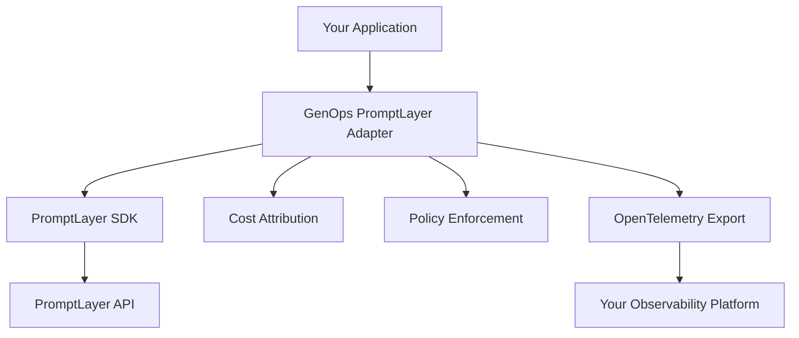

# PromptLayer Integration with GenOps

**Comprehensive guide for enterprise PromptLayer prompt management with GenOps governance, cost intelligence, and policy enforcement.**

---

## 🎯 Overview

This integration enhances PromptLayer's prompt management capabilities with comprehensive enterprise governance, providing automatic cost intelligence, policy enforcement, and observability without disrupting existing workflows.

**Perfect for:**
- **Engineering teams** managing prompt costs and optimization across multiple projects
- **AI product managers** needing visibility into prompt performance and team attribution  
- **Platform engineers** implementing governance for organization-wide prompt management
- **FinOps teams** requiring detailed cost tracking and budget enforcement for AI operations

### Key Capabilities

- **🎯 Enhanced Prompt Operations**: All PromptLayer prompts gain automatic governance tracking
- **💰 Cost Intelligence**: Real-time cost estimation and attribution with team/project breakdown
- **🛡️ Policy Enforcement**: Configurable budget limits, alerts, and governance compliance
- **📊 Enterprise Observability**: Native OpenTelemetry export to your existing monitoring stack
- **🚀 Zero-Code Integration**: Works with existing PromptLayer applications without code changes
- **🔄 Advanced Patterns**: A/B testing, evaluation workflows, and prompt lifecycle management

### Architecture Overview



---

## 🚀 Quick Start

**New to PromptLayer + GenOps?** Start with the [5-minute quickstart guide](../promptlayer-quickstart.md) first, then return here for advanced patterns.

### Advanced Setup Options

For production deployments and advanced governance patterns, this guide covers:

**Environment Configuration Patterns:**
```bash
# Development environment
export GENOPS_ENVIRONMENT="development"
export GENOPS_GOVERNANCE_POLICY="advisory"  # Log violations only

# Staging environment  
export GENOPS_ENVIRONMENT="staging" 
export GENOPS_GOVERNANCE_POLICY="enforced"  # Block violations
export GENOPS_DAILY_BUDGET_LIMIT="50.0"

# Production environment
export GENOPS_ENVIRONMENT="production"
export GENOPS_GOVERNANCE_POLICY="enforced"
export GENOPS_DAILY_BUDGET_LIMIT="500.0"
export GENOPS_COST_CENTER="ai-operations"
```

**Multi-Team Configuration:**
```bash
# Team-specific governance
export GENOPS_TEAM="ai-research"
export GENOPS_PROJECT="prompt-optimization"
export GENOPS_CUSTOMER_ID="internal-research"

# For customer-facing applications
export GENOPS_TEAM="product-engineering"
export GENOPS_PROJECT="customer-support-ai"
export GENOPS_CUSTOMER_ID="enterprise-tier-customers"
```

---

## 🔧 Integration Patterns

### 1. Zero-Code Auto-Instrumentation (Recommended)

**Add governance to existing PromptLayer code with ONE line:**

```python
# Add this single line at application startup
from genops.providers.promptlayer import auto_instrument
auto_instrument(
    team="ai-team",
    project="prompt-optimization",
    daily_budget_limit=50.0  # $50 daily limit
)

# Your existing PromptLayer code works exactly the same
import promptlayer

client = promptlayer.PromptLayer()
response = client.run(
    prompt_name="customer_support_v2",
    input_variables={"query": "Help with billing"}
)
# ↑ Now automatically includes governance!
```

### 2. Manual Adapter (Advanced Control)

**For fine-grained control over governance:**

```python
from genops.providers.promptlayer import instrument_promptlayer

# Initialize with specific governance policies
adapter = instrument_promptlayer(
    promptlayer_api_key="pl-your-key",
    team="engineering",
    project="customer-support",
    environment="production",
    daily_budget_limit=100.0,
    max_operation_cost=5.0,
    enable_cost_alerts=True
)

# Enhanced prompt execution with governance
with adapter.track_prompt_operation(
    prompt_name="escalation_handler",
    customer_id="enterprise_123",
    cost_center="support"
) as span:
    result = adapter.run_prompt_with_governance(
        prompt_name="escalation_handler",
        input_variables={
            "issue": "Billing dispute",
            "priority": "high",
            "customer_tier": "enterprise"
        },
        tags=["billing", "escalation"]
    )
    
    # Access governance metrics
    metrics = span.get_metrics()
    print(f"Cost: ${metrics['estimated_cost']:.6f}")
    print(f"Team: {metrics['team']}")
```

### 3. Context Manager Pattern (Production)

**For complex workflows with nested operations and advanced governance:**

#### Understanding Governance Concepts

Before diving into advanced patterns, here are key governance concepts:

**Cost Attribution:** Every prompt execution is attributed to your team, project, and optionally customer for billing and reporting purposes.

**Budget Enforcement:** Set daily/monthly limits that can either log warnings (advisory mode) or block operations (enforced mode) when exceeded.

**Policy Compliance:** Automatic tracking of governance violations with audit trails for compliance reporting.

**Team Attribution Impact:**
- **Billing**: Costs are allocated to the specified team's budget
- **Reporting**: Usage appears in team-specific dashboards and reports  
- **Access Control**: Future versions may use team attribution for access policies

#### Advanced Context Manager Usage

```python
from genops.providers.promptlayer import GenOpsPromptLayerAdapter

adapter = GenOpsPromptLayerAdapter(
    team="product-team",
    project="ai-features",
    enable_governance=True
)

# Multi-step workflow with governance
with adapter.track_prompt_operation(
    prompt_name="product_workflow",
    operation_type="complex_workflow",
    customer_id="customer_456"
) as workflow_span:
    
    # Step 1: Intent analysis
    with adapter.track_prompt_operation(
        prompt_name="intent_classifier",
        operation_name="analyze_intent"
    ) as intent_span:
        intent = adapter.run_prompt_with_governance(
            prompt_name="intent_classifier",
            input_variables={"user_input": "Product recommendation"}
        )
        intent_span.update_cost(0.008)
    
    # Step 2: Recommendation generation
    with adapter.track_prompt_operation(
        prompt_name="recommendation_engine",
        operation_name="generate_recommendations"
    ) as rec_span:
        recommendations = adapter.run_prompt_with_governance(
            prompt_name="recommendation_engine",
            input_variables={"intent": intent, "user_profile": "premium"}
        )
        rec_span.update_cost(0.025)
    
    # Workflow complete
    total_cost = intent_span.estimated_cost + rec_span.estimated_cost
    workflow_span.update_cost(total_cost)
```

---

## 🏗️ Advanced Configuration

### Governance Policies

```python
from genops.providers.promptlayer import GovernancePolicy

adapter = instrument_promptlayer(
    # Policy enforcement levels
    governance_policy=GovernancePolicy.ENFORCED,  # Block violations
    # governance_policy=GovernancePolicy.ADVISORY,  # Log warnings
    # governance_policy=GovernancePolicy.AUDIT_ONLY,  # Track only
    
    # Cost controls
    daily_budget_limit=100.0,      # $100 daily team budget
    max_operation_cost=10.0,       # $10 max per operation
    enable_cost_alerts=True,       # Alert on threshold violations
    
    # Attribution
    team="ai-engineering",
    project="prompt-platform", 
    customer_id="enterprise_client_123",
    cost_center="rd-department",
    environment="production",
    
    # Custom tags
    tags={
        "service": "prompt-api",
        "version": "2.1.0",
        "region": "us-east-1"
    }
)
```

### Multi-Environment Setup

```python
import os
from genops.providers.promptlayer import instrument_promptlayer

def setup_promptlayer_governance():
    """Setup governance based on environment."""
    environment = os.getenv('ENVIRONMENT', 'development')
    
    if environment == 'production':
        return instrument_promptlayer(
            governance_policy="enforced",
            daily_budget_limit=500.0,      # Higher production budget
            max_operation_cost=25.0,
            enable_cost_alerts=True,
            environment=environment
        )
    elif environment == 'staging':
        return instrument_promptlayer(
            governance_policy="advisory",   # Warnings only in staging
            daily_budget_limit=50.0,
            max_operation_cost=5.0,
            environment=environment
        )
    else:  # development
        return instrument_promptlayer(
            governance_policy="audit_only", # Track only in dev
            daily_budget_limit=10.0,
            max_operation_cost=2.0,
            environment=environment
        )

# Use environment-appropriate governance
adapter = setup_promptlayer_governance()
```

---

## 📊 Advanced Use Cases

### 1. A/B Testing with Governance

```python
# Comprehensive A/B testing with cost intelligence
test_variants = ["control_v1", "empathetic_v2", "concise_v3"]

with adapter.track_prompt_operation(
    prompt_name="customer_support_ab_test",
    operation_type="ab_test",
    tags={"experiment": "support_optimization_q4"}
) as test_span:
    
    variant_results = []
    
    for variant in test_variants:
        with adapter.track_prompt_operation(
            prompt_name=f"customer_support_{variant}",
            prompt_version=variant,
            operation_type="ab_variant"
        ) as variant_span:
            
            # Run variant with governance tracking
            result = adapter.run_prompt_with_governance(
                prompt_name=f"customer_support_{variant}",
                input_variables={
                    "query": "Billing question",
                    "customer_tier": "premium"
                },
                tags=[f"variant_{variant}", "ab_test"]
            )
            
            # Collect metrics for comparison
            variant_results.append({
                "variant": variant,
                "cost": variant_span.estimated_cost,
                "quality": evaluate_response_quality(result),
                "governance_score": variant_span.estimated_cost / quality_score
            })
    
    # Select optimal variant based on governance metrics
    optimal_variant = min(variant_results, key=lambda x: x["governance_score"])
    test_span.add_attributes({"optimal_variant": optimal_variant["variant"]})
```

### 2. Cost-Optimized Prompt Selection

```python
# Intelligent prompt selection based on budget constraints
available_prompts = [
    {"name": "basic_response_v1", "estimated_cost": 0.008, "quality": 0.80},
    {"name": "enhanced_response_v2", "estimated_cost": 0.015, "quality": 0.90},
    {"name": "premium_response_v3", "estimated_cost": 0.035, "quality": 0.95}
]

def select_optimal_prompt(remaining_budget: float, quality_threshold: float):
    """Select best prompt within budget and quality constraints."""
    viable_prompts = [
        p for p in available_prompts 
        if p["estimated_cost"] <= remaining_budget and p["quality"] >= quality_threshold
    ]
    
    if not viable_prompts:
        return None
    
    # Select highest quality within budget
    return max(viable_prompts, key=lambda x: x["quality"])

# Use budget-aware prompt selection
remaining_budget = adapter.daily_budget_limit - adapter.daily_usage
selected_prompt = select_optimal_prompt(remaining_budget, quality_threshold=0.85)

if selected_prompt:
    with adapter.track_prompt_operation(
        prompt_name=selected_prompt["name"],
        max_cost=selected_prompt["estimated_cost"]
    ) as span:
        result = adapter.run_prompt_with_governance(
            prompt_name=selected_prompt["name"],
            input_variables={"query": "Complex customer inquiry"}
        )
else:
    print("⚠️ No prompts available within budget/quality constraints")
```

### 3. Prompt Lifecycle Management

```python
# Progressive prompt deployment with governance
def deploy_prompt_with_governance(prompt_name: str, stage: str):
    """Deploy prompt through governance-controlled lifecycle."""
    
    stage_configs = {
        "development": {
            "cost_limit": 0.05,
            "governance": "audit_only",
            "quality_threshold": 0.70
        },
        "testing": {
            "cost_limit": 0.10,
            "governance": "advisory", 
            "quality_threshold": 0.80
        },
        "staging": {
            "cost_limit": 0.25,
            "governance": "advisory",
            "quality_threshold": 0.85
        },
        "production": {
            "cost_limit": 0.50,
            "governance": "enforced",
            "quality_threshold": 0.90
        }
    }
    
    config = stage_configs[stage]
    
    with adapter.track_prompt_operation(
        prompt_name=f"{prompt_name}_{stage}",
        operation_type="lifecycle_deployment",
        tags={"stage": stage, "lifecycle": "deployment"},
        max_cost=config["cost_limit"]
    ) as deploy_span:
        
        # Test prompt in current stage
        result = adapter.run_prompt_with_governance(
            prompt_name=prompt_name,
            input_variables={"test_input": f"Stage {stage} validation"},
            tags=[f"stage_{stage}", "lifecycle_test"]
        )
        
        # Validate against stage requirements
        quality_score = evaluate_prompt_quality(result)
        cost = deploy_span.estimated_cost
        
        if quality_score >= config["quality_threshold"] and cost <= config["cost_limit"]:
            deploy_span.add_attributes({
                "deployment_status": "approved",
                "quality_score": quality_score,
                "cost_efficiency": cost / quality_score
            })
            print(f"✅ {prompt_name} approved for {stage}")
            return True
        else:
            deploy_span.add_attributes({
                "deployment_status": "rejected",
                "quality_score": quality_score,
                "rejection_reason": "quality" if quality_score < config["quality_threshold"] else "cost"
            })
            print(f"❌ {prompt_name} rejected for {stage}")
            return False

# Deploy through lifecycle stages
stages = ["development", "testing", "staging", "production"]
prompt_name = "new_customer_support_v4"

for stage in stages:
    if deploy_prompt_with_governance(prompt_name, stage):
        print(f"Proceeding to next stage...")
    else:
        print(f"Deployment stopped at {stage}")
        break
```

---

## 📈 Monitoring and Observability

### Built-in Metrics

GenOps automatically exports comprehensive metrics to OpenTelemetry:

```python
# Access current metrics
metrics = adapter.get_metrics()

print(f"Daily Usage: ${metrics['daily_usage']:.6f}")
print(f"Operation Count: {metrics['operation_count']}")
print(f"Team: {metrics['team']}")
print(f"Budget Remaining: ${metrics['budget_remaining']:.6f}")
print(f"Active Operations: {metrics['active_operations']}")
```

### Custom Metrics Collection

```python
# Add custom metric collectors
def cost_efficiency_collector(span):
    """Calculate cost efficiency metrics."""
    if hasattr(span, 'quality_score') and span.estimated_cost > 0:
        span.add_attributes({
            "cost_per_quality_point": span.estimated_cost / span.quality_score,
            "efficiency_tier": "high" if span.estimated_cost / span.quality_score < 0.01 else "standard"
        })

def performance_collector(span):
    """Track performance characteristics."""
    duration_ms = (span.end_time - span.start_time) * 1000 if span.end_time else 0
    if duration_ms > 0:
        span.add_attributes({
            "latency_tier": "fast" if duration_ms < 1000 else "standard",
            "performance_score": max(0, 1 - (duration_ms / 5000))  # Normalized score
        })

# Register collectors
adapter.add_metric_collector(cost_efficiency_collector)
adapter.add_metric_collector(performance_collector)
```

### Dashboard Integration

**Grafana Dashboard Configuration:**
```json
{
  "dashboard": {
    "title": "PromptLayer + GenOps Governance",
    "panels": [
      {
        "title": "Prompt Execution Rate",
        "type": "stat",
        "targets": [{"expr": "rate(genops_promptlayer_operations_total[5m])"}]
      },
      {
        "title": "Cost by Team",
        "type": "piechart", 
        "targets": [{"expr": "genops_promptlayer_cost_by_team"}]
      },
      {
        "title": "Quality vs Cost Efficiency",
        "type": "scatter",
        "targets": [
          {"expr": "genops_promptlayer_quality_score"},
          {"expr": "genops_promptlayer_cost_per_quality"}
        ]
      }
    ]
  }
}
```

**Datadog Custom Metrics:**
```python
# Automatically exported metrics
{
    "genops.promptlayer.cost.total": {"type": "gauge", "tags": ["team", "project"]},
    "genops.promptlayer.operations.count": {"type": "count", "tags": ["prompt_name", "team"]},  
    "genops.promptlayer.quality.score": {"type": "gauge", "tags": ["prompt_name", "version"]},
    "genops.promptlayer.budget.utilization": {"type": "gauge", "tags": ["team", "environment"]}
}
```

---

## 🚀 Production Deployment

### Docker Configuration

```dockerfile
# Production Dockerfile
FROM python:3.11-slim

WORKDIR /app

# Install dependencies
COPY requirements.txt .
RUN pip install --no-cache-dir -r requirements.txt

# Application code
COPY . .

# Production environment
ENV GENOPS_ENVIRONMENT=production
ENV PYTHONUNBUFFERED=1

# OpenTelemetry configuration
ENV OTEL_RESOURCE_ATTRIBUTES="service.name=promptlayer-service,service.version=1.0.0"
ENV OTEL_EXPORTER_OTLP_ENDPOINT="http://jaeger:14268/api/traces"

EXPOSE 8080

# Health check
HEALTHCHECK --interval=30s --timeout=10s --start-period=5s --retries=3 \
    CMD python -c "from genops.providers.promptlayer_validation import validate_setup; assert validate_setup().overall_status.value == 'passed'"

CMD ["python", "app.py"]
```

### Kubernetes Deployment

```yaml
apiVersion: apps/v1
kind: Deployment
metadata:
  name: promptlayer-service
  labels:
    app: promptlayer-service
spec:
  replicas: 3
  selector:
    matchLabels:
      app: promptlayer-service
  template:
    metadata:
      labels:
        app: promptlayer-service
      annotations:
        genops.ai/governance: "enforced"
        genops.ai/team: "ai-platform"
        genops.ai/cost-center: "engineering"
    spec:
      containers:
      - name: promptlayer-service
        image: your-registry/promptlayer-service:latest
        ports:
        - containerPort: 8080
        env:
        - name: GENOPS_ENVIRONMENT
          value: "production"
        - name: PROMPTLAYER_API_KEY
          valueFrom:
            secretKeyRef:
              name: promptlayer-secret
              key: api-key
        - name: GENOPS_TEAM
          value: "ai-platform"
        - name: GENOPS_PROJECT  
          value: "prompt-services"
        resources:
          requests:
            memory: "2Gi"
            cpu: "1"
          limits:
            memory: "4Gi"
            cpu: "2"
        livenessProbe:
          httpGet:
            path: /health
            port: 8080
          initialDelaySeconds: 30
        readinessProbe:
          httpGet:
            path: /ready  
            port: 8080
          initialDelaySeconds: 5
---
apiVersion: autoscaling/v2
kind: HorizontalPodAutoscaler
metadata:
  name: promptlayer-hpa
spec:
  scaleTargetRef:
    apiVersion: apps/v1
    kind: Deployment
    name: promptlayer-service
  minReplicas: 3
  maxReplicas: 10
  metrics:
  - type: Resource
    resource:
      name: cpu
      target:
        type: Utilization
        averageUtilization: 70
```

### Production Application Pattern

```python
import asyncio
import signal
from contextlib import asynccontextmanager
from genops.providers.promptlayer import instrument_promptlayer, GovernancePolicy

class ProductionPromptLayerService:
    def __init__(self):
        self.adapter = instrument_promptlayer(
            team=os.getenv("GENOPS_TEAM"),
            project=os.getenv("GENOPS_PROJECT"),
            environment="production",
            daily_budget_limit=1000.0,
            governance_policy=GovernancePolicy.ENFORCED,
            enable_cost_alerts=True
        )
        self.is_running = True
    
    async def start(self):
        """Start production service."""
        # Register signal handlers
        signal.signal(signal.SIGTERM, self._shutdown_handler)
        signal.signal(signal.SIGINT, self._shutdown_handler)
        
        # Start health check loop
        health_task = asyncio.create_task(self._health_check_loop())
        
        try:
            # Main service loop
            while self.is_running:
                await self._process_requests()
                await asyncio.sleep(0.1)
        finally:
            health_task.cancel()
    
    async def _process_requests(self):
        """Process incoming prompt requests."""
        # Your request processing logic here
        pass
    
    async def _health_check_loop(self):
        """Continuous health monitoring."""
        while self.is_running:
            try:
                # Check adapter health
                metrics = self.adapter.get_metrics()
                if metrics["budget_remaining"] < 10.0:
                    logger.warning("Budget running low!")
                
                await asyncio.sleep(30)
            except Exception as e:
                logger.error(f"Health check failed: {e}")
    
    def _shutdown_handler(self, signum, frame):
        """Graceful shutdown handler."""
        logger.info("Received shutdown signal")
        self.is_running = False

# Run production service
if __name__ == "__main__":
    service = ProductionPromptLayerService()
    asyncio.run(service.start())
```

---

## 🔧 Troubleshooting

For basic setup issues, see the [quickstart troubleshooting guide](../promptlayer-quickstart.md#-common-issues--solutions). This section covers advanced troubleshooting scenarios.

### Advanced Issues

**❌ "Governance tracking not working" - Prompts run but no cost/team data**

This usually indicates instrumentation timing issues:
```python
# Check instrumentation order
from genops.providers.promptlayer import auto_instrument, get_current_adapter

# Must call auto_instrument BEFORE any PromptLayer imports
auto_instrument(team="test-team")

# Then import and use PromptLayer
import promptlayer
client = promptlayer.PromptLayer()

# Verify adapter exists
adapter = get_current_adapter()
print(f"Adapter active: {adapter is not None}")
```

**❌ "Cost estimates seem wrong" - Understanding cost calculation**

GenOps estimates costs based on:
- **Token usage**: Input/output tokens × model pricing (GPT-4: ~$0.03/1K, GPT-3.5: ~$0.002/1K)
- **Model detection**: Automatically detects model from PromptLayer configuration
- **Provider rates**: Uses latest published rates from providers

```python
# Debug cost calculation
with adapter.track_prompt_operation("cost_debug") as span:
    result = adapter.run_prompt_with_governance(
        prompt_name="your_prompt",
        input_variables={"test": "debug cost"}
    )
    
    # Check cost components
    print(f"Input tokens: {span.input_tokens}")
    print(f"Output tokens: {span.output_tokens}")  
    print(f"Model: {span.model}")
    print(f"Estimated cost: ${span.estimated_cost:.6f}")
```

**❌ "Policy violations not enforced" - Governance policies not working**

Policy enforcement depends on governance mode:
```python
from genops.providers.promptlayer import GovernancePolicy

# Advisory mode: logs violations but doesn't block
adapter = instrument_promptlayer(
    governance_policy=GovernancePolicy.ADVISORY,
    daily_budget_limit=5.0
)

# Enforced mode: blocks operations that exceed limits
adapter = instrument_promptlayer(
    governance_policy=GovernancePolicy.ENFORCED,
    daily_budget_limit=5.0
)

# Check current policy
print(f"Policy mode: {adapter.governance_policy}")
print(f"Budget limit: ${adapter.daily_budget_limit}")
print(f"Current usage: ${adapter.daily_usage}")
```

**❌ "OpenTelemetry export failing"**
```bash
# Check OTLP endpoint
echo $OTEL_EXPORTER_OTLP_ENDPOINT

# Test connectivity
curl -v $OTEL_EXPORTER_OTLP_ENDPOINT/v1/traces
```

### Debug Mode

```python
import logging
logging.basicConfig(level=logging.DEBUG)

# Enable detailed tracing
adapter = instrument_promptlayer(
    enable_detailed_logging=True,
    debug_mode=True
)
```

### Validation Tools

```python
# Comprehensive setup validation
from genops.providers.promptlayer_validation import validate_setup, print_validation_result

result = validate_setup(
    include_connectivity_tests=True,
    include_performance_tests=True, 
    include_governance_tests=True
)

print_validation_result(result, detailed=True)

# Check specific components
if result.overall_status.value != "passed":
    failed_checks = [c for c in result.checks if c.status.value == "failed"]
    for check in failed_checks:
        print(f"❌ {check.name}: {check.message}")
        if check.fix_suggestion:
            print(f"💡 Fix: {check.fix_suggestion}")
```

---

## 🧪 Testing

### Unit Testing

```python
import pytest
from unittest.mock import Mock, patch
from genops.providers.promptlayer import instrument_promptlayer

@patch('genops.providers.promptlayer.PromptLayer')
def test_basic_governance_integration(mock_promptlayer):
    """Test basic governance integration."""
    # Setup mock
    mock_client = Mock()
    mock_promptlayer.return_value = mock_client
    mock_client.run.return_value = {"response": "test response"}
    
    # Create adapter
    adapter = instrument_promptlayer(
        promptlayer_api_key="pl-test-key",
        team="test-team",
        project="test-project"
    )
    
    # Test governance tracking
    with adapter.track_prompt_operation("test_prompt") as span:
        result = adapter.run_prompt_with_governance(
            prompt_name="test_prompt",
            input_variables={"test": "value"}
        )
        span.update_cost(0.01)
    
    # Assertions
    assert span.team == "test-team"
    assert span.project == "test-project"
    assert span.estimated_cost == 0.01
    assert result["governance"]["team"] == "test-team"

def test_budget_enforcement():
    """Test budget limit enforcement."""
    adapter = instrument_promptlayer(
        daily_budget_limit=0.05,  # Very low limit
        max_operation_cost=0.01
    )
    
    # First operation should succeed
    with adapter.track_prompt_operation("test_prompt") as span:
        span.update_cost(0.01)
        assert len(span.policy_violations) == 0
    
    # Second operation should trigger violation
    with adapter.track_prompt_operation("test_prompt") as span:
        span.update_cost(0.05)  # Exceeds daily budget
        assert len(span.policy_violations) > 0
        assert "budget limit" in span.policy_violations[0].lower()
```

### Integration Testing

```python
@pytest.mark.integration 
def test_promptlayer_integration():
    """Test actual PromptLayer integration."""
    if not os.getenv("PROMPTLAYER_API_KEY"):
        pytest.skip("PROMPTLAYER_API_KEY not set")
    
    adapter = instrument_promptlayer()
    
    # Test real prompt execution
    with adapter.track_prompt_operation("integration_test") as span:
        result = adapter.run_prompt_with_governance(
            prompt_name="integration_test",
            input_variables={"test": "integration"}
        )
        
        # Verify governance context
        assert result["governance"]["team"] is not None
        assert span.estimated_cost >= 0
```

### Load Testing

```python
import asyncio
import time
from concurrent.futures import ThreadPoolExecutor

async def load_test_promptlayer_governance():
    """Load test PromptLayer with governance."""
    adapter = instrument_promptlayer(
        daily_budget_limit=10.0,  # Higher limit for load test
        max_operation_cost=1.0
    )
    
    def run_prompt_operation(operation_id):
        with adapter.track_prompt_operation(f"load_test_{operation_id}") as span:
            result = adapter.run_prompt_with_governance(
                prompt_name="load_test_prompt",
                input_variables={"operation_id": operation_id}
            )
            span.update_cost(0.01)
            return result
    
    # Run concurrent operations
    start_time = time.time()
    
    with ThreadPoolExecutor(max_workers=10) as executor:
        futures = [executor.submit(run_prompt_operation, i) for i in range(100)]
        results = [f.result() for f in futures]
    
    duration = time.time() - start_time
    
    # Performance assertions
    assert len(results) == 100
    assert duration < 30  # Should complete within 30 seconds
    
    # Verify governance metrics
    metrics = adapter.get_metrics()
    assert metrics["operation_count"] >= 100
    assert metrics["daily_usage"] <= 1.0  # $1 for 100 operations
```

---

## 📚 Examples

### Complete Example Suite

Run the complete example suite to explore all features:

```bash
cd examples/promptlayer/
./run_all_examples.sh
```

**Individual Examples:**

1. **Setup Validation** (30 seconds)
   ```bash
   python setup_validation.py
   ```

2. **Basic Tracking** (5 minutes)
   ```bash
   python basic_tracking.py
   ```

3. **Auto-Instrumentation** (5 minutes) 
   ```bash
   python auto_instrumentation.py
   ```

4. **Advanced Prompt Management** (30 minutes)
   ```bash
   python prompt_management.py
   ```

5. **Evaluation Integration** (30 minutes)
   ```bash
   python evaluation_integration.py
   ```

6. **Advanced Observability** (2 hours)
   ```bash
   python advanced_observability.py
   ```

7. **Production Patterns** (2 hours)
   ```bash
   python production_patterns.py
   ```

---

## 🤝 Support

**Need Help?**
- 📖 [Quickstart Guide](../promptlayer-quickstart.md) - 5-minute setup guide
- 🧪 [Example Suite](https://github.com/KoshiHQ/GenOps-AI/tree/main/examples/promptlayer/) - Working code examples
- 📊 [Performance Guide](../performance-benchmarking.md) - Benchmarking and optimization
- 🐛 [Report Issues](https://github.com/KoshiHQ/GenOps-AI/issues) - Bug reports and feature requests
- 💬 [Community Support](https://github.com/KoshiHQ/GenOps-AI/discussions) - Questions and discussions

**Enterprise Support:**
- 🏢 Professional services and custom integrations available
- 📞 Priority support for production deployments
- 🎓 Training and workshops for enterprise teams

---

**Ready to transform your PromptLayer prompt management with enterprise governance!** 🚀